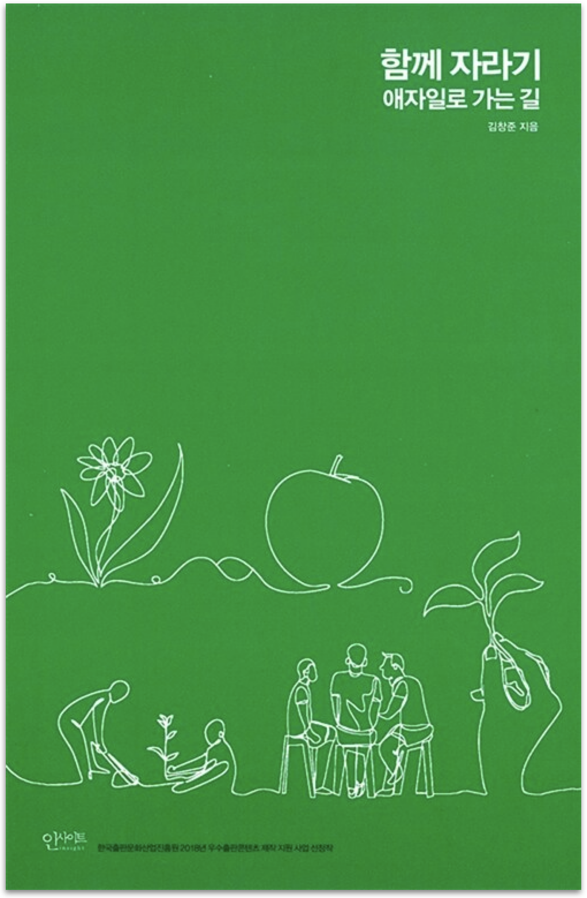

  
  <h1>함께 자라기</h1>
  

    
    
    
  

## 📝 목차

- [1장. 자라기](#1장-자라기)
- [2장. 함께](#2장-함께)
- [3장. 애자일](#3장-애자일)
- [💬 느낀점](#-느낀점)

---

## 1장. 자라기

> <strong><i>p22. 최소한도의 경험치만 넘어가면 경력 연수와 실제 직무 성과의 상관성이 생각보다 낮다는 것은 소프트웨어 개발뿐만 아니라 다른 여러 영역에서도 동일하게 밝혀졌습니다.</i></strong> 🐧🐤🙂🌵

- `샐리`: 주변에서도 심심치 않게 보인다.
- `후미`: 만년 차장, 과장이 괜히 있는 말이 아니니다.
- `튜브`: 책에서 말하는 ‘최소한도의 경험치'도 생각보다 짧아서 인상적이었다. (6개월 ~ 2년정도)

> <strong><i>p27. 그가 말하는 1만 시간 법칙에서 1만 시간은 '자신의 기량을 향상시킬 목적으로 반복적으로 하는 수련'을 한 시간을 일컫습니다.</i></strong> 🐧🌵🐤🙂

- `펭귄`: 1만 시간 법칙이 흔히 “1만 시간 동안 반복하면 잘하게 된다" 이런 느낌으로 퍼져있는데, 이 법칙의 핵심은 “자신의 기량을 향상시킬 목적으로 수련"인 것 같다.
- `후미`: 개선 없는 1만 시간은 물이 점점 고여 썩어가는 느낌인것 같다..
- `튜브`: 같은 시간을 보내도 이 ‘수련'에 속할 수도 있고 아닐 수도 있기 때문에 때문에 경력 연수와 직무 성과에 상관성이 낮은 것 같다.

> <strong><i>p27. 정말 기량 향상을 목적으로 자신의 약점을 개선하려고 애쓰는 수련, 그것만이 의도적 수련입니다. </i></strong> 🐤

- `샐리`: 넋놓고 시간을 보내는 것이 아닌, 자신의 목표를 위해 무언가를 개선하는 과정이 수련이라고 생각하기 때문에 와닿은 문장!

> <strong><i>p35. 조직이 첫 주기에 만들어낸 결과물을 계단 삼아서 다음 주기에는 조금 더 높은(더 똑똑한) 위치에서 다음 결과물을 만들어냅니다.</i></strong> 🌵

- `튜브`: 단순히 결과물에 그치지 않고 결과물을 통해 조직이 성장하는 것!
- `후미`: [“회의도, 신규개발도 모두 스톱”…오늘의집 ‘FIW’ 제도 ‘눈길’ - 이데일리 뉴스](https://m.edaily.co.kr/news/read?newsId=01321846635542008&mediaCodeNo=257)
- `샐리`: 다같이 리팩토링하는 시간을 가지는 게 정말 좋은 것 같습니다!

> <strong><i>p38. 어떻게 하면 더하기보다 곱하기를 할 수 있을 것인가입니다.</i></strong> 🙂

- `후미`: 확실히 이전 자료, 프로젝트를 거름삼아 다음것을 진행하면 더하기가 아닌 곱하기가 되는거 같다.
- `샐리`: 범용적인 플랫폼을 구축해놓는 것이 중요한 것 같다!

> <strong><i>p38. 자신이 평소 투자하는 비용을 한번 살펴보세요. A 작업, B 작업, C 작업이 각각 어느 정도 비율인지, 만약 B나 C가 거의 없다면 '이상한 나라의 앨리스'에 나오는 붉은 여왕의 말대로, 후퇴하는 셈이 될 겁니다.</i></strong> 🐤🌵

- `샐리`: 내가 하는 일에는 C 작업이 있는지 다시 생각하게 된다.

> <strong><i>p39. 자신이 이미 갖고 있는 것들을 잘 활용하라. … 새로운 지식 유입에 집중하지 말고 가지고 있는 지식을 얼마나 어떻게 활용하는지 반성하라.</i></strong> 🐤

- `샐리`: 지금까지 배웠던 것 중에 얼마나 실제로 활용해보았는지 반성하게 된다. 회사 업무 외에 내가 개인적으로 자기발전을 위해 리뷰해본적이 없는 것 같아서 아쉽다.
- `펭귄`: 배우기만 하고 실제 써먹지 않으면 까먹기 쉽다.
- `튜브`: 실제로 써먹지 않으면 실제로는 모르는 것일 수도 있다.

> <strong><i>p39. 이미 갖고 있는 것들을 하이퍼링크로 서로 촘촘히 연결하라. 노드 간 이동 속도가 빨라질 수 있도록 고속도로를 놔라. 즉, 이미 습득한 지식, 기술 경험 등을 서로 연결 지어서 시너지 효과가 나게 하고 하나의 영역에서 다른 영역으로 왔다갔다하는 것을 자주 해서 다른 영역 간을 넘나들기가 수월해지도록 하라.</i></strong> 🐧

- `펭귄`: 그래서 요즘 [Obsidian](https://obsidian.md/)에 관심을 갖고 있다.

> <strong><i>p40. 피드백을 자주 받아라. … 사이클 타임을 줄여라. 새로운 정보를 얻었다면 1년 후에 크고 완벽한 실험을 하려고 준비하기보다는 1달, 혹은 1주 후에 작게라도 실험해 보는 것이 좋다. 순환률을 높여라. … 일찍, 그리고 자주 실패하라. 실패에서 학습하라.</i></strong> 🐤🌵

- `샐리`: 예전에 실수한 걸 물어보지 않고 프로젝트를 진행했던 때가 생각난다. 했던 일을 또 하게 되고, 시간은 시간대로 늘어나더라.

> <strong><i>p45. 저는 알파고 같은 인공지능 시대에 대비하려면 배우기 힘든 것에 집중하라고 말하고 싶습니다.</i></strong> 🐤

- `샐리`: 디바이스 드라이버가 돌아가도록 설계하는 것 뿐만아니라, 효율적인 플랫폼에 대해 고민하게 됐다.

> <strong><i>p51. 반면에 소프트웨어 개발자는 소프트웨어를 뭘 만들지를 고민하고 설계하는 부분이 포함되며, 그 과정에서 타인과 상호작용하는 업무가 많습니다. 앞서 이야기한 독창성, 협상, 설득 등에서 차이가 나는 것이죠.</i></strong> 🐧🐤

> <strong><i>p55. 꾸준한 반복으로 달인이 되려면 적어도</i></strong>  
> <strong><i>1. 실력을 개선하려는 동기가 있어야 하고</i></strong>  
> <strong><i>2. 구체적인 피드백을 적절한 시기에 받아야 한다</i></strong> 🌵

- `펭귄`: [코드 리뷰의 목적은 성장이어야 한다 - JBEE.io](https://jbee.io/essay/code-review-goal/)

> <strong><i>p63. 의도적 수련의 필수 요건 중 하나가 ‘적절한 난이도’입니다.</i></strong> 🐤🐧🌵

- `샐리`: 수련의 필수 요건중에 하나가 ‘적절한 난이도'일거라곤 생각 못했다. 근데 읽다보니 너무 맞는 말인 것 같다.
- `튜브`: 너무 쉽거나 어려우면 몰입을 하기가 어렵다!

> <strong><i>p66 - p70. 지루함을 느끼는 경우: a1 실력 낮추기  
> 지루함을 느끼는 경우: a2 난이도 높이기  
> 불안함을 느끼는 경우: b2 실력 높이기  
> 불안함을 느끼는 경우: b1 난이도 낮추기
> </i></strong> 🐤🌵

- `샐리`: 긴장감을 높이는 방법이 유용하게 사용될 수 있다니!
- `튜브`: 실력 낮추기도 방법이 될 수 있다는 게 신기했다.

> <strong><i>p67. 흔하게 쓰는 방법은 자기에게 요구되는 수준을 더 높게 여기는 겁니다. 하루 만에 개발하라고 주어진 업무인데 지루한 느낌이 드니 한 시간 만에 할 수 있는 방법을 고안해 보기.</i></strong> 🐧

- `펭귄`: 일이 간단히 끝나면, “좋네"하고 기뻐하긴 해서 무슨 말인지는 아는데 엄청 공감되지는 않는다.
- `샐리`: 출근 전에는 항상 쉬운 문제에 다른 툴을 써서 실력을 높여봐야지! 하는데 잘 안된다.
- `후미`: 항상 생각은 하느데 쉽지는 않다.

> <strong><i>p68. 인지심리학에서 상대의 전문성을 빠른 시간 내에 간파하는 기법 중에 남들보다 일을 좀 더 효율적/효과적으로 하기 위해 내가 직접 만들어 쓰는 나만의 도구, 방법을 묻는 방법이 있습니다. </i></strong> 🐤

- `샐리`: 인사과 동기한테 알려줄 내용!

> <strong><i>p69. 근데, 쉬운 일을 하면 좋지 왜 자기 일을 어렵게 만드냐고 반문하는 분이 있다면, 자신의 실력을 높일 의향이 있는 건지 생각해보라고 묻고 싶습니다. </i></strong> 🙂

- `후미`: 자기 스스로 난이도를 높이려고 해도 이걸 굳이 해야할까라는 생각이 드는데, 이런 생각이 들때 마다 이 문장을 상기해보면 좋을거 같다.
- `샐리`: 툴 배운답시고 천천히 무언가 하고 있다보면, 사람들이 “쟤 뭐하냐” 라고 생각할까봐 무섭다.
- `펭귄`: 보통 바쁘면 “성장"보다는 빨리 일을 처리하는 거에 더 집중하는 것 같다. ~~어쩔 수 없지..~~
- `튜브`: 당장 쉬운 게 좋긴 하지만, 성장은 어느정도 고통스러울 수 밖에 없는 것 같다.

> <strong><i>p69 - p70. 실력을 어떻게 당장 올릴 수 있을까요. 크게 보면 사회적 접근과 도구적 접근, 내관적 접근 세 가지가 가능합니다.  
> 사회적 접근은, 나보다 뛰어난 전문가의 도움을 얻는 것입니다. …  
> 도구적 접근은 다른 도구의 도움을 받는 겁니다. …  
> 내관적 접근은 비슷한 일을 했던 경험을 머릿속에서 되살려보는 겁니다. …</i></strong> 🐤

> <strong><i>p71. 간단하면서 효과적인 방법은, 자신이 맡은 일의 가장 간단하면서 핵심적인 결과물, 즉 아기 버전(혹은 0.0.1 버전)을 첫 번째 목표로 삼는 겁니다.</i></strong> 🐧

- `샐리`: 부딪혀보고 모르는 것이 어떤 것인지 알기 위함인 것 같다.

> <strong><i>p83. 이런 것을 적극적 읽기라고 합니다. 무언가를 읽을 때 구체적인 질문이나 목적을 가지고 있는 방법을 말합니다.</i></strong> 🐧🌵

- `튜브`: 모르면서 안다고 넘어갈 수 있는 것을 다시 살펴볼 수 있는 방법인 것 같다.
- `펭귄`: “목적" 정말 중요한 것 같아. 쿠버네티스 공부를 했을 때 별다른 목적 없이 했는데, 나중에 필요해서 다시 보니 훨씬 지식 흡수가 잘 되었다.
- `샐리`: 내관적 접근의 바탕이 되기 위해서는 경험이 필요하고, 어떻게 적용해야겠다는 목적성을 생각하며 읽어야한다.

> <strong><i>p72. 4인치 반사경을 만든 다음에 6인치 반사경을 만드는 것이, 6인치 반사경 하나를 만드는 것보다 빠르다.</i></strong> 🙂

- `후미`: 많이 공감이 된 말이다. 확실히 쉬운 것을 먼저하니 구조에 대해 잘 이해해서, 더 복잡한 것을 할 수 있었다.

> <strong><i>p84. 표준 라이브러리는 보통 해당 언어 발명자가 직접 작성하거나 적어도 해당 언어의 스타일을 따르는 소수의 사람들이 작성합니다. 가장 그 언어다운 코드들의 말뭉치이지요. 이런 실제 사례들을 통해 해당 언어의 문화와 스타일을 익히는 것이 중요합니다.</i></strong> 🌵

> <strong><i>p86. 여기서 중요한 점은 그 당시에 자신이 만들 수 있는 작고 간단한 추가 기능을 생각해 낼 수 있었던 점이 아닌가 싶습니다.</i></strong> 🐤

- `샐리`: 달성 가능한 목표!

> <strong><i>p87. ‘전문가가 빨리 되기’를 위해서는 ‘전문가에게서 전문성을 효과적으로 뽑아내기’에 대해 전문가가 되어야겠지요.  
> 그 첫걸음은 전문가를 만나는 것이고, 그 다음은 구체적 사례를 듣는 것이 되겠죠.</i></strong> 🐤

> <strong><i>p92. 다양한 실수를 경험하는 걸 격려하고, 실수 사례를 배우고, 실수 시에 어떻게 대처하는가를 가르치는 교육이 더 효과적이라는 연구 결과가 많습니다. 그래서 전문가에게 실수 대처법을 배우는 것이 중요하지요.</i></strong> 🐧🌵

- `펭귄`: 사람은 실수를 할 수 있고, 실수를 했다면 “원인 - 해결 - 재발 방지” 프로세스를 잘 했다면 괜찮다고 본다. 실수를 한 것 가지고 뭐라한다면 그 팀은…

> <strong><i>p102. 뛰어난 소프트웨어 개발자일수록 타인과 인터랙션에 더 많은 시간을 쓰며, 초보 개발자들에게 조언을 할 때 사회적인 측면(예컨대 "모르면 주변에 물어봐라", "남을 도와줘라" 등)이 포함됩니다. 기술적인 조언만 하는 게 아니라는 뜻입니다.</i></strong> 🐧🙂🐤

- `후미`: 개인의 실력과 커뮤니케이션 능력은 상관관계가 별로 없다 생각 했는데, 생각 보다 연관이 높다고 해서 커뮤니케이션의 능력의 종요성을 깨닫게 되었다.

> <strong><i>p104. 간단한 방법은 주변 사람들과 매일 주고받는 마이크로 인터랙션에 신경쓰는 겁니다.</i></strong> 🐧

<small><a href="#-목차">⬆️ 위로 이동</a></small>

## 2장. 함께

> <strong><i>p110. 그래서 프로젝트를 할 때 협력적으로 하자고 합니다. 그러나 실제 모습을 들여다보면 초반에 일을 세밀하게 나누고 선을 긋습니다.</i></strong> 🐤🙂

- `후미`: 내 경험을 보는거 같다. 프로젝트에 전반적 지식 없이 일을 나눌때, 잘 안됐던 경험이..
- `튜브`: 한번쯤 해본 경험인 것 같다.

> <strong><i>p117. 실제로 프로젝트가 아주 성공하거나 실패하거나 하는 이유는 첫 번째가 관리라는 변수 때문이었습니다. 하지만 각 분류별로 실제로 개선 시도가 얼마나 있었는지 확인해 보니 가장 많은 개선 노력이 있었던 분류는 바로 '도구'였습니다.</i></strong> 🐤🌵

> <strong><i>p121. 예전 연구의 실험 조건이 상대적으로 협력에 불리하게 짜여 있는 경우가 많았으며, 그냥 협력이라고 다 좋은 것이 아니고 몇 가지 전제 조건이 필요하다는 것입니다. 예컨대 두 사람이 시각화 없이 협력하는 것(예컨대 전화 통화나 텍스트로만 소통한다든지)보다 중간 매개(화이트보드, 종이 등)를 두고 협력하는 것이 훨씬 낫다는 등의 연구들이 있습니다.</i></strong> 🌵

- `펭귄`: 인턴 시절에 많이 혼났던 부분이라 공감되고 중간 매개가 생각보다 중요하다.
- `튜브`: 실제로 협력이 효율을 낮추는 것처럼 보이는 경험을 했는데, 어쩌면 제대로 협력할 수 있는 조건이 갖춰지지 않았기 때문이 아닐까?

> <strong><i>p123. 혼자서 작업한 경우는 14%만이 추상화 규칙을 찾아냈습니다. 반면 둘이서 함께 작업한 경우 58%나 추상화 규칙을 찾아냈습니다. 4배가 넘습니다. 만약 두 사람이 한 팀으로 작업하되 서로 인터랙션하지 않았고, 그들의 결과물 중 더 나은 것을 택하는 방식이라면? 이 경우는 확률적으로 계산할 수 있는데, 26%가 됩니다.</i></strong> 🌵

> <strong><i>p124. 둘이서 협력하면서 작업하면 서로 시각이 다르기 때문에 두 사람의 다른 시각을 연결해줄 다리가 필요하고, 그 다리에는 필연적으로 추상화의 요소가 있게 됩니다.</i></strong> 🙂🌵

- `후미`: 상대방한테 내 의견을 전달할때, 상대방은 내가 하는 일에 대해 하나도 모른다는 것을 인지하고 전달해야된다. 이런식으로 전달하다보면 필연적으로 추상적으로 설명을 할 수 밖에 없다.

> <strong><i>p133. 반대로 복수 공유는 그런 불안감이 상대적으로 덜합니다. 또 부정적인 피드백을 수용하려는 마음도 더 많죠. 여러 개를 준비했으니 그중 하나를 두고 뭐라고 해도 나에 대한 공격은 아닌 겁니다.</i></strong> 🐤🐧

> <strong><i>p134. 복수 공유는 (같은 시간을 투자했을 때) 신뢰도 높아지고 성과도 더 좋았다</i></strong> 🌵

> <strong><i>p136. 그러면 우리가 품질을 이야기할 때에는 '누구'를 놓고 하는 말이냐는 걸 생각해 봐야 한다 이겁니다. 왜냐? 당사자가 별로 중요하게, 가치 있게 여기지도 않는 거에만 신경을 썼을 수 있거든요.</i></strong> 🐤

> <strong><i>p137. 품질이란 누군가에게 가치가 되는 것이다.</i></strong> 🌵

> <strong><i>p139. 결국 결정하는 것은 사람입니다. 그 사람 마음에 드냐 안 드냐, 이겁니다. 안 들면 어떤 이유를 들어서든 반대하게 됩니다. 도대체 '누구'의 객관이냐 이거죠. 가만히 보면 우리는 그동안 우리의 객관만 신경을 쓰는 실수를 저질러 왔습니다.</i></strong> 🐤🐧

> <strong><i>p141. 남을 설득하려면 논리성과 객관성에 대한 환상을 버려야 합니다. 그래야 현실적으로 설득이 가능합니다. 내가 설득하고 싶은 상대를 자주 만나서 신뢰를 쌓고, 그 사람이 무엇을 중요하게 여기는지, 어떤 설명 방식을 선호하는지 이해해야 합니다.</i></strong> 🐧

> <strong><i>p144. 그런 이유로 설득을 하기 위해 '객관적' 자료를 모으는 부분 이상으로 상대를 이해하는 데 많은 시간을 투자해야 합니다.</i></strong> 🐤🌵🙂

- `후미`: 필요한 일이다. 상대방을 설득 시켜야되는데, 이를 위해 자료 준비하는게 너무 힘들다. ㅠㅠ

> <strong><i>p148. 그 사람이 이 상황에서 왜 이런 접근을 할 수밖에 없었는지 알기 때문에 좀 더 정확하고 효과적인 제안을 해줄 수 있습니다. 다 설명해줄 필요도 없고, 핵심적인 부분만 짚어주면 됩니다. </i></strong> 🐤🌵

> <strong><i>p154. 잘 정의된 문제는 연구하기가 쉽기 때문에 많은 연구가 이루어져 있습니다. 하지만 우리가 실생활에서 만나는 대다수의 문제는 잘 정의되지 않은 문제입니다.</i></strong> 🐧🙂

- `후미`: 프로젝트 처음 시작할 때, 문제정의에 많은 시간을 쏟았다.

> <strong><i>p156. 전문가는 추상성의 정도를 오르락내리락거리고, 특히 탑다운과 바텀업의 방향이 전환되는 시점들에서 '아하 순간'이 찾아왔습니다.</i></strong> 🌵🐤

- `샐리`: 추상성의 정도를 오르락내리락거린다는 표현이 와닿았다.

> <strong><i>p157. 비전문가일수록 자신이 만든 애초에 세운 계획에 집착했습니다. 오히려 전문가일수록 자신의 계획을 수정한 횟수가 많았습니다.</i></strong> 🐧🐤

- `샐리`: 여기서 기술해둔 비전문가의 특징이 너무나 나같다. 계획을 수정하려면 탑다운 형식의 한국 기업에서는, 상호간 소통하는 분위기가 중요한것같다.
- `펭귄`: 약간 인공지능에서 학습하는 과정과 비슷한 것 같다. 이루고자 하는 지표에 맞추기 위해 기울기를 조정하는 과정과 유사한 것 같다.
- `튜브`: 지식, 경험 등등으로 문제를 해결할 수 있는 능력이 전문성이라고 할 수 있을 것 같다.

> <strong><i>p158. 연구에 따르면, 프로그램을 이해할 때 고수는 상호 참조 전략을 쓰는 반면, 하수는 그렇지 않았습니다. 고수는 프로그램을 연구하면서, 프로그램에서 이해한 것을 도메인 어휘로 번역합니다. 그러고는 도메인 어휘를 프로그램상의 어휘로 다시 바꿔서 검증합니다. 이를 상호 참조 전략이라고 합니다. </i></strong> 🐤

- `샐리`: 도식화된 자료와 코드를 연결하기 어렵다. 코드를 보고 추상화하는 연습을 해야겠다.

> <strong><i>p159. 삼투압적 모형에서는 은연중에 서로 간에 정보가 스며드는 겁니다. 그렇게 하려면 사람들이 물리적으로 가까운 거리에 있어야 유리하겠죠.</i></strong> 🐤🙂

- `샐리`: 물리적인 거리, 심리적인 거리가 중요한 것 같다.
- `후미`: 우리 회사 경험이랑 비슷한 것 같다.
- `펭귄`: 심리적 거리가 가깝다는 것이 전재될 때, 물리적 거리가 가까우면 시너지 효과가 나는 것 같다.

> <strong><i>p165. 협력 개입이 된 경우, 팀원들은 정보를 공유해서 더 통합된 해결책을 제시했습니다. 이에 반해 협력 개입이 없으면 결과물은 서로 모순되는 등 통합되지 못했습니다.</i></strong> 🐧

> <strong><i>p168. 실수율이 낮은 조직은 실수를 적게 하는 게 아니라 실수를 공개하는 것이 공격을 받을 수 있는, 그래서 실수를 감추는 조직이었습니다.</i></strong> 🐧🐤

> <strong><i>p170. 하지만 이 모든 것 이전에 우선적으로 중요한 게 있습니다. 어떤 새로운 프로그램을 도입하기 전에 리더와 관리자가 매일매일 팀원들과 갖는 마이크로 인터랙션에서 다른 행동 양태를 보여줘야 합니다.</i></strong> 🐧🌵🐤

- `샐리`: 업무를 왜 해야하는지 알려주고 시작하는 것 중요!
- `튜브`: 마이크로 인터렉션에 변화가 없다면 실질적인 변화로 느껴지지 않을 수 있는 것 같다.
- `펭귄`: “용용체"를 쓰면 전달할 때 부정적인 감정이 덜 들어가는 것 같다.
- `후미`: 어떤 말투를 쓸지 고민이 되면 영어로 커뮤니케이션 해보는 방법도 있다…

> <strong><i>p175. 학습이 빠른 팀은 팀원을 뽑을 때부터 달랐습니다. 선발 자체가 매우 협동적으로 이루어졌을 뿐 아니라, 선발 기준도 달랐습니다. 단순한 업무 수행 능력뿐만 아니라 다른 사람과 협력을 얼마나 잘하는지, 새롭고 애매모호한 상황을 즐길 수 있는지, 자기보다 지위가 높은 사람에게도 자신 있게 의견을 제안할 수 있는지 등을 보고 뽑았습니다.</i></strong> 🐤

- `샐리`: 탑다운인 기업 문화에서 자기보다 지위가 높은 사람에게 자신있게 의견을 제안하기란 쉽지 않은 것 같다!

> <strong><i>p175 - p176. 개개인이 새로운 기술을 획득해야 한다고 보지 않고, 함께 일하는 새로운 방법을 만들어야 한다고 생각했습니다.</i></strong> 🌵

> <strong><i>p176. 실패에 관대 했으며 잠재적 문제를 지적하고 실수를 인정하는 데에 부담을 느끼지 않습니다.</i></strong> 🙂🌵

- `후미`: 실수를 하더라도, 철판깔고 실수를 고치고 다음으로 넘어가자.
- `펭귄`: 실수를 꾸짖지 않는 팀의 분위기가 중요한 것 같다.

> <strong><i>p177. 속도가 빠른 팀은 도전 자체를 팀의 학습 능력에 대한 도전으로 받아들였고, 같이 학습해야 한다고 생각했습니다. 학습을 팀의 중대한 목표로 받아들였습니다. 리더는 기회와 가능성, 큰 변화의 흐름에 동참하는 중요성과 즐거움 등을 강조했습니다.</i></strong> 🐤

- `샐리`: 리더가 교육의 분위기를 조성하는 것이 중요하다.

> <strong><i>p180. 사람들은 통상 'AND' 조건의 사건은 확률을 과대평가하는 경향이 있고, 논리연산의 'OR' 조건의 사건은 반대로 확률을 과소평가하는 경향이 있습니다.</i></strong> 🐤

- `샐리`: 협력을 통해 성공의 확률을 높일 수 있다는 논리가 신박하고 인상깊었다.

> <strong><i>p184. 사람들에게 가장 그럴싸한 추정(best guess)을 부탁했을 때와 자신이 기대하는 최선의 상황(best case scenario)을 상상해서 추정해보라고 부탁했을 때 그 추정치는 큰 차이가 없었습니다.</i></strong> 🌵

> <strong><i>p186. 제가 선호하는 접근법은 관리자 12명 모두에게 단지 3가지 일만 주고 서로 협동해서 그 일을 하도록 요청하는 것입니다. ... 이 방식이 잘 돌아가는 이유는 사람들이 '관심사의 섞임'을 통해 서로에 대해 엄청나게 많은 것을 매우 빨리 배울 수 있기 때문입니다.</i></strong> 🐤

- `샐리`: 굳이 회식을 하는 이유도 이것과 같지 않을까? 관심사의 섞임을 통해 더 빠르고 안전한 의사결정을 할 수 있게 될 것!
- `펭귄`: 3명이 각자 1개의 일을 맡는 것보다는 3명이 1개의 일을 맡는 게 처리하는 시간, 결과의 질을 더 높이는 것 같다.

> <strong><i>p189. 애자일은 좋은 일에 대해서는 '그리고' 확률을 '또는' 확률로 바꾸고, 나쁜 일에 대해서는 '또는' 확률을 '그리고' 확률로 바꾸는 경향이 있습니다. 좋은 일은 공유를 해서 한 사람만이라도 중요한 통찰이 있었다면 이걸 공유해서 '또는' 확률로 만들고, 버그 같이 나쁜 일에 대해서는 여러 사람이 중복 검토를 해서(짝 프로그래밍, 코드 공유, 퀵 디자인 세션, 코드 리뷰 등) 모두가 실수해야지만 구멍이 나게 '그리고' 확률로 바꾸는 것입니다.</i></strong> 🐧🐤

- `샐리`: ‘또는’과 ‘그리고’ 이론에 대해 무척 공감하게 된 문장!

<small><a href="#-목차">⬆️ 위로 이동</a></small>

## 3장. 애자일

> <strong><i>p194. 애자일은 불확실성이 클 때 우리가 어떻게 해야 하는지를 고민한 결과물입니다.</i></strong> 🌵

<small><a href="#-목차">⬆️ 위로 이동</a></small>

---

## 💬 느낀점

<table>
  <thead>
    <tr>
      <th width='10%'>팀원</th>
      <th width='90%'>느낀점</th>
    </tr>
  </thead>
  <tbody>
    <tr>
      <td align='center'><code>펭귄</code></td>
      <td></td>
    </tr>
    <tr>
      <td align='center'><code>샐리</code></td>
      <td></td>
    </tr>
    <tr>
      <td align='center'><code>후미</code></td>
      <td></td>
    </tr>
    <tr>
      <td align='center'><code>튜브</code></td>
      <td></td>
    </tr>
  </tbody>
</table>

<small><a href="#-목차">⬆️ 위로 이동</a></small>
