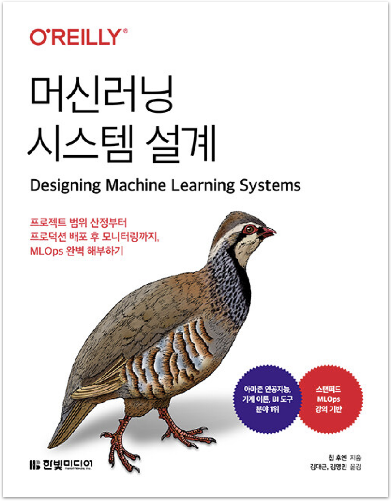

  
  <h1>머신러닝 시스템 설계</h1>
  

    
    
    
  

## 📚 정리 노트

- [2장. 머신러닝 시스템 설계 소개](./ch02.md)
- [3장. 데이터 엔지니어링 기초](./ch03.md)
- [4장. 훈련 데이터](./ch04.md)
- [5장. 피처 엔지니어링](./ch05.md)
- [6장. 모델 개발과 오프라인 평가](./ch06.md)
- [7장. 모델 배포와 예측 서비스](./ch07.md)
- [8장. 데이터 분포 시프트와 모니터링](./ch08.md)
- [9장. 연속 학습과 프로덕션 테스트](./ch09.md)
- [10장. MLOps를 위한 인프라와 도구](./ch10.md)
- [11장. 머신러닝의 인간적 측면](./ch11.md)

---

## 💬 느낀점

<table>
  <thead>
    <tr>
      <th width='10%'>팀원</th>
      <th width='90%'>느낀점</th>
    </tr>
  </thead>
  <tbody>
    <tr>
      <td align='center'><code>펭귄</code></td>
      <td>부스트캠프 이후로 머신러닝을 포함한 인공지능 분야를 거의 접하지 못했는데, 이 책으로나마 비즈니스에서의 머신러닝을 자세히 살펴볼 수 있어서 좋았다. 이 책의 가장 좋은 점은 단순히 모델 학습에만 머물러 있는 것이 아니라 <strong>시스템을 어떻게 단계적으로 구축해나가는지</strong>를 보여주어서 좋았다. 조금 아쉬웠던 건 뒤로 갈수록 내용이 어려워지는데 반해 설명이 자세하지 않아서 아쉬웠다. 그래도 좋은 머신러닝 책이어서 머신러닝을 협업에서 어떻게 사용하는지 궁금하다면 추천하고 싶은 책이다.</td>
    </tr>
    <tr>
      <td align='center'><code>샐리</code></td>
      <td></td>
    </tr>
    <tr>
      <td align='center'><code>튜브</code></td>
      <td>머신러닝 시스템이 어떻게 돌아가는지에 대한 궁금증을 해소해 준 책이었다. 현업 엔지니어가 아니라면 생각해 보기 어려운 것들을 실제 사례를 통해 접할 수 있던 점이 특히 좋았다. 방대한 내용을 축약해서 다루다 보니 설명이 부족하다고 느끼거나, 어떤 주제에 대해서는 논의를 하다가 말고 넘어간다는 느낌을 받았다. 하지만 한편으로는 그만큼 알아야 할 것이 많다는 것이고, 찾아서 공부할 수 있는 주제를 던져주는 것만으로도 이 책의 역할을 어느 정도 다 한 것이라고 생각한다. 일부 번역이나 용어가 조금 부자연스럽다고 느껴진 점은 확실히 아쉬웠다.
    </tr>
  </tbody>
</table>
