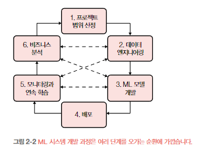

    <h1>2장. 머신러닝 시스템 설계 소개</h1>
    <i>moderated by <a href="https://github.com/opijae">후미</a></i>

---

## 📝 목차

- [비지니스와 머신러닝의 목적](#비지니스와-머신러닝의-목적)
- [머신러닝 시스템 요구 사항](#머신러닝-시스템-요구-사항)
- [반복 프로세스](#반복-프로세스)
- [머신러닝 문제 구조화하기](#머신러닝-문제-구조화하기)
- [지성(AI 모델) vs. 데이터](<#지성(AI-모델)-vs.-데이터>)
- [머신러닝 시스템 설계 소개 챕터 정리](#머신러닝-시스템-설계-소개-챕터-정리)
- [❓ 궁금한 점](#-궁금한-점)

---

## 비지니스와 머신러닝의 목적

### 정확도는 수익성이랑 비례하지 않는다.

> 정확도가 높은 모델보다 돈 잘버는 모델이 좋다. -회사 동료-

- 비지니스 지표에 영향을 주지 않는한 (요구되는 성능 이상이면) 기업들과 사용자는 모델 정확도에는 관심이 없다.
- 따라서 AI 프로그램을 만들 때는 정확도 <<<< 돈을 잘 벌 수 있는 AI 프로그램

## 머신러닝 시스템 요구 사항

### 1. 신뢰성

- AI 모델은 어떠한 input에 대해서도 output이 나옴
- 개와 고양이를 구분하는 모델에 input으로 사람 사진을 넣어도, AI 모델은 output으로 개 또는 고양이라고 예측하는데, 이는 잘못된 output임에도 불구하고, 이러한 경우를 handliing할 수단이 없다.

### 2. 확장성

- AI 모델 뿐만이 아니라, 모든 서비스가 그렇든. 서비스 중인 프로그램은 확장성이 용이해야된다.

### 3. 유지보수성

- AI 모델을 만들기 위해서는 ML 엔지니어, DevOps(MLOps) 엔지니어, 도메인 전문가들이 필요하다.
- 서로 다른 직군의 사람들이 원할히 협력하기 위해, 작업물을 문서화하고 데이터와 모델들을 버전관리 해야된다.

### 4. 적응성

- ML 시스템은 코드 반, 데이터 반으로 구성되어 있다.
- 데이터는 빠르게 변화고, ML 시스템도 이에 맞춰 빠르게 변화해야한다.
- ML 시스템을 빠르게 업데이트 할 수 있도록, 파이프라인을 잘 구축해야된다.

## 반복 프로세스

- ML 시스템은 아래 그림 처럼 반복적이고, 끝이 없는 프로세스이다.
- 이런 반복적이 프로세스를 잘 구축을 해야 ML시스템을 빠르게 업데이트할 수 있다.

> 출처: 머신러닝 시스템 설계 p.70

## 머신러닝 문제 구조화하기

### 해결하고자 하는 문제에 따라 AI모델을 설계 해야된다.

- AI모델의 출력 형식 설정
  - 키를 예측하는 AI 모델의 출력값은 회귀 형식이여야되고
  - 성별을 구분하는 AI 모델의 출력값은 분류 형식으로 나와야된다.
- AI모델의 목적함수(학습 방향)
  - AI모델을 학습 시킬때, 해결하고자 하는 문제를 잘풀 수 있도록 학습해야된다.
  - 잘학습하기 위해서는 목적함수를 잘 설계해야된다.

## 지성(AI 모델) vs. 데이터

- AI모델의 알고리즘도 중요하고, 데이터도 중요하다.
- 오늘날은 Data Centric이 더 중요하다라고 한다.
- AI모델의 크기와 데이터의 수는 점점 증가하고 AI모델 성능 또한 많이 증가하고 있다.
- 하지만 AI 모델이 크다고, 데이터가 많다고 성능이 좋은 AI 모델이 나오는 것은 아니다. 거대 AI모델이 데이터들을 잘 학습할 수 있게 해야되고, 방대한 데이터 중, 품질이 좋은 데이터들을 사용해야된다.

## 머신러닝 시스템 설계 소개 챕터 정리

- 프로젝트 시작전, 왜 이 프로젝트가 필요한지와 요구사항을 생각해야된다.
- ML 시스템은 일회성 작업이 아닌, 반복적인 프로세스다.
- 성능 좋은 AI모델도 중요하지만, 품질 좋은 데이터가 짱이다.

<a href="#-목차">⬆️ 위로 이동</a>

---

## ❓ 궁금한 점

> <strong><i>🐧: 책에서도 모델과 데이터 중 어느 게 더 중요한지가 화두였는데, 개인적으로 어느 게 더 중요하다고 생각하시나요?</i></strong>

- 답변에 관련된 내용은 스터디 하면서 그리고 미리 정리합니다.

<a href="#-목차">⬆️ 위로 이동</a>
