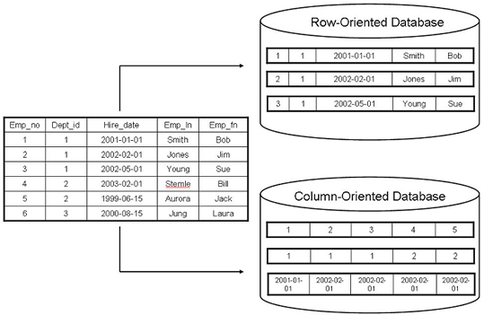
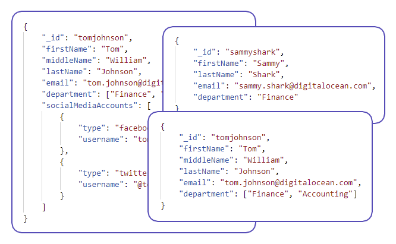
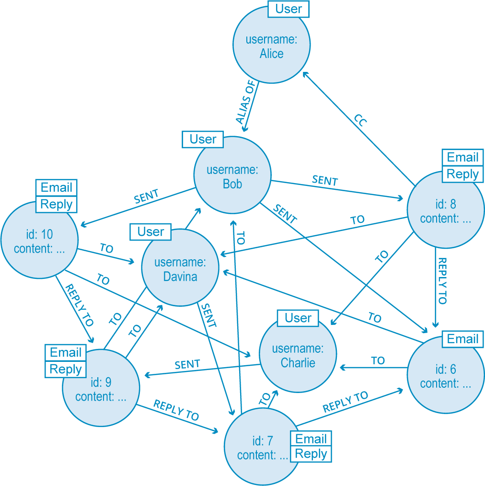
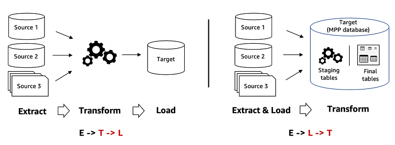
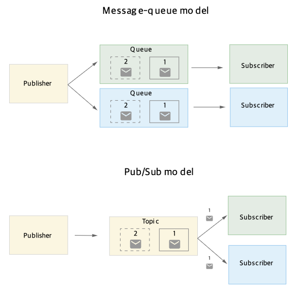

<div align="center">
    <h1>3장. 데이터 엔지니어링 기초</h1>
    <i>moderated by <a href="https://github.com/CoodingPenguin">펭귄</a></i>
</div>

## 📝 목차

- [3.1. 데이터 소스](#31-데이터-소스)
- [3.2. 데이터 포맷](#32-데이터-포맷)
  - [3.2.1. JSON(JavaScript Object Notation)](#321-jsonjavascript-object-notation)
  - [3.2.2. 행 우선 포맷 vs. 열 우선 포맷](#322-행-우선-포맷-vs-열-우선-포맷)
  - [3.2.3. 텍스트 포맷 vs. 이진 포맷](#323-텍스트-포맷-vs-이진-포맷)
- [3.3. 데이터 모델](#33-데이터-모델)
  - [3.3.1. 관계형 모델](#331-관계형-모델)
  - [3.3.2. NoSQL](#332-nosql)
    - [문서 모델 (Document Model)](#문서-모델-document-model)
    - [그래프 모델 (Graph Model)](#그래프-모델-graph-model)
  - [3.3.3. 정형 데이터 vs. 비정형 데이터](#333-정형-데이터-vs-비정형-데이터)
- [3.4. 데이터 스토리지 엔진 및 처리](#34-데이터-스토리지-엔진-및-처리)
  - [3.4.1. 트랜잭션 처리와 분석 처리](#341-트랜잭션-처리와-분석-처리)
  - [3.4.2. ETL: Extract, Tranform, Load](#342-etl-extract-tranform-load)
- [3.5. 데이터플로 모드](#35-데이터플로-모드)
  - [3.5.1. 데이터베이스를 통한 데이터 전달](#351-데이터베이스를-통한-데이터-전달)
  - [3.5.2. 서비스를 통한 데이터 전달](#352-서비스를-통한-데이터-전달)
  - [3.5.3. 실시간 전송을 통한 데이터 전달](#353-실시간-전송을-통한-데이터-전달)
- [3.6. 배치 처리 vs. 스트림 처리](#36-배치-처리-vs-스트림-처리)
- [💬 이야기 주제](#-이야기-주제)

---

## 3.1. 데이터 소스

- **사용자 입력 데이터**는 텍스트, 이미지, 비디오 등 포맷이 다양하며, 사용자가 실수로 입력하는 경우가 있어 철저한 검사화 처리가 필요하다.
- **시스템 생성 데이터**는 시스템의 여러 구성 요소에서 생성되는 데이터로 시스템 로그, 사용자 행동 데이터 등이 있다.
  - 바로 처리가 필요한 데이터가 아니므로 주로 배치 처리를 수행한다.
- **내부 데이터베이스**는 회사의 다양한 서비스 및 엔터프라이즈 애플리케이션에서 생성된 데이터를 말한다. ~~우리가 사용하고 있는 그 데이터베이스입니다~~
- **서드 파티 데이터**는 주로 기업이나 조직 외부에서 수집되고 소유하는 데이터를 말한다. ~~사이트를 돌아다니다 보면 내가 원하는 제품의 광고를 하는 경우~~

## 3.2. 데이터 포맷

### 3.2.1. JSON(JavaScript Object Notation)

```json
{
  "firstName": "Taylor",
  "lastName": "Swift"
}
```

- JavaScript에서 파생되었지만, 현재 대부분의 프로그래밍 언어에서 JSON 생성과 파싱을 지원 중이다.
- key-value 형식으로 데이터를 저장하고, 다양한 수준의 정형 데이터를 처리한다.
- JSON 파일은 텍스트 파일이므로 저장 공간을 많이 차지한다.

### 3.2.2. 행 우선 포맷 vs. 열 우선 포맷



- CSV는 행 우선으로 행의 연속 요소가 메모리에 나란히 저장되지만, Parquet은 열 우선으로 열의 연속 요소가 메모리에 나란히 저장.
- **행 우선 포맷**은 빠른 데이터 쓰기가 가능해, 계속 새로운 데이터를 추가해야하는 상황이라면 행 우선 포맷을 쓰는 게 좋음.
- **열 우선 포맷**은 유연한 열 기반 읽기가 가능해 수많은 컬럼 중 일부 컬럼만 조회하는, 즉 열 기반 읽기를 많이 수행할 때는 열 우선 포맷을 쓰는 게 좋음.

> **Note**
> Pandas는 열 포맷 중심으로 구축되었고, Numpy는 행 우선인지 열 우선인지 지정할 수 있으나 `ndarray`는 생성될 때 기본적으로 행 우선이 된다.

### 3.2.3. 텍스트 포맷 vs. 이진 포맷

- **텍스트 파일**은 일반 텍스트로 된 파일로, 사람이 읽을 수 있음. (ex. CSV, JSON)
- **이진 파일**은 텍스트가 아닌 모든 파일을 지칭하며, 원시 바이트를 해석하는 방법을 알고 있는 프로그램에서 읽거나 사용하기 위한 파일을 말함. (ex. Parquet)
  - 이지 파일은 간결하여 텍스트 파일보다 공간을 절약 할 수 있다.
  - 예를 들어, "1000000"을 텍스트 파일로 저장하면 7바이트가 필요하지만, int32로 이진 파일에 저장하면 4바이트만 필요하다.

## 3.3. 데이터 모델

### 3.3.1. 관계형 모델

- **관계형 모델**에서 데이터는 관계로 구성되며 각 관계는 튜플의 집합이다.
  - **테이블**은 관계를 시각적으로 표현한 것으로 테이블의 각 행이 튜플을 구성한다.
  - 관계에서 행의 순서나 열의 순서를 섞더라도 여전히 동일 관계이므로, 순서가 없다.
- 관계는 정규화하는 편이 좋은 경우가 많다.
  - [[DB] 데이터베이스 정규화(Normalization)에 대하여 | 코딩팩토리](https://coding-factory.tistory.com/872)
- 관계형 데이터베이스에 가장 많이 사용하는 쿼리 언어는 **SQL**이다.
  - 엄밀히 관계는 중복을 포함할 수 없지만 SQL 테이블은 행 중복을 포함할 수 있다.
  - SQL은 선언적 언어이다. 즉, 실제 쿼리가 수행할 때 어떻게 쿼리를 수행할지는 쿼리 옵티마이저가 정한다.

### 3.3.2. NoSQL

- 비관계형 모델의 주요 유형으로는 **문서 모델**과 **그래프 모델**이 있다.

#### 문서 모델 (Document Model)



- **문서 모델**은 문서라는 개념을 기반으로 구축됐으며, 각 문서는 JSON, XML, BSON르로 인코딩된다.
  - 문서 데이터베이스 내 모든 문서는 동일한 포맷으로 인코딩됐다고 가정한다.
  - 각 문서마다 고유한 키가 있어 이 키를 사용하여 문서를 검색하는 데 사용한다.
- 문서 모델은 스키마를 적용하지 않아 종종 **스키마리스(Schemaless) 모델**이라고도 부른다.
  - 하지만 이는 스키마를 강제하지 않는다는 말이고, 이런 책임을 이 데이터를 사용하는 애플리케이션으로 전가한다..
- 문서 모델은 관계형 모델보다 <strong>지역성(Locality)</strong>가 우수하다.
  - 문서 하나에 모든 정보를 저장할 수 있어서 검색이 더 용이해진다.
  - 하지만 관계형 모델과 달리 문서 간 조인이 어렵다.

#### 그래프 모델 (Graph Model)



- **그래프 모델**은 그래프 개념을 기반으로 구축됐으으며, 그래프는 노드와 에지로 구성되고 에지는 노드 간의 관계를 나타낸다.
- 데이터 항목 간의 관계를 우선으로 하기 때문에, 데이터 간의 연결 관계를 나타내고 싶을 때 사용한다.

### 3.3.3. 정형 데이터 vs. 비정형 데이터

| 정형 데이터                             | 비정형 데이터                          |
| :-------------------------------------- | :------------------------------------- |
| 스키마가 명확히 정의됨                  | 스키마를 따르지 않아도 됨              |
| 검색 및 분석이 편함                     | 전처리 등을 하지 않고 바로 저장이 가능 |
| 특정 스키마를 따르는 데이터만 처리 가능 | 어떤 소스에서 온 데이터든 처리 가능    |
| 스키마 변경이 많은 문제를 야기함        | 스키마 변경을 아직 걱정하지 않아도 됨  |
| 데이터 웨어하우스에 저장                | 데이터 레이크에 저장                   |

## 3.4. 데이터 스토리지 엔진 및 처리

### 3.4.1. 트랜잭션 처리와 분석 처리

- <strong>OLTP(Online Transaction Processing)</strong>은 온라인 뱅킹, 쇼핑 등 동시에 발생하는 다수의 트랜잭션을 처리한다.
  - 트랜잭션에는 사용자가 관련되는 경우가 많으므로 레이턴시는 낮고 가용성은 높아야한다.
  - 일반적으로 트랜젝션 데이터베이스는 <strong>ACID(Atomicity, Consistency, Isolation, Durability)</strong>를 준수하려 한다.
- <strong>OLAP(Online Analytical Processing)</strong>은 대용량의 데이터를 고속으로 다차원 **분석**을 수행한다.

### 3.4.2. ETL: Extract, Tranform, Load



## 3.5. 데이터플로 모드

실제 프로덕션에서는 여러 개의 프로세스가 실행 중이고, 메모리를 공유하지 않은 서로 다른 프로세스 간에 데이터를 전달하는 경우가 많다.

### 3.5.1. 데이터베이스를 통한 데이터 전달

- **한 프로세스에서 데이터베이스에 데이터를 쓰고 다른 프로세스에서 데이터를 읽는 식**으로 데이터를 전달한다.
- 데이터베이스를 공유할 수 없거나 레이턴시 이슈로 인해 잘 쓰이지 않는 것 같다.

### 3.5.2. 서비스를 통한 데이터 전달

- 네트워크롤 통해 데이터를 전달하는 방법으로, <strong>REST(Representational State Transfer)</strong>와 <strong>RPC(Remote Procedure Call)</strong> 요청 방식이 있다.
- REST는 **네트워크를 통항 요청을 위해 설계**된 반면, RPC는 **원격 네트워크 서비스에 대한 요청이 프로그래밍 언어로 ㅎ마수나 메서드를 호출하는 것과 동일하게 보이도록** 한다.

### 3.5.3. 실시간 전송을 통한 데이터 전달

- 이벤트 기반(Event-driven) 방식으로 실시간으로 이벤트를 브로드캐스트하는 방식을 말한다.
  - [[우아콘2020] 배달의민족 마이크로서비스 여행기](https://youtu.be/BnS6343GTkY?t=1145)
- 실시간 정송 유형으로는 **PubSub**과 **메시지 큐**가 있다.



## 3.6. 배치 처리 vs. 스트림 처리


- <strong>배치 처리(Batch Processing)</strong>은 데이터를 배치 작업에서 처리하는 것을 말하며, [MapReduce](https://hadoop.apache.org/docs/stable/hadoop-mapreduce-client/hadoop-mapreduce-client-core/MapReduceTutorial.html), [Apache Spark](https://spark.apache.org/) 같은 분산 시스템이 고안되었다.
- <strong>스트림 처리(Stream Processing)</strong>은 스트리밍 데이터에 대한 계산을 의미하며, 관련 엔진으로는 [Apache Flink](https://flink.apache.org/), [KSQL](https://ksqldb.io/), [Spark Streaming](https://spark.apache.org/docs/latest/streaming-programming-guide.html)이 있다.

<sup><a href="#-목차">⬆️ 위로 이동</a></sup>

---

## 💬 이야기 주제

> <strong><i>😀: 데이터를 저장할때, DB vs. file 중 어떤 형식을 선호하시는지 궁금합니다.</i></strong>

> <strong><i>😀: 데이터 읽고 쓰기를 할때, 시간이 오래 걸렸고 (해결했으면) 경험 공유</i></strong>

> <strong><i>🐤: 현업에서는 데이터를 철저히 정규화하여 저장하나요? 책에 쓰여진대로, 분산된 데이터를 조인하는 데에 비용이 많이 들 것 같은데, 어떤 조건으로 분리하는게 좋을지 얘기해보면 좋을 것 같습니다. (쿼리 옵티마이저는 기업에서 자체 제작해야하는지?)</i></strong>

> <strong><i>🐤: 정형데이터보다 비정형데이터에서 유용한 정보를 취득하기 더 어려워보입니다. 데이터는 규칙이 있어야 데이터를 뽑아쓸 수 있지 않나요? 규칙이 있다는건 결국 정형데이터와 같은거 아닌가요? </i></strong>

<sup><a href="#-목차">⬆️ 위로 이동</a></sup>
