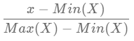
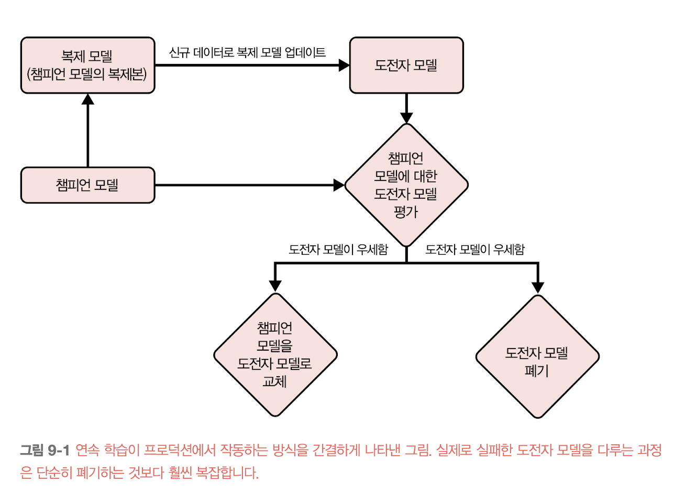

    <h1>5장. 피처 엔지니어링</h1>
    <i>moderated by <a href="https://github.com/peacecheejecake">튜브</a></i>

## 📝 목차

- [📝 목차](#-목차)
- [5.1 학습된 피처 vs. 엔지니어링된 피처](#51-학습된-피처-vs-엔지니어링된-피처)
- [5.2 피처 엔지니어링 기법](#52-피처-엔지니어링-기법)
  - [5.2.1 결측값 처리](#521-결측값-처리)
  - [5.2.2 스케일링](#522-스케일링)
  - [5.2.3 이산화](#523-이산화)
  - [5.2.4 범주형 피처 인코딩](#524-범주형-피처-인코딩)
  - [5.2.5 피처 교차](#525-피처-교차)
  - [5.2.6 이산 및 연속 위치 임배딩](#526-이산-및-연속-위치-임배딩)
- [5.3 데이터 누수](#53-데이터-누수)
  - [5.3.1 일반적인 원인](#531-일반적인-원인)
  - [5.3.2 검출](#532-검출)
- [5.4 좋은 피처를 설계하는 방법](#54-좋은-피처를-설계하는-방법)
  - [5.4.1 피처 중요도](#541-피처-중요도)
  - [5.4.2 피처 일반화](#542-피처-일반화)
- [💬 이야기 주제](#-이야기-주제)

(⭐️ 작성 후에 목차도 추가해주세요!)

---

## 5.1 학습된 피처 vs. 엔지니어링된 피처
- 피처 엔지니어링: 사용할 정보를 선택하고 이 정보를 ML 모델에서 사용하는 포맷으로 추출하는 프로세스
- 딥러닝은 스스로 유용한 피처를 추출하는 것을 학습한다. -> 딥러닝을 '피처 학습'이라고도 한다.
- 하지만 프로덕션용 ML에서 모든 피처를 자동화하려면 아직 멀었다!
  - (아직) 대부분의 모델은 딥러닝이 아니다.
  - 매우 많은 피처를 사용하는 경우 피처 엔지니어링이 필요하다. (예: 틱톡에서 동영상 추천을 위해 수백만 개의 피처를 사용한다.)
  - 트랜잭션 이상 거래 여부를 예측하는 등의 task는 반드시 도메인 지식을 기반으로 해야한다.

## 5.2 피처 엔지니어링 기법

### 5.2.1 결측값 처리
- 프로덕션에서 일부 데이터는 결측되어 있다!
- 유형
  - 비무작위 결측 (MNAR, Missing Not At Random)
    - 결측값이 발생한 이유가 `그 값 자체`에 있다. 
      🌵 소득을 신고하지 않은 응답자가 소득을 신고한 응답자보다 소득이 더 높은 경향이 있다.
  - 무작위 결측 (MAR, Missing At Random)
    - 결측값이 발생한 이유가 `다른 관측 변수`에 있다. 
      🌵 성별이 'A'인 응답자의 연령 값이 더 많이 누락된 이유는 'A' 성별의 응답자가 연령 공개를 원치 않아서일 수도 있다.
  - 완전 무작위 결측 (MCAR, Mssing Completely at Random)
    - 결측값 발생에 패턴이 없다. 
      🌵 설문 조사 응답자가 실수로 값을 빠뜨린 경우가 있을 수 있다. 
    - 이러한 경우는 매우 드물다. (사실 이유가 있는데 모르는 것일 수 있다.)
- 처리 방법
  - 결측값 삭제 (Deletion)
    - 열 삭제
      - 많은 값이 누락된 `변수`를 제거한다. 
      - 결측값이 많다고 중요한(상관관계가 높은) 정보를 제거하면 모델의 정확도를 낮출 수도 있다. 
        🌵 주택 구매를 예측하는데, 혼인 상태 변수를 제거하면 예측 정확도가 낮아진다.
    - 행 삭제
      - 많은 값이 누락된 `샘플`을 제거한다.
      - 결측값이 완전 무작위(MCAR)이며 삭제할 샘플이 적을 때(약 0.1% 미만) 유용하다.
      - 결측값이 비무작위(MNAR)인 경우, 모델이 예측을 수행하는 데 필요한 중요한 정보도 사라질 수 있다. 
        🌵 소득을 신고하지 않은 응답자가 소득을 신고한 응답자보다 소득이 더 높은 경향이 있다면, 누락된 사실 자체를 예측에 이용할 수 있다.
      - 결측값이 무작위(MAR)인 경우, 모델에 편향이 발생한다. 
        🌵 'A' 성별이 연령 공개를 원치 않아 연령 정보가 없는데, 그 이유로 연령이 없는 샘플을 삭제한다면 'A' 성별 샘플을 모두 잃는다.
  - 결측값 대치 (Imputation)
    - 결측값을 특정 값으로 채우는 방법
    - 어떤 값으로 채울까?
      - 기본값(예를 들어, 문자열이라면 `""`) → 일반적인 방법
      - 평균, 중앙값, 최빈값 등 가장 일반적인 값
    - 일반적으로 가증한 값으로 결측값을 채우지 않은 것이 좋다. 
      🌵 자녀 수는 0일 수 있는데 이 피처의 결측값을 0으로 채우면 안 된다.
  - 결측값 삭제와 대치를 동시에 사용할 수 있다!

### 5.2.2 스케일링
- 각 변수의 단위는 다른데, 모델은 그 차이를 모르기 때문에 피처를 유사한 범위로 스케일링해야 한다.
- 적은 노력으로 모델 성능 향상을 이끌어 낼 수 있는 방법이지만, 스케일링을 하지 않으면 모델(특히 고전적인 알고리즘)이 엉뚱한 예측을 할 수도 있다.
- 변수의 최소, 최댓값을 기준으로 임의의 범위 [a, b]에 있도록 하는 방법 (Normalization)

- 정규 분포를 따른다고 가정하고 평균과 단위 분산이 각각 1, 0이 되도록 정규화하는 방법 (Standarization)

- 데이터의 비대칭 분포를 완화하기 위해 일반적으로 로그 변환(log transformation)을 적용한다.
- 주의 사항
  - 스케일링은 흔히 데이터 누수의 원인이 된다.
  - 전역 통계치가 필요한 경우가 많다. → 신규 데이터가 기존 학습 데이터와 다른 통계를 가진다면 재학습이 필요하다.
- [왜, 언제 스케일링(standardization, min-max)를 수행해야 할까?](https://syj9700.tistory.com/56)

### 5.2.3 이산화
- 연속형 피처를 불연속형 피처로 바꾸는 과정으로, 주어진 값에 대한 버킷을 생성해서 그룹화한다.
- 이산화를 통해 모델이 학습해야 할 범주를 줄일 수 있다.
  🌵 소득을 '저소득', '중간 소득', '고소득'으로 나누면 범주는 무한 개에서 3개로 줄어든다. 
- 학습 데이터가 제한된 경우에 더 유용하다.
- 범주 경계에서 불연속성을 발생시키기 때문에 상식, 기본 분위수, 도메인 전문 지식 등을 활용해서 경계를 잘 선택해야 한다.
- 실제로 이산화가 도움이 되는 경우는 거의 없다. (??)

### 5.2.4 범주형 피처 인코딩
- 프로덕션에서는 범주가 변화한다. 모델이 이전에 본 적없는 범주는 기존의 방법으로 적절히 인코딩할 수 없다. 
  🌵 아마존에 실시간으로 입점하는 신규 브랜드는 서로 다르지만 모델은 모두 같은 `UNKNOWN`으로 처리할 수 밖에 없다. 
  🌵 신규 계정, 신규 제품 유형, 신규 웹사이트 도메인, 신규 음식점, 신규 회사, 신규 IP 등
- 해싱 트릭
  - [Vowpal Wabbit](https://vowpalwabbit.org/) 패키지에 의해 대중화됐다.
  - 해시 함수를 사용해 각 범주의 해시 값을 생성하고, 그 값을 인덱스로 활용한다.
  - 해시 공간을 지정하면 현재 범주가 몇 개인지 관계 없이 피처에 대해 인코딩된 값의 개수를 미리 고정할 수 있다.
  - 해시 충돌이 문제지만 그 영향은 그리 크지 않다. (피처 중 50%가 충돌하더라도 로그 손실은 0.5% 미만으로 증가)
  - [참고](https://haehwan.github.io/posts/sta-Hashing/)

### 5.2.5 피처 교차
- 둘 이상의 피처를 결합해 새로운 피처를 생성하는 기법
- 변수 간의 비선형 관계를 모델링하는 데 유용하다. 
  🌵 12개월 내 주택 구매 여부를 예측할 때, 자녀 수는 혼인 상태와 상관관계가 있을 것으로 보아 '혼인 상태 및 자녀 수'라는 신규 피처를 생성한다.
- 선형 회귀, 로지스틱 회귀 등의 모델에서는 필수적이다.
- 딥러닝은 피처 사이의 비선형 관계를 학습할 수는 있지만, 명시적 피처 교차를 통해 딥러닝이 비선형 관계를 학습하는 것을 가속화할 수 있다.
- 주의 사항
  - 피처 공간이 폭발할 수 있다. (🌵 각각 100가지 값이 있는 두 피처를 교차하면 값이 10000개인 피처가 된다.) 학습을 위해 더 많은 데이터가 필요할 수 있다.
  - 과적합이 발생할 수 있다. 모델이 사용하는 피처 수가 증가하기 때문이다.

### 5.2.6 이산 및 연속 위치 임배딩
- 위치 임배딩
  - "Attention Is All You Need"를 시작으로 NLP와 컴퓨터 피전에서 표준 데이터 엔지니어링 기술로 자리잡았다.
  - 순환 신경망은 단어 임베딩을 순차적으로 처리하지만, 트랜스포머 같은 모델은 단어가 병렬로 처리되어 단어 위치 정보가 필요하다.
    - 신경망은 단위 분산(분산=1)을 가지고 있지 않은 입력값에는 잘 작동하지 않는 특성이 있기 때문에 절대 위치(0, 1, 2, ...)는 좋은 방법이 아니다.
  - 위치 임베딩은 일반적으로 단어 임베딩과 차원이 동일하므로, 위치 임베딩과 단어 임베딩을 합산하는 방식으로 위치 임베딩을 학습할 수 있다.
  - 고정 위치 임베딩
    - "Attention Is All You Need"는 요소가 짝수 인덱스에 있으면 사인 함수를, 홀수 인덱스에 있으면 코사인 함수를 사용한다.
    - 고정 위치 임베딩은 푸리에 피처로 알려진 방식의 특수한 경우이다. 푸리에 피처는 좌표를 입력으로 사용하는 작업에서 모델 성능을 향상시키는 것으로 알려져 있다.

## 5.3 데이터 누수
* 학습 시 레이블 정보가 누수되는 현상이다. 추론 시에는 이 레이블 정보가 없다면 모델의 성능은 떨어질 수 밖에 없다. 
  🌵 환자 사진을 통해 코로나19 위험을 예측하는 모델은 특정 병원에서만 사용한 글꼴을 인식하는 것으로 나타났다. 
  🌵 폐암 예측 모델은 의사가 폐암 확률이 높아 보이는 환자를 해상도가 더 좋은 장비로 보내는 것을 학습했다.

### 5.3.1 일반적인 원인
* 시간 대신 무작위로 시간적 상관 데이터를 분할한 경우
  * 많은 경우 데이터는 시간 상관관계가 있다.
  * 시간 상관관계는 주식 데이터처럼 명확한 경우도 많지만, 그렇지 않은 경우도 많다. 
  🌵 어떤 가수가 세상을 떠나면 사람들이 그 가수의 노래를 들을 가능성이 훨씬 올라간다.
  * 가능한 시간별로 학습, 검증, 테스트 데이터를 분할해야 한다.
* 분할 전 스케일링을 수행한 경우 / 테스트 분할의 통계치로 결측값을 채운 경우
  * 모든 데이터를 대상으로 낸 통계치를 기반으로 스케일링을 수행한 다음 데이터를 분할하면, 테스트 샘플의 정보가 학습 과정에 누출된다.
  * 마찬가지로, 모든 데이터를 대상으로 낸 통계치를 기반으로 결측치를 대체해도 데이터 누수가 발생한다.
* 분할 전 데이터 중복을 제대로 처리하지 않은 경우
  * 데이터 중복으로 인해 같은 데이터가 학습과 테스트 데이터에 모두 포함된 경우가 있을 수 있다.
* 그룹 누수 / 데이터 생성 과정에서 누수가 생긴 경우
  * 강한 레이블 상관관계를 갖는 데이터 포인트(그룹)들이 다른 분할로 나뉘어 들어가는 경우 
  🌵 환자가 일주일 간격으로 폐 CT를 두 번 촬영했는데, 하나는 학습 데이터에, 다른 하나는 테스트 데이터에 있는 경우 
  🌵 동일한 물체를 밀리초 단위로 찍은 사진이 서로 다른 분할에 들어가는 경우
  * 데이터가 어떻게 생성됐는지 잘 이해하고 데이터를 분할해야 한다.
  * 데이터를 정규화해 소스가 서로 다른 데이터의 분포를 같게 한다. 
  🌵 CT 장비별로 출력 이미지 해상도가 다를 때 해상도를 동일하게 맞춘다.
  * 데이터 수집 및 사용 방법에 대해 많은 정보를 갖고 있는 도메인 전문가를 ML 설계 프로세스에 영입한다.

### 5.3.2 검출
- 타깃 변수(레이블)에 대한 각 피처(혹은 피처 그룹)의 예측 검정력을 측정한다.
  - 피처의 상관관계가 지나치게 높다면 해당 피처가 생성되는 방식과 상관관계가 적절한지 조사해야 한다.
  - 피처가 독립적으로 데이터 누수를 포함하지 않아도 여러 피처가 같이 데이터 누수를 발생시킬 수 있다. 
  🌵 근속 기간을 예측하는 모델에서, 시작 날짜와 종료 날짜 각각은 어렵지만 둘을 합친다면 근속 기간에 대한 정보를 얻을 수 있다.
- 특정 피처 제거 시 모델 성능이 크기 저하된다면 해당 피처가 왜 중요한지 조사한다.
- 신규 피처를 추가했을 때 모델 성능이 크게 향상됐다면 피처가 정말 좋기 때문일 수도 있지만, 해당 피처에 레이블 정보가 유출됐기 때문일 수도 있다.
- 테스트 분할은 하이퍼파라미터 튜닝 이외의 목적으로는 함부로 사용하지 않아야 한다.

## 5.4 좋은 피처를 설계하는 방법

### 5.4.1 피처 중요도
- (XGBoost에서 구현된) 내장 피처 중요도 함수: 고전적인 ML 알고리즘을 사용할 때 쉽게 사용할 수 있다.
  - [Feature selection : feature importance vs permutation importance](https://hwi-doc.tistory.com/entry/Feature-selection-feature-importance-vs-permutation-importance)
- SHAP: 모델 전체에 대한 피처 중요도를 측정할 뿐만 아니라, 모델의 특정 예측에 대한 피처 기여도를 각각 측정한다.
  - [\[개념정리\]SHAP(Shapley Additive exPlanations)](https://velog.io/@sjinu/%EA%B0%9C%EB%85%90%EC%A0%95%EB%A6%ACSHAPShapley-Additive-exPlanations)
- [InterpretML](https://interpret.ml/)
  - [InterpretML: Another Way to Explain Your Model](https://towardsdatascience.com/interpretml-another-way-to-explain-your-model-b7faf0a384f8)

### 5.4.2 피처 일반화
- 피처 커버리지
  - 해당 피처 값이 있는(결측값이 아닌) 샘플의 비율
  - 일반적으로 커버리지가 높은 피처가 유용하지만, 데이터 대부분이 결측값이어도 유용한 경우(특히 결측값이 무작위가 아닌 경우)가 있다. 
  🌵 피처 커버리지가 1%이지만 피처가 있는 샘플의 99%가 POSITIVE 레이블이 있는 경우
  - 피처 커버리지가 학습 분할과 테스트 분할 간에 많이 다르다면 데이터 분할 방식이 타당한지, 이 피처가 데이터 누수의 원인인지 조사해야 한다.
- 피처 값 분포
  - 어떠한 피처에 대해 학습 분할과 테스트 분할의 분포가 다르면 이 피처는 모델 성능을 저하시킨다.
- 피처 일반화 측정은 피처 중요도 측정보다 훨씬 덜 과학적이며, 통계 지식 외에도 직관과 도메인 지식이 필요한 영역이다.

---

## 💬 이야기 주제

> <strong><i>🐧: 왜 펭귄은 귀여울까요?</i></strong>
