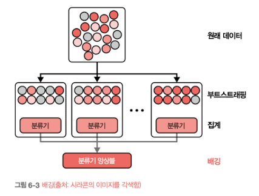

    <h1>6장. 모델 개발과 오프라인 평가</h1>
    <i>moderated by <a href="https://github.com/CoodingPenguin">펭귄</a></i>

## 📝 목차

- [💬 이야기 주제](#-이야기-주제)

(⭐️ 작성 후에 목차도 추가해주세요!)

---

> **모델 개발은 반복 프로세스입니다. 반복이 끝날 때다 모델 성능을 비교해봐야 하죠. 이번 반복 단계 결과물의 성능이 이전 반복 단계와 비교해서 프로덕션 환경에 얼마나 적합할지 평가합니다.**

## 6.1. 모델 개발과 훈련

### 6.1.1. 머신러닝 모델 평가

문제에 대한 모델을 선택할 때는 가용한 모델 전체가 아니라 **문제에 일반적으로 적합한 모델 집합**에 집중해야 한다.

- `예시 1` 유해한 트윗을 탐지하는 시스템 개발한다고 할 때, 해당 문제는 텍스트 분류 문제이므로 나이브 베이즈, 로지스틱 회귀, 순환 신경망, 트랜스포머 기반 모델을 사용한다.
- `예시 2` 이상 거래 탐지 시스템을 개발한다고 할 때, 전형적인 이상 탐지 문제이므로 k-최근접 이웃, 아이솔레이션 포레스트, 클러스트링, 신경망 등의 알고리즘을 사용한다.

#### 최첨단만 추종하는 함정에 빠지지 않기

- 최첨단 모델이 의미하는 바는 **"일부 정적 데이터셋에서 기존 모델보다 성능이 더 좋다"**는 뜻이다.
- 즉, 내가 가지고 있는 데이터에서는 성능이 잘 안 나올 수도 있다는 의미이다.

#### 가장 단순한 모델부터 시작하기

- 단순한 모델을 선택하면 배포하기 쉽고 복잡하지 않기 때문에 디버깅하기 수월하다.
- 단, 단순하다는 의미가 항상 노력이 최소한으로 드는 모델을 의미하는 것은 아니다.
  - 사전 훈련된 BERT 모델은 시작하기 쉬울 수 있다.
  - 하지만 성능을 개선하려고 할 때 모델 자체가 복잡하기 때문에 개선하기에 많은 노력이 든다.

#### 모델을 선택할 때 사람의 편향을 주의하기

- 모델 평가 과정에는 사람의 편향이 들어갈 수 밖에 없다.
- 그렇기 때문에 서로 다른 아키텍처를 비교할 때는 비교 가능한 설정 아래에서 비교하는 것이 좋다.
  - 예를 들어, A 모델은 실험을 100회 수행했는데 B 모델은 실험을 5회만 수행했다면 비교가 되지 않는다.

#### 현재 성과와 미래 성과를 비교 평가하기

- 현재 최적인 모델은 두 달 후에도 최적이 아닐 수 있다.
- 이 때 학습 곡선으로 데이터가 늘어남에 따라 모델 성능이 어떻게 변할지 가늠해볼 수 있다.
  - 훈련 데이터 증가에 따라 성능이 정확히 얼마나 향상될지 추정은 못 하지만 성능상 이점이 있을지 대략적으로 파악이 가능하다.

#### 트레이드오프를 평가하기

모델을 선택할 때 수많은 **트레이드오프**를 고려해야 한다.

- `ex1` FP(False Positive) vs FN(False Negative)
  - 지문 잠금 해제의 경우 모르는 사람이 지문 잠금을 해제하는 것이 더 위험하기 때문에 FP가 적어야 한다.
  - 코로나 19 선별 검사의 경우 코로나에 걸린 사람이 아니라고 판단하는 것이 더 위험하기 떄문에 FN이 적어야 한다.
- `ex2` 연산량 요구 사항 vs 정확도
  - 복잡한 모델은 정확도가 높지만 예측값을 짧은 처리 시간 내에 내려면 CPU보다는 GPU를 사용해야 한다.
- `ex3` 해석 가능성 vs 성능
  - 복잡한 모델은 성능이 좋지만 결과를 해석하기 어렵다.

#### 모델의 가정을 이해하기

- 현실은 모델보다 훨씬 복잡하고 모델은 이를 어느 정도 근사를 할 뿐이다.
- 모든 모델은 자신만의 가정이 있으며, 이를 잘 이해하면 상황에 맞는 모델이 무엇인지 판단할 수 있다.

다음은 흔히 사용하는 가정을 나열한 것이다.

> **예측 가정**
> 입력 X에서 Y를 예측하는 것이 목표인 모델은 X를 기반으로 Y를 예측할 수 있다.

> **IDD(Independent and Identically Distributed)**
> 신경망에서 모든 데이터 포인트가 동일한 결합 분포에서 독립적으로 추출되었다고 가정한다.

> **매끄러움(Smoothness)**
> 입력 X가 출력 Y를 생성한다면 에 가까운 입력값은 비례적으로 Y에 가까운 출력값을 생성한다.

> **계산 가능성(Tractability)**
> X는 입력이고 Z는 X의 잠재 표현이라고 할 때 생성 모델은 확률 $P(Z|X)$를 계산할 수 있다.

> **경계(Boundaries)**
> 선형 분류기는 결정 경계가 선형이라고 가정한다.

> **조건부 독립(Conditional Independence)**
> 나이브 베이즈 분류기는 정해진 클래스에 대해 속성값들이 상호 독립이라고 가정한다.

> **정규 분포(Normally Distributed)**
> 많은 통계정 방법론은 데이터가 정규 분포를 따른다고 가정한다.

### 6.1.2. 앙상블

성능을 향상하기 위한 방법 중 하나로 여러 개의 모델을 앙상블하는 방법이 있다. 이 때 앙생블내의 각 모델을 기본 학습기(base learner)라고 한다.

앙상블은 배포가 복잡하고 유지 관리가 어려워 프로덕션에서 선호되지는 않지만 광고 클릭률 예측 같이 성능이 조금만 향상돼도 금전적 이ㄷ그이 큰 경우 자주 사용되가도 한다.

다음과 같이 3개의 분류기로 앙상블을 수행하여 보팅(voting)을 통해 판단한다고 할 때 얻을 수 있는 결과는 다음과 같다.

이 때 모든 분류기가 서로 상관관계가 없다면, 앙상블의 정확도는 **0.784(0.343 + 0.441)**이다.

#### 배깅

데이터셋이 주어지만 전체 데이터셋으로 하나의 분류기를 훈련하는 대신 복원 추출을 수행해 얻은 각 데이터셋으로 모델을 훈련한다.

- 분류 문제에서는 다수결 투표로 최종 예측값을 결정하고 회귀 문제에서는 예측값의 평균을 내 결정한다.
- 배깅은 신경망, 분류 및 회귀 트리 등 **불안정성이 높은 모델의 성능을 개선**한다.
- 배깅을 사용하는 대표적인 모델로 랜덤 포레스트가 있다.

#### 부스팅

앙상블을 구성하는 각 학습기는 동일한 샘플 집합으로 학습을 수행하는데, 매 반복마다 잘못 분류된 샘플에 더 높은 가중치를 부여하며 반복 학습을 수행한다.

부스팅을 사용하는 모델의 예로 그래디언트 부스팅 머신(GVM)이 있다.

#### 스태킹

훈련 데이터로 기본 학습기를 훈련하고, 기본 학습기의 출력을 결합해 최종 예측을 수행하는 메타 학습기를 만든다. 메타 학습기에서는 다수결 투표 혹은 평균 투표를 수행해 최종 예측갑을 결정한다.

이 때 기본 학습기로 서로 다른 종류의 모델 집합을 사용할 수 있다.

### 6.1.3. 실험 추적과 버전 관리

실험 진행 상황과 결과를 추적하는 과정을 **실험 추적**이라고 하며, 나중에 재현하거나 다른 실험과 비교할 목적으로 실험의 모든 세부 정보를 기록하는 프로세스를 **버전 관리**라고 한다.

#### 실험 추적

실험 추적시 모든 추적 지표를 고려하는 것은 좋지만 대부분 살펴보지 않아도 되는 것들이다. 실험 추적 지표는 디버깅의 단초를 제공하므로 필요한 항목을 추려서 추적하는 것이 좋다.

실험 추적 지표의 예로 다음이 있다.

- 손실 곡선
- 모델 성능 지표
- 샘플, 예측값, 그라운드 트루스 레이블 쌍에 대한 로그
- 모델 훈련 속도
- 시스템 성능 지표
- 매개변수와 하이퍼파라미터

#### 버전 관리

ML 시스템은 **코드와 데이터**로 이루어진 것이므로, 코드 뿐만 아니라 데이터도 버전을 지정해야 한다. 데이터를 버전 관리하면 좋지만 다음과 같은 어려움으로 인해 실제 버전 관리를 하는 사람은 많지 않다.

- `이유 1` 데이터가 종종 코드보다 훨씬 크기 때문에 코드 버전 전략을 데이터 버전 관리에 동일하게 사용하기가 어렵다.
- `이유 2` diff를 어떻게 정의할지 명확하지 않고 의견이 분분하기 때문이다.
- `이유 3` 데이터 보호 규정(GDPR) 때문에 버전 관리가 어렵다.

### 6.1.4. 분산 훈련

#### 데이터 병렬 처리

데이터 벙렬 처리는 각 작업자가 모델 전체를 복제해와 모든 계산을 수행한다. 이때 가장 어려운 문제는 **서로 다른 머신에서 계산한 그래디언트를 어떻게 정확하고 효과적으로 합산할 것**인지이다.

- **동기식 확률적 경사 하강법(Synchronous Stochastic Gradient Descent)**을 사용한다면 작업 속도가 노른 머신 하나가 전체 시스템의 속도를 늦출 수 있다.
  - 이런 문제는 **낙오자 문제(Straggler Problem)**라고 한다.
- **비동기식 확률적 경사 하강법(Asynchronous Stochastic Gradient Descent)**을 사용한다면 한 머신의 그래디언트가 다른 머신의 그래디언트를 입수하기 전에 가중치를 바꿔버리기 때문에 최신이 아닌 그래디언트를 적용할 수 있다.
  - 이런 문제를 **그래디언트 부패(Gradient Staleness)**라고 한다.

가중치 수가 많은 경우 그래디언트 업데이트가 회소하게 이뤄는 경향이 있어 같은 가중치를 수정할 가능성이 낮아지므로 그래디언트 부패 문제가 줄어든다.
즉, 가중치 수가 많은 경우 동기식이나 비동기식 SGD 모두 유사하게 수렴한다.

이렇게 데이터를 병렬 처리하는 경우 배치 크기가 매우 중요하다.

#### 모델 병렬 처리

모델 병렬 처리는 모델의 각기 다른 구성 요소를 서로 다른 머신에서 훈련하는 것을 말한다.

- 실제로 병렬로 실행되지는 않음 -> 머신1에 첫 번째 레이어 머신2에 두번재레이어 할당하면 머신2는 머신1이 끝나길 기다려야함

파이프라인 병렬 처리는 서로 다른 머신에 있는 모델의 서로 다른 구성 요소돌이 좀 더 병렬화해 처리되도록 고안한 방법이다.

### 6.1.5. 오토ML

> 현재: ML 전문 지식 + 데이터 + 연산 능력
> 우리가 가고자 하는 방향: 솔루션 = 데이터 + 100배의 연산 능력

오토ML이란 실제 문제를 풀기 위해 ML 알고리즘 탐색 프로세스를 자동화하는 것을 말한다.

#### 소프트 오토ML: 하이퍼파라미터 조정

하이퍼파라미터란 사용자가 제공하는 매개변수로 학습률, 배치 크기, 은닉층 수, 은닉 유닛 수, 드롭아웃 확률 등 학습 과정을 제어하는 데 사용하는 값을 말한다.

https://arxiv.org/abs/1707.05589
에 따르면 구식 모델에 하이퍼파라미터가 잘 조정돼 있으면 최신 모델보다 구식 모델이 더 우수할 수 있다.

auto-sklearn, keras tuner, tune 등의 유틸리티를 통해 하아퍼파라미터를 자동화하고 있음

모델 성능은 여러 하이퍼파라미터보다 특정 하이퍼파라미터 변경에 더 민감하므로 민감한 하이퍼파라미터 수정은 신중해야 한다.

#### 하드 오토ML: 아키텍처 탐색과 학습된 옵티마이저

모델의 서로 다른 구성 요소 혹은 모델 전체를 하이퍼 파라미터로 간주하는 것.
ex. 합성곱 레이어 크기 or 스킵 레이어 유무 등을 하이퍼파라미터의 일종으로 생각.

이런 것을 연구하는 분야를 신경망 아키텍처 탐색(Neural Architecture Search, NAS)라고 한다.
= 최적의 신경말 모델 아키텍처를 탐색한다

NAS 설정의 세가지 요소

- 탐색 공간: 가능한 모델 아키텍처의 범위
- 성능 추정 전략: 각 아키텍처 후보를 밑바닥부터 수렴할 때까지 훈련할 필요 없이 성능을 평가할 수 있어야 한다.
- 탐색 전략: 탐색 공간을 탐험 (ex. 무작위 탐색, 강화학습, 진화)

NAS의 경우 탐색 공간이 이산 형태 구성 단위의 집합을 NAS에게 제공해야 한다. (ex. 다양한 크기와 여러 종류의 합성곱, 선형, 풀링, ...)

옵티마이전를 NAS의 구성 단위에 포함 시켜 잘 작동하는 것을 탐색하면 되지만, 옵티마이저는 하이퍼파라미터 설정에 민감하고 기본 하이퍼파라미터가 아키텍처 후보 전체에 두루 잘 동작하지 X

=> 업데이트 규칙을 정하는 함수를 옵티마이저 대신 신경망으로 대체
=> 옵티마이저조차도 신경망이므로 학습이 필요
=> 학습된 옵티마이저는 나머지 신경망과 동일한 데이터셋에서 훈련 가능
=> 이렇게 하면 작업할 때마다 옵티마이저를 새로 훈련해야 함

그래서 기존 작업 집합으로 옵티마이저를 한 번 더 학습시켜서 새로운 작업마다 사용하게 한다.

=> 옵티마이저 학습 시
손실 함수 = 기존 작업의 한산 소실

## 6.2. 모델 오프라인 평가

평가 방법은 개발과 프로덕션 환경 간에 동일해야 한다.
but 개발 환경은 Ground Truth 테이블이 있지만 프로덕션ㅇ에는 없어서 현실적으로 어려움
프로덕션 환경에서 모델 성능을 직접 평하기 어렵 => 성능 변화와 오류 탐지를 위해 모니터링 수행

배포 후에는 프로덕션 환경에서 모델을 계속 모니터링하고 테스트

### 6.2.1. 베이스라인

평가 지표 자체로는 크게 의미가 없다.
모델을 평ㄱ가할 때는 평가 기준을 정확히 알아야 한다.
유스 케이스마다 다르지만 유요한 베이스라인은 다음과 같다.

무작위 베이스라인: 무작위로 예측
단순 휴리스틱: 
0 규칙 베이스라인: 단순 휴리스틱의 특수 -> 가장 흔항 클래스로 예측
인간에 의한 베이스라인: 전문가와 비교
기존 솔루션: ㄱ기존 솔류션과 비교

좋은 시스템과 유용한 시스템을 구분
좋은 시스템이 반드시 유용하 것은 아니며 나쁜 시스템이 반드시 유용하지 않은 것도 안디ㅏ.

### 6.2.2. 평가 방법

모델 평가 시 성능 지표가 중심
유용한 평가 방법 예시

#### 교란 테스트
잡음이나 소음 추가
무작위 클립

#### 불변성 테스트

입력에 특정 변경을 적용했을 때 출력이 변해서는 안 됨
나머지 입력은 동일하게 유지하고 민감 정보만 변경해 출력이 바뀌는지 확인
더 좋은 방법은 모델 훈련에 사용한 피처에서 민감 정보를 최우선으로 제외하는 것

#### 방향 예상 테스트

입력에 특정 변경을 적용했을 떄 출력이 예측 가능한 방향으로 변해야 한다.

#### 모델 보정

미묘하지만 중요한 개념
예측 시스템에서 매우 중요한 속성

#### 신뢰도 측정

개별 예측의 유용성에 대해 임곗값을 생각해보는 방식

#### 슬라이스 기반 평가

데이터를 하위 집합으로 분리하고 각 하위 집ㅎ바마다 모델의 개별 성능으 ㄹ확인하는 것을 의미

모델이 서로 다른 데이터 ㅅㄹ라이스에서 동일하게 수행돼야 할 때 다르게 수행된다는 점

모델이 서로 다른 데이터 슬라이스에서 다르게 수행돼야 할 때도 동일하게 수행된다는 점

---

## 💬 이야기 주제

> <strong><i>🐧: 왜 펭귄은 귀여울까요?</i></strong>
