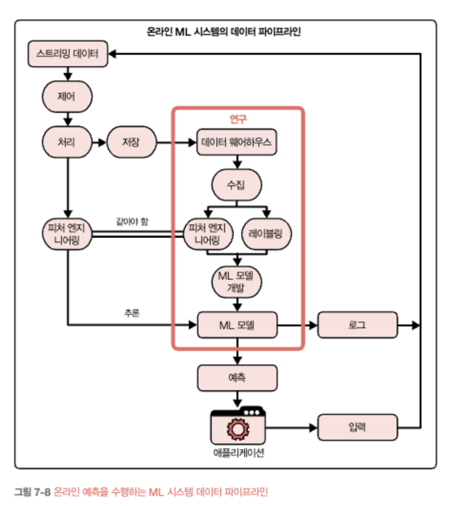

    <h1>7장. 모델 배포와 예측 서비스</h1>
    <i>moderated by <a href="https://github.com/bsm8734">샐리</a></i>

---

## 📝 목차

- [7.1. 머신러닝 배포에 대한 통념](#71-머신러닝-배포에-대한-통념)
  - [7.1.1. 통념1: 한 번에 한두 가지 머신러닝 모델만 배포합니다.](#711-통념1-한-번에-한두-가지-머신러닝-모델만-배포합니다)
  - [7.1.2. 통념2: 아무것도 하지 않으면 모델 성능은 변하지 않습니다.](#712-통념2-아무것도-하지-않으면-모델-성능은-변하지-않습니다)
  - [7.1.3. 통념3: 모델을 자주 업데이트할 필요 없습니다.](#713-통념3-모델을-자주-업데이트할-필요-없습니다)
  - [7.1.4. 통념4: 대부분의 머신러닝 엔지니어는 스케일에 신경 쓰지 않아도 됩니다.](#714-통념4-대부분의-머신러닝-엔지니어는-스케일에-신경-쓰지-않아도-됩니다)
- [7.2. 배치 예측 vs. 온라인 예측](#72-배치-예측-vs-온라인-예측)
  - [7.2.1 배치 예측에서 온라인 예측으로](#721-배치-예측에서-온라인-예측으로)
  - [7.2.2. 배치 파이프라인과 스트리밍 파이프라인의 통합](#722-배치-파이프라인과-스트리밍-파이프라인의-통합)
- [7.3. 모델 압축](#73-모델-압축)
  - [7.3.1. 저차원 인수분해](#731-저차원-인수분해)
  - [7.3.2. 지식 증류](#732-지식-증류)
  - [7.3.3. 가지치기](#733-가지치기)
  - [7.3.4. 양자화](#734-양자화)
- [7.4. 클라우드와 에지에서의 머신러닝](#74-클라우드와-에지에서의-머신러닝)
  - [7.4.1. 에지 디바이스용 모델 컴파일 및 최적화(컴파일러 사용 방법)](#741-에지-디바이스용-모델-컴파일-및-최적화컴파일러-사용-방법)
  - [7.4.2. 브라우저에서의 머신러닝(브라우저 사용 방법)](#742-브라우저에서의-머신러닝브라우저-사용-방법)
- [7.5. 정리](#75-정리)

---

## 7.1. 머신러닝 배포에 대한 통념

### 7.1.1. 통념1: 한 번에 한두 가지 머신러닝 모델만 배포합니다.

- 실제 기업에서는 수많은 ML 모델을 보유하며, 단일 모델은 실제 상황에서 제대로 돌아가지 않는 경우가 많다.

### 7.1.2. 통념2: 아무것도 하지 않으면 모델 성능은 변하지 않습니다.

- ML은 아무런 변화가 없으면 점점 성능이 저하된다.
- ML 시스템은 프로덕션에서 모델이 접하는 데이터 분포가 훈련된 데이터 분포와 다를 때 데이터 분포 시프트 문제를 겪는다.

### 7.1.3. 통념3: 모델을 자주 업데이트할 필요 없습니다.

- 모델 성능은 시간에 따라 저하되므로 최대한 빨리 업데이트 해야한다.
- 넷플릭스는 하루에 수천 회, AWS는 11.7초마다 배포한다고 한다.

### 7.1.4. 통념4: 대부분의 머신러닝 엔지니어는 스케일에 신경 쓰지 않아도 됩니다.

- 통계에 따르면, ML 관련 직업을 구한다면 직원이 100명 이상인 회사에서 일할 가능성이 높으며, 따라서 ML 애플리케이션을 확장할 수 있어야한다.

<a href="#-목차">⬆️ 위로 이동</a>

## 7.2. 배치 예측 vs. 온라인 예측

### 배치 예측

- 예측이 주기적으로 혹은 트리거될 때마다 생성되는 경우
- 예측 결과를 저장소에 저장해두고 필요할때마다 저장된 예측결과를 제공하는 방식이다.
- ex. 넷플릭스는 네 시간마다 모든 사용자에 대한 영화 추천을 생성하고, 사용자가 로그인할 때 사전 계산된 추천을 가져와서 표시해준다.
- 배치 예측은 요청과 비동기식으로 생성되므로 `비통기 예측`이라고도 한다.

### 온라인 예측

- 예측에 대한 요청이 도착하는 즉시 예측이 생성되고 반환되는 경우
- 예측 요청은 요청과 동기식으로 생성되므로 `동기식 예측`이라고도 한다.
- 온라인 예측과 배치 예측은 함께 사용되기도 한다.

### 스트리밍 예측

- 실시간으로 전송되는 데이터(피처)를 사용하는 예측
- ex. 스트리밍 피처: 지난 10분 동안 해당 건 외에 들어온 주문 건수. 가용 배달 인력 명수

**스트리밍 피처 vs. 온라인 피처**

- 온라인 피처는 온라인 예측에 사용되는 모든 피처를 의미하며, 여기에는 메모리에 저장된 배치 피처도 포함된다.
- 온라인 예측의 예시로 세션 기반 추천이 있으며, 일반적으로 아이템 임베딩을 사용한다. 아이템 임베딩은 보통 배치 처리로 사전 계산하여 온라인 예측이 필요할때마다 가져오므로, 스트리밍 피처가 아닌 온라인 피처로 간주된다.

**배치 예측과 온라인 예측의 주요 차이점**

### 7.2.1 배치 예측에서 온라인 예측으로

- 온라인 예측 vs. 배치 예측
  - 온라인 예측은 예측을 생성하는 데 오래 걸릴 수 있다.
  - 배치 예측은 복잡한 모델의 추론 레이턴시를 줄이기 위한 트릭으로 사용될 수 있다.
  - 배치 예측은 예측을 많이 생성하되 결과가 즉시 필요하지는 않을 때 유용하다.
  - 배치 예측은 모델이 사용자의 선호도에 덜 민감하다.
  - 배치 예측은 예측을 생성할 요청을 미리 알아야 만들 수 있다.
  - 배치 예측은 온라인 예측의 비용이 높거나 느릴 때 유용하다.
- 최근 동향
  - 하드웨어가 발전하며 더 빠르고 저렴하게 온라인 예측을 할 수 있게 되었고, 기업들도 배치 예측에서 온라인 예측으로 전환하는 추세이다.
  - 온라인 예측의 레이턴시 이슈를 극복하기 위한 두가지 요소
    - 실시간 파이프라인: 수신 데이터로 작업하고 필요에 따라 스트리밍 피처를 추출하고 실시간으로 예측을 반환해야한다.
    - 빠른 모델 추론 속도: 사용자가 만족할 만한 속도로 예측을 생성하는 모델이 필요하다.

### 7.2.2. 배치 파이프라인과 스트리밍 파이프라인의 통합

- 훈련에서 배치 예측, 추론에서 스트리밍 예측

  - 온라인 예측에서 주로 배치 계산을 사용하다가 최근에 스트리밍 예측을 도입한 기업의 경우, 위처럼 별도의 스트리밍 파이프라인을 구축해야한다.
  - 훈련에서 피처가 배치 계산되는 반면, 추론 중에는 스트리밍 프로세스에서 계산되는 방식
  - 훈련과 추론에 서로 다른 파이프라인이 있는 경우, ML 프로덕션에 버그가 발생하는 원인이 된다.
    - ex. 한 파이프라인의 변경 사항이 다른 파이프라인에 제대로 복제되지 않아, 두 파이프라인에서 서로 다른 피처 집합 두 개가 추츨되는 경우

- 스트림 처리와 배치 처리를 통합한 방식
  - 피처 스토어를 사용하면 배치 피처와 예측에 사용되는 스트리밍 피처간 일관성을 보장할 수 있다.
  - 통합방식 예시
    

<a href="#-목차">⬆️ 위로 이동</a>

## 7.3. 모델 압축

- 추론 레이턴시를 줄이기 위한 3가지 접근 방식
  1. 추론을 더 빠르게 한다.
  2. 모델을 더 작게 만든다. 👈
  3. 배포된 하드웨어가 더 빠르게 실행하도록 한다.

### 7.3.1. 저차원 인수분해

- 고차원 텐서를 저차원 텐서로 대체하는 방법
- 파라미터가 많은 합성곱 필터를 소형 합성곱 필터로 대체한다.
- ex. MobileNet
  - 크기 $K \times K \times C$인 표준 합성곱을 *깊이별 합성곱*과 _점별 합성곱_($1 \times 1 \times C$)로 분해하면 매배변수가 8~9배 감소(K는 커널 크기, C는 채널 갯수)

### 7.3.2. 지식 증류

- 작은 모델(학생)이 더 큰 모델(교사)의 앙상블을 모방하도록 훈련하는 방법으로, 배포할 대상은 더 작은 모델이다.
- 교사와 학생 네트워크 산에 아키텍처가 달라도 관계없이 작동한다는 장점이 있다.
- 교사 네트워크의 가용성에 크게 의존한다는 단점이 있다.
  - 사전 훈련된 모델을 교사 모델로 사용하면 학생 네트워크를 훈련하는 데 필요한 데이터가 적고 훈련이 빠르다.
  - 반면 사용 가능한 교사 모델이 없다면 학생 네트워크를 훈련하기 전에 교사 네트워크를 훈련해야하며, 교사 네트워크를 훈련하는 데는 더 많은 데이터와 학습 시간이 필요하다.
  - 게다가 애플리케이션과 모델 아키텍처에도 민감해서 널리 사용되지 않는다.

### 7.3.3. 가지치기

- 중요하지 않은 트리 섹션을 제거하는 의사결정 트리에 사용된 방법으로, 분류 작업에 중요하지 않거나 중복된 트리 부분을 제거한다.
- 신경망에 과도하게 많은 매개변수를 줄여, 워크로드를 줄일 수 있다.
- 신경망에서의 가지치기의 두가지 의미
  1. 신경망 전체 노드를 제거함으로써 아키텍처를 변경하고 매개변수를 줄이는 방법
  2. 총 매개변수를 줄이는 것이 아닌, 예측에 덜 유용한 매개변수를 찾아 0으로 설정하는 방법(일반적)
     - 이 방법은 신경망의 아키텍처가 그대로 유지된다.
     - 신경망이 더 희소해지며, 밀집 구조보다 저장 공간이 덜 필요한 경향이 있다.(모델 크기 감소 효과)
     - 실험에 따르면, 훈련된 네트워크에서 매개변수를 90% 이상 줄여, 전체 정확도를 손상하지 않으면서 스토리지 요구사항을 줄이고 추론 계산 성능을 계산한다고 한다.
- 가지치기의 주요 가치는 상속된 '중요한 가중치'가 아니라 가지치기된 아키텍처 자체에 있다는 의견도 존재한다.

### 7.3.4. 양자화

- 매개변수를 나타내는 데 더 적은 비트를 사용함으로써 모델 크기를 줄이는 모델 압축 방식
- 부동소수점(FP32) > 반정밀도(FP16) > 고정 소수점, 정수(8비트)
- 양자화는 메모리 풋프린트를 줄일 뿐 아니라 계산 속도도 향상시킨다.
- 배치 크기를 늘릴 수 있으며, 정밀도가 낮을수록 계산 속도가 빨라져 훈련 시간과 추론 레이턴시가 더욱 단축된다.
- 비트 수를 줄이면 나타낼 수 있는 값의 범위가 줄어드는 단점이 있다.
  - 반올림 오차로 인해 성능이 변한다.
  - 언더플로, 오버플로로 반올림 혹은 스케일링하면 값을 0으로 만들 위험이 있다.

<a href="#-목차">⬆️ 위로 이동</a>

## 7.4. 클라우드와 에지에서의 머신러닝

- 클라우드 배포의 장단점
  - 클라우드 서비스가 발전하여 많은 기업이 손쉽게 ML을 클라우드 서비스를 활용해 배포한다.
  - 클라우드 배포는 비용이 높은 단점이 있어, 점점 더 많은 기업이 에지 디바이스에서 컴퓨팅을 수행할 방법을 찾고 있다.
- 에지 컴퓨팅의 장단점
  - 에지 컴퓨팅은 클라우드 컴퓨팅이 불가능한 곳에서 애플리케이션을 실행할 수 있다.
  - 모델이 이미 소비자의 디바이스에 있으면 네트워크 레이턴시에 대한 우려가 줄어든다.
  - 민감한 사용자 데이터를 처리할 때 이점이 있다.
  - 모델 계산을 에지로 이동하려면 에지 디바이스가 계산을 처리할 수 있을 만큼 강력해야 한다.
  - ML 모델을 저장하고 메모리에 올리기에 충분한 메모리가 있어야한다.
  - 전력 소모가 크다.

### 7.4.1. 에지 디바이스용 모델 컴파일 및 최적화(컴파일러 사용 방법)

- ML 워크로드에서 하드웨어 백엔드로 매핑하려면 하드웨어 설계를 활용할 줄 알아야 한다.
- 하드웨어 백엔드에 따라 메모리 레이아웃과 계산 기본 단위가 다르다.
  
- 1차원 벡터의 합성곱 연산자를 수행하는 일은 2차원 벡터와 매우 다르다.
- CPU, GPU, TPU를 효율적으로 사용하려면 서로 다른 L1, L2, L3 레이아웃과 버퍼 크기를 고려해야한다.
- 이러한 이유로 프레임워크가 일부 하드웨어만 지원하고, 하드웨어도 일부 프레임워크만 지원한다.

#### IR

- 모든 신규 하드웨어 백엔드를 위한 새로운 컴파일러와 라이브러리를 직접 개발하는 대신, 중개자, 중간표현(IR)을 이용한다.
- 프레임워크 개발자는 프레임워크 코드를 중개자로 변환하고, 하드웨어 공급업체는 중개자 하나만 지원하면 된다.
- IR은 컴파일러 작동 방식의 핵심에 있다.
  - 컴파일러는 하드웨어 백엔드에 네이티브 코드를 생성하기 전에 일련의 고수준 및 저수준 IR을 생성한다.(위의 그림처럼)
  - lowering: 고수준의 프레임워크를 저수준의 하드웨어 네이티브 코드로 낮춘다는 의미이다.
    - 프레임워크 코드와 네이티브 코드 간에 일대일 매핑을 하는 것이 아니므로 번역이 아님
  - 고수준 IR: ML 모델의 계산 그래프

#### 모델 최적화

- 선택한 하드웨어에서 모델을 실행하기 위해 코드를 '낮추'고 나면 성능 문제가 발생할 수 있다.
- 실행될 수는 있으나 효율적으로 실행되지는 않을 수 있다.
  - 데이터 지역성이나 하드웨어 캐시를 활용하지 않아, 코드 속도를 향상하는 벡터나 병렬 작업 등 고급 기능을 활용하지 않을 수 있다.
  - 일반적인 ML 워크플로에서 사용되는 많은 프레임워크나 라이브러리는, 개별 함수들은 최적화되어도 프레임워크 전반에 걸친 최적화는 거의 수행되지 않을 수 있다.
  - 판다스 및 텐서플로를 사용하는 일반 ML 워크로드는 수동으로 최적화된 코드에 비해 느리게 동작한다.
- 최적화 엔지니어는 ML과 하드웨어 아키텍처에 대한 전문지식을 모두 갖춰야한다.
- ML 모델을 최적화하는 방법
  - 로컬 최적화: 모델의 연산자나 연산자 집합을 최적화한다.
  - 전역 최적화: 전체 계산 그래프를 end-to-end로 최적화한다.
- 모델 속도를 높이는 표준 로컬 최적화 기법
  - 보통 작업을 병렬화하거나 칩의 메모리 액세스를 줄인다
  - **방법1) 벡터화**
    - 루프가 있는 경우, 한 번에 한 항목씩 실행하는 대신, 메모리에 인접한 여러 요소를 동시에 실행하여 데이터 I/O로 인한 레이턴시 감소
  - **방법2) 병렬화**
    - 입력 배열이 주어지면 이를 독립적인 청크로 나눠, 각 청크가 개별적으로 수행될 수 있도록 한다.
  - **방법3) 루프타일링**
    - 루프에서 데이터 액세스 순서를 변경해 하드웨어의 메모리 레이아웃과 캐시를 활용(only CPU)
  - **방법4) 연산자 융합**
    - 중복 메모리 액세스를 방지하기 위해 여러 연산자를 하나로 통합

#### 머신러닝을 사용해 모델 최적화하기

- 경험을 바탕으로 모델의 계산 그래프를 가장 잘 실행하는 방법에 대한 휴리스틱 생각해내기
  - 최적이 아닐 수 있다.
  - 신규 프레임워크, 신규 하드웨어에서 프로세스를 반복하려면 시간과 노력이 필요하다.
- 가능한 모든 방법으로 계산 그래프를 실행해보고 가장 좋은 방법을 선택하기
  - 실제로 전부 실행시켜보는게 아닌, 경로가 얼마나 걸릴지 예측하는 방법이 있다.
  - 전체가 실행되는 데 걸리는 시간을 추정하는 것은 어려우니, 부분 그래프의 크기와 가능한 경로를 바탕으로 시간을 측정하는 방법을 사용한다.

### 7.4.2. 브라우저에서의 머신러닝(브라우저 사용 방법)

- 브라우저에서 ML 모델을 실행하면 어떤 하드웨어 백엔드에서든 실행 가능한 코드를 생성할 수 있다.
- 모델을 자바스크립트로 컴파일하는 데 도움이 되는 도구: Tensorflow.js, 시냅틱, brain.js
- 여러 언어로 작성된 프로그램을 웹 브라우저상에서 실행하도록 해주는 개방형 표준: WASM(웹어셈블리)

<a href="#-목차">⬆️ 위로 이동</a>

## 7.5. 정리

- 온라인 예측을 사용하며 모델이 사용자의 선호도 변경에 더 잘 반응하지만 추론 레이턴시라는 문제가 있다.
- 배치 예측은 모델이 에측을 생성하는 데 너무 오래 걸릴 때 해결책이 되지만 모델 유연성이 떨어진다.
- 클라우드에서 추론을 수행하며 설정하기는 쉽지만 네트워크 레이턴시와 클라우드 비용이 커지면 실용성이 떨어진다.
- 에지에서 추론을 수행하려면 충분한 연산 성능, 메모리 및 배터리를 갖춘 에지 디바이스가 필요하다.

<a href="#-목차">⬆️ 위로 이동</a>
