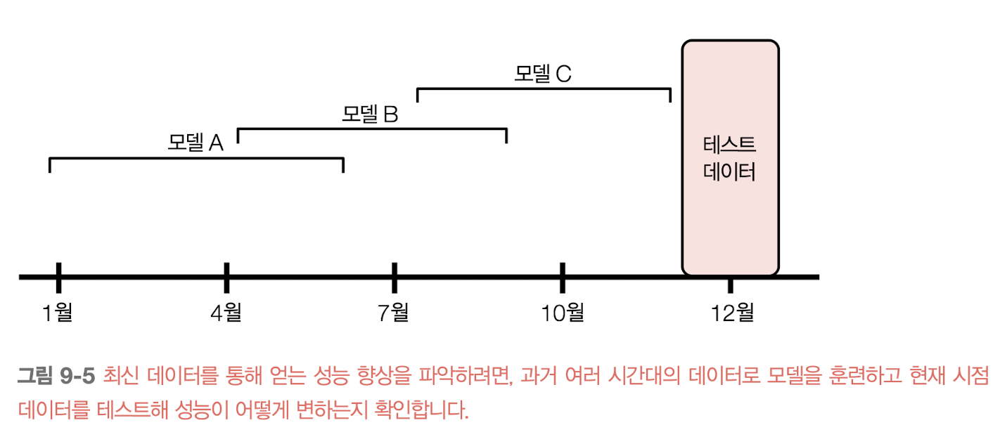
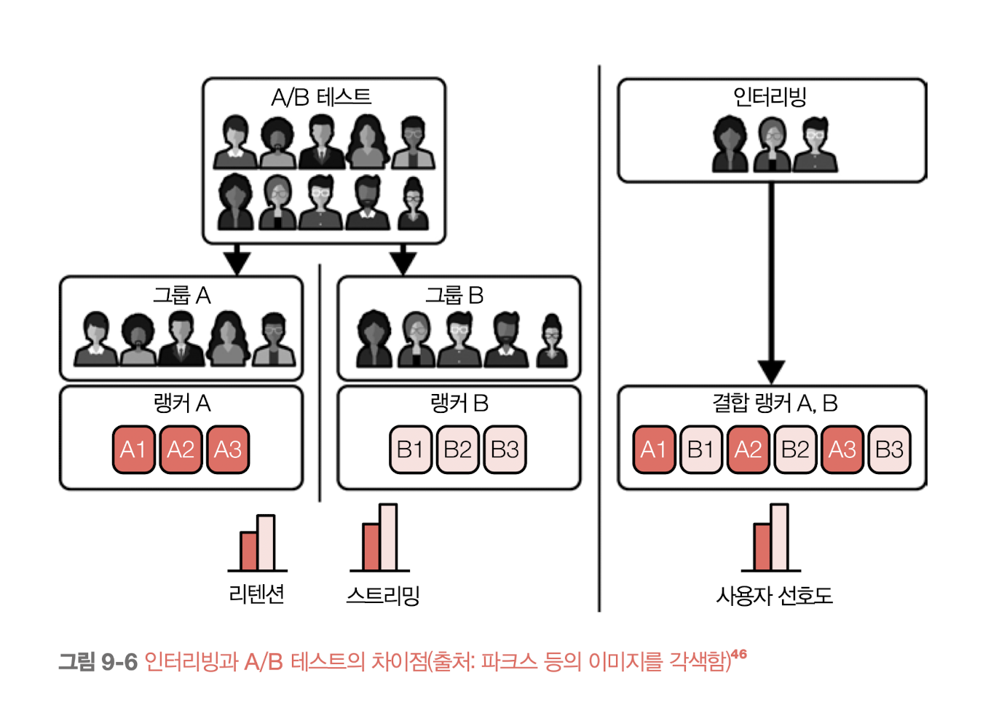

    <h1>9장. 연속 학습과 프로덕션 테스트</h1>
    <i>moderated by <a href="https://github.com/CoodingPenguin">펭귄</a></i>

## 📝 목차

- [9.1. 연속 학습](#91-연속-학습)
  - [9.1.1. 무상태 재훈련 vs. 상태 유지 훈련](#911-무상태-재훈련-vs-상태-유지-훈련)
  - [9.1.2. 연속 학습의 필요성](#912-연속-학습의-필요성)
  - [9.1.3. 연속 학습의 난제](#913-연속-학습의-난제)
  - [9.1.4. 연속 학습의 네 단계](#914-연속-학습의-네-단계)
  - [9.1.5. 모델 업데이트 빈도](#915-모델-업데이트-빈도)
- [9.2. 프로덕션에서 테스트하기](#92-프로덕션에서-테스트하기)
  - [9.2.1. 섀도 배포](#921-섀도-배포)
  - [9.2.2. A/B 테스트](#922-ab-테스트)
  - [9.2.3. 카나리 배포](#923-카나리-배포)
  - [9.2.4. 인터리빙 실험](#924-인터리빙-실험)
  - [9.2.5. 밴딧](#925-밴딧)

---

## 9.1. 연속 학습

연속 학습은 다음과 같은 과정으로 이루어진다.

1. 기존 모델(= 챔피언 모델)의 복제본을 생성해 신규 데이터로 업데이트한다.
2. 업데이트된 복제본(= 도전자 모델)과 기존 모델을 비교한다.
3. 업데이트된 복제본이 더 좋은 성능을 내는 경우, 복제본으로 기존 모델을 교체한다.
4. 기존 모델이 더 좋은 성능을 내는 경우, 복제본을 폐기한다.

연속 학습이라는 용어로 오해가 있을 수 있지만, 연속 학습은 **적은 양의 데이터(ex. 512개, 1024개)로 업데이트를 진행**하며 상황에 따라 다르지만 **너무 자주 모델을 업데이트**하지 않는다.

### 9.1.1. 무상태 재훈련 vs. 상태 유지 훈련

<strong>무상태 재훈련stateless retraining</strong>은 **모델을 매번 처음부터 훈련하는 방법**을 말하며, <strong>상태 유지 훈련stateful training</strong>(미세 조정fine-tuning 혹은 증분 훈련incremental training라고도 불림)은 **신규 데이터로 모델 훈련을 지속하는 방법**을 말한다.

연속 학습 시 상태 유지 훈련을 수행하며, 상태 유지 훈련은 다음과 같은 장점이 있다.

- 무상태 재훈련보다 더 적은 양의 데이터로 모델을 업데이트 할 수 있다.
- 그럽 허브에 따르면 상태 유지 훈련을 하면 **모델이 더 빠르게 수렴하고 필요한 연산 비용도 훨씬 적다**고 한다.
- 개인 정보가 포함된 데이터와 같이 민감 데이터를 사용한다면, 데이터를 완전히 저장하는 일을 피할 수 있어 상태 유지 훈련이 괜찮을 수 있다.

상태 유지 훈련은 데이터 반복Data iteration시에만 적용할 수 있는 방법이며, 모델 반복Model iteration 시에는 처음부터 훈련을 수행해야 한다.

> **💡 모델 반복과 데이터 반복**
>
> - 모델 반복(Model iteration): 기존 모델 아키텍처에 새로운 피처가 추가되거나 모델 아키텍처가 변경되는 것
> - 데이터 반복(Data iteration): 모델 아키텍처와 피처는 동일하게 유지되지만 신규 데이터로 모델을 갱신하는 것

### 9.1.2. 연속 학습의 필요성

연속 학습이 필요한 이유는 다음과 같다.

- `이유 1` 갑자기 발생하는 시프트에 대처하기 위해
  - ex. 승차 공유 서비스의 가격 결정 모델 + 특정 이벤트로 인해 한가한 지역에 사람이 몰리는 경우
- `이유 2` 희귀한 사건에 적응하기 위해
  - ex. 전자 상거래 서비스의 고객 행동 예측 모델 + 블랙프라이데이
- `이유 3` 지속 콜드 스타트continuous cold start 문제에 대처하기 위해
  - ex. OTT 서비스의 콘텐츠 추천 모델 + 신규 사용자 혹은 접속한지 오래된 사용자

### 9.1.3. 연속 학습의 난제

연속 학습을 성공적으로 적용한 기업이 있으나 이를 적용하기 쉽지 않다. 그 이유로는 다음과 같다.

#### 신규 데이터 액세스 난제

짧은 주기로 모델을 업데이트 하기 위해서는 매 주기마다 새로운 데이터가 필요하지만 이를 확보하기 쉽지 않다.

- 신규 데이터가 데이터 웨어하우스에 적재되고 거기서 데이터를 가져오기까지 시간이 소요된다.
- 이를 해결하기 위해 카프카나 키네시스와 같은 **스트리밍 서비스**를 사용해 데이터를 수급할 수 있다.

모델 업데이트를 하기 위해서는 신규 데이터에 대한 레이블링이 필요하지만, 레이블링하는 속도가 모델 업데이트 속도에 병목 현상을 일으킨다.

- 레이블링 시 추천시스템을 통해 레이블을 얻는데, 이때 사용자 행동 로그, 시스템 로그 등 다양한 로그를 쿼리한 후 최종적으로 레이블을 추천하게 된다.
- 이러한 프로세스를 레이블 계산label computation이라고 하며, 로그가 늘어날수록 비용이 높아진다.
- 이 방식을 배치 처리를 통해 추출할 수 있으나 배치 처리가 끝날 때까지 기다려야 하므로, 앞서 스트리밍 서비스를 이용해 직접 레이블을 추철하는 방법을 사용한다.

#### 평가 난제

업데이트된 모델이 기존 모델을 대체하고 배포할만한 모델인지 판단하기 쉽지 않다.

- 모델을 자주 업데이트할수록 업데이트가 실패할 기회가 더 많아진다.
  - ex. 수백만 명의 소수 집단이 부당하게 대출을 거부당한 사례
- 모델을 조정된 조작과 적대적 공격에 더 취약하게 만든다.
  - ex. 2016년 마이크로소프트에서 출시한 챗본 테이가 트롤들로 인해 혐오 발언을 하게 된 사례

#### 알고리즘 난제

매우 빠르게(ex. 매시간) 업데이트하고자 하는 행렬 기반 모델과 트리 기반 모델의 경우 사용하는 알고리즘으로 인해 연속 학습 적용이 어려울 수 있다.

- 협업 필터링 모델을 사용하는 경우 차원 축소 단계가 느려 모델을 자주 업데이트하기 쉽지 않다.
- 평균, 분산과 같은 통계량을 사용해 피처를 확장해야 하는 경우가 많은데, 이러한 통계량을 계산하려면 전체 데이터셋을 봐야한다.
  - 부분 통계는 전체 통계와 다를 수도 있고 전체 데이터에 대해 통계량을 근사한다 하더라도 여기서 시간이 많이 소요된다.

### 9.1.4. 연속 학습의 네 단계

연속 학습을 적용하는 네 단계에 대해 알아보자.

#### 1단계: 수동 무상태 재훈련

초기에는 가능한 많은 비즈니스 문제를 해결하기 위해 **신규 모델 개발**에 주력한다. 기존 모델을 업데이트 하는 경우는 다음 두 가지가 충족될때만 수행한다.

1. 모델 성능이 가져오는 득보다 실이 클 때
2. 기존 모델을 업데이트할 수 있는 시간이 있을 경우

#### 2단계: 자동 재훈련

프로덕션의 몇 개의 모델이 안정적으로 적용되고 **기존 모델의 유지/보수가 필요하다는 생각이 들 때** 수동 업데이트를 하기보다는 배치 프로세스를 통해 모델을 주기적으로 개선한다.

업데이트 스크립트를 작성하고 스크립트를 자동으로 실행하도록 워크플로우를 짠다.

1. 데이터를 가져온다.
2. 필요 시 데이터를 다운샘플링하거나 업샘플링한다.
3. 피처를 추출한다.
4. 레이블링 작업과 그에 대한 처리를 수행해 훈련 데이터를 생성한다.
5. 훈련 과정을 시작한다.
6. 새로 훈련한 모델을 평가한다.
7. 모델을 배포한다.

스크립트를 작성에 영향을 미치는 요소로는 **스케줄러, 데이터, 모델 스토어**가 있다.

- **스케줄러**는 작업 스케줄링을 처리하는 도구로, [Airflow](https://airflow.apache.org/)나 [Argo](https://argoproj.github.io/)와 같은 스케줄러를 사용하면 좋다.
- 모델에서 사용할 **데이터의 요구사항**(ex. 데이터 조인, 피처 추출 등)에 따라 스크립트 작성 시간이 오래 걸릴 수 있다.
- **모델 스토어**는 모델을 재현하는 데 필요한 모든 아티팩트를 자동으로 버전화하고 저장하는 곳을 말한다. 예를 들어, [AWS의 SageMaker](https://aws.amazon.com/ko/sagemaker/), [Databricks의 ML Flow](https://mlflow.org/)가 있다.

> **💡 피처 재사용(Log and wait)**
>
> 신규 데이터는 이미 예측 서비스를 통해 모델에 입력할 피처를 추출한 상태이다. 이 피처를 예측용으로만 쓰지 않고 이를 저장한 후 추후에 모델 재훈련에 재사용을 하는데, 이를 <strong>피처 재사용(Log and wait)</strong>라고 한다.  
> 이 방법을 사용하면 계산 비용을 절약하고 예측과 훈련 간의 일관성을 갖게 할 수 있다.

#### 3단계: 자동 상태 유지 훈련

자동 재훈련은 매번 처음부터 훈련을 수행하기 때문에 비용이 높았다. 이 비용 개선이 필요하다는 생각이 들면 **자동 상태 유지 훈련**을 도입한다. 자동 재훈련에서 작성한 스크립트를 이전 체크포인트부터 모델을 다시 훈련하도록 수정한다.

여기서 가장 중요한 것은 **데이터 및 모델 계보**를 추적하는 것이다. 모델을 재현하고 디버깅하기 위해서는 "모델이 시간에 따라 어떻게 발전했는지", "어떤 모델이 기본 모델로 사용됐는지" 등을 파악해야 하는데 이때

모델을 재현하고 디버깅하기 위해서는 모델이 시간에 따라 어떻게 발전했는지, 어떤 모델이 기본 모델로 사용됐는지 등을 파악하기 위해서이다.

#### 4단계: 연속 학습

갑작스런 이벤트가 자주 발생하고 업데이트 주기가 다가오기 전에 업데이트를 자주 하게 된다면, 그때 **연속 학습**을 도입한다.

이때 업데이트 주기를 고정하지 않고 트리거(ex. 모델 성능이 떨어질 때, 레이블링된 데이터 총량이 5% 증가할 때 등)가 발생하면 모델이 자동으로 업데이트되도록 한다.

이렇게 트리거 매커니즘이 작동하려면 견고한 모니터링 솔루션과 모델 평가 파이프라인이 필요하다.

### 9.1.5. 모델 업데이트 빈도

모델 업데이트 주기는 **신규 데이터로 모델을 업데이트 했을 때 성능이 얼마나 향상되는지**를 파악한 후 정해야 한다.

#### 신규 데이터의 가치

모델 성능이 얼마나 향상되었는지 파악하는 방법 중 하나는 **과거 여러 시간대의 데이터로 모델을 훈련하고 현재 시점 데이터로 평가해 성능이 어떻게 편하는지 확인하는 것**이다.

예를 들어, 과거 데이터로 훈련한 A모델(1월 ~ 6월), B모델(4월 ~ 9월), C모델(6월 ~ 11월)과 현재 모델(12월)을 비교하며 성능이 얼마나 좋아졌는지 확인할 수 있다.

이를 몇 주, 며칠, 몇 시간, 몇 분 단위로도 실행해서 업데이트 주기를 파악할 수 있다.

#### 모델 반복 vs 데이터 반복

주로 모델을 업데이트할 때 데이터 반복을 수행하지만, 데이터 반복만으로 성능이 크게 향상되지 않는다면, 모델 반복을 통해 더 나은 모델을 찾아야 한다.

단, 새로운 모델을 찾기 위해 많은 비용이 들지만 성능 향상이 크지 않다면 데이터 반복을 하는 편이 낫다.

## 9.2. 프로덕션에서 테스트하기

모델을 충분히 평가하려면 오프라인 평가 뿐만 아니라 온라인 평가도 진행해야 한다. 그 이유를 알기 전에 우선 오프라인 평가의 주요 테스트 유형인 <strong>테스트 분할test split</strong>과 <strong>백테스트backtest</strong>를 알아보자.

- **테스트 분할**은 정적 테스트 분할로, <u>여러 모델을 비교할 때 동일한 테스트 세트로 평가를 수행</u>한다.
  - 하지만 모델을 신규 데이터 분포에 맞게 업데이트하는 경우 신규 모델을 이전 분포의 테스트 분할에서 평가하는 것은 충분하지 않다.
- **백테스트**란 <u>과거 특정 기간의 데이터로 예측 모델을 테스트하는 방법</u>을 말한다.
  - 데이터가 최신일수록 현재 분포에서 추출될 가능성이 더 높다는 가정하에, 직전 일자의 데이터로 모델을 업데이트한 후 직전 1시간의 데이터로 모델을 테스트한다.
  - 어떤 이유로 최신 데이터가 손상된 경우 모델을 평가하기 쉽지 않기 때문에, 백테스트가 정적 테스트 분할을 대체할 수 없다.
  - 그렇기 때문에 백테스트를 사용한다면 새너티 체크sanity check를 통해 데이터의 신뢰성을 높여야 한다.

데이터 분포는 시간에 다라 변화할 수 있으므로, 모델이 지난 시간의 데이터로 잘 작동한다 해서 그 이후의 데이터에서도 좋은 성능을 낸다고 보장할 수 없다. 그러므로 온라인 평가 즉, **프로덕션 테스트**도 같이 이루어져야 한다.

### 9.2.1. 섀도 배포

<strong>섀도 배포shadow deployment</strong>는 소프트웨어 업데이트를 배포하는 방법 중 하나이며, 다음과 같이 진행된다.

1. 기존 모델과 후보 모델을 같이 배포한다.
2. 요청이 들어오면 두 모델에 둘 다 요청을 전달하되 기존 모델의 처리 결과만 사용자에게 제공한다.
3. 후보 모델의 예측 결과를 기록한다.
4. 후보 모델의 예측 결과가 만족스럽다면 기존 모델을 후보 모델로 교체한다.

이 방법은 새로운 모델로 인해 잘못된 결과가 나올 위험성은 적지만, 모델 2개를 동시에 운영해야 하기 때문에 비용이 높다는 단점이 있다.

### 9.2.2. A/B 테스트

**A/B 테스트**는 <u>한 객체의 두 가지 변형을 비교하는 방법</u>으로, 두 변형에 대한 응답을 테스트하고 둘 중 어느 것이 더 좋은지 결정한다. A/B 테스트는 다음과 같이 진행된다.

1. 기존 모델과 후보 모델을 같이 배포한다.
2. 트래픽 중 일정 비율은 후보 모델로 라우팅하고 나머지 트래픽은 기존 모델로 라우팅한다.
3. 두 모델의 예측 결과와 사용자 피드백을 모니터링하고 분석해 도 모델의 성능 차이를 확인한다.

A/B 테스트에서 중요한 점은 **각 모델로 라우팅되는 트래픽은 무작위**여야 하고 **테스트가 실행되는 샘플 개수가 충분**해야 한다. 즉, A/B 테스트를 통해 두 모델의 성능을 비교하기 위해서는 그 차이가 통계적으로 유의미해야한다는 것이다.

### 9.2.3. 카나리 배포

<strong>카나리 배포Canary Release</strong>는 <u>변경 사항을 전체 인프라에 롤아웃해 모든 사용자가 사용하기 전에 소수의 사용자에게 천천히 롤아웃하는 방법</u>을 말한다. 카나리 배포는 다음과 같이 진행된다.

1. 기존 모델과 후보 모델(= 카나리)을 같이 배포한다.
2. 일부 트래픽은 후보 모델로 라우팅한다.
3. 후보 모델의 성능이 만족스럽다면 후보 모델에 라우팅하는 트래픽을 늘린다.
4. 후보 모델의 성능이 만족스럽지 않다면 카나리를 중단하고 모든 트래픽을 기존 모델로 돌린다.
5. 카나리가 모든 트래픽을 처리하거나 카나리가 중단되면 중지한다.

카나리 배포는 A/B 테스트와 유사해 A/B 테스트를 수행하는 데 적용할 수 있다.

### 9.2.4. 인터리빙 실험

<strong>인터리빙 실험interleaving</strong>은 <u>두 모델의 추천 사항 모두 노출하고 두 추천 사항 중 사용자가 어느 것을 더 선호하는지를 확인하는 방법</u>이다.

A/B 테스트는 리텐션, 스트리밍과 같은 핵심 지표를 측정해 두 모델을 비교하지만, 인터리빙은 실제 사용자 선호도를 기준으로 비교한다.

인터리빙 시 주의할 점은 추천 사항의 위치가 사용자 선호도에 영향을 미칠 수 있다는 점이다. 그러므로 인터리빙을 통해 모델을 비교한다면, 위치에 상관 없이 두 추천 사항이 선택할 확률이 동일하도록 해야 한다.

### 9.2.5. 밴딧

<strong>밴딧bandit</strong>은 <u>예측을 위해 각 트래픽을 각 모델로 라우팅해 최상의 모델을 결정하는 동시에, 사용자에 대한 예측 정확도를 최대화하는 방법</u>을 말한다. 즉, 요청을 모델로 라우팅하기 전에 모든 모델의 현재 성능을 측정해야 한다. 이때 다음 세 가지가 필요하다.

- 모델이 온라인 예측을 수행할 수 있어야 한다.
- 피드백 루프가 짧아야 보상을 빠르게 업데이트할 수 있다.
- 피드백 수집, 모델 성능 계산 및 추적, 현재 성능을 기반으로 다른 모델에 예측 요청을 라우팅하는 매커니즘이 필요하다.

밴딧은 A/B 테스트보다 더 적은 데이터로 더 빠르게 라우팅하여 비용을 줄여준다는 장점이 있지만, 구현이 어렵다는 단점이 있다.

#### 탐색 전략으로서의 컨텍스트 밴딧

**컨텍스트 밴딧**은 <u>각 행동의 보상을 결정하는 것</u>을 말한다. 추천 시스템에서의 행동은 사용자에게 보여줄 아이템이며 사용자가 클릭할 확률이 얼마나 되는지에 따라 보상이 결정된다.

예를 들어, 아이템이 1000개인 추천 시스템에서 사용자에게 가장 관련이 높은 상위 10개의 아이템을 추천해야 한다고 가정하자. 이때 10개의 아이템은 사용자의 클릭 여부로 피드백을 받고 990개 아이템에 대한 피드백을 받지 않는다. 이런 경우를 <strong>부분 피드백partial feedback</strong> 혹은 <strong>밴딧 피드백bandit feedback</strong>라고 한다.

컨텍스트 밴딧 알고리즘은 사용자가 좋아할 아이템을 보여주는 것과 피드백을 원하는 이이템을 보여주는 것 사이에 균형을 유지하는 데 도움이 된다.

> **💡 테스트를 수행하는 사용자도 중요하다!?**
>
> 모델을 개발한 데이터 과학자는 선호하는 테스트 데이터를 이용해 신규 모델을 평가하는 경향이 있다. 왜냐하면 데이터 과학자는 사용자들이 알지 못하는 컨텍스트를 가지고 있고 사람에 따라 결과를 다르게 해석할 수도 있기 때문이다.  
> 그러므로 이러한 문제를 해결하려면 각 팀에서 모델 평가 방법에 대한 명확한 파이프라인을 설명하고, 더 나아가 파이프라인을 자동화해야 한다.
