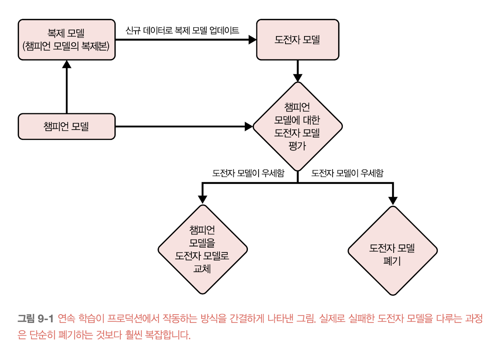
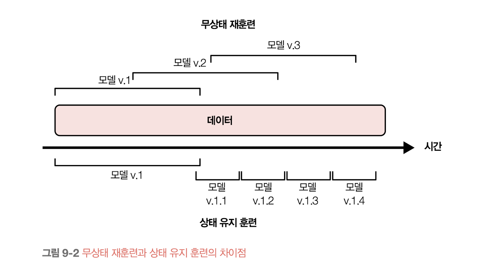

    <h1>9장. 연속 학습과 프로덕션 테스트</h1>
    <i>moderated by <a href="https://github.com/CoodingPenguin">펭귄</a></i>

## 📝 목차

- [💬 이야기 주제](#-이야기-주제)

(⭐️ 작성 후에 목차도 추가해주세요!)

---

## 9.1. 연속 학습

연속 학습은 다음과 같은 과정으로 이루어진다.

1. 기존 모델(= 챔피언 모델)의 복제본을 생성해 신규 데이터로 업데이트한다.
2. 업데이트된 복제본(= 도전자 모델)과 기존 모델을 비교한다.
3. 업데이트된 복제본이 더 좋은 성능을 내는 경우, 복제본으로 기존 모델을 교체한다.
4. 기존 모델이 더 좋은 성능을 내는 경우, 복제본을 폐기한다.

연속 학습이라는 용어로 오해가 있을 수 있지만, 연속 학습은 **적은 양의 데이터(ex. 512개, 1024개)로 업데이트를 진행**하며 상황에 따라 다르지만 **너무 자주 모델을 업데이트**하지 않는다.

### 9.1.1. 무상태 재훈련 vs. 상태 유지 훈련

<strong>무상태 재훈련stateless retraining</strong>은 **모델을 매번 처음부터 훈련하는 방법**을 말하며, <strong>상태 유지 훈련stateful training</strong>(미세 조정fine-tuning 혹은 증분 훈련incremental training라고도 불림)은 **신규 데이터로 모델 훈련을 지속하는 방법**을 말한다.

연속 학습 시 상태 유지 훈련을 수행하며, 상태 유지 훈련은 다음과 같은 장점이 있다.

- 무상태 재훈련보다 더 적은 양의 데이터로 모델을 업데이트 할 수 있다.
- 그럽 허브에 따르면 상태 유지 훈련을 하면 **모델이 더 빠르게 수렴하고 필요한 연산 비용도 훨씬 적다**고 한다.
- 개인 정보가 포함된 데이터와 같이 민감 데이터를 사용한다면, 데이터를 완전히 저장하는 일을 피할 수 있어 상태 유지 훈련이 괜찮을 수 있다.

상태 유지 훈련은 데이터 반복Data iteration시에만 적용할 수 있는 방법이며, 모델 반복Model iteration 시에는 처음부터 훈련을 수행해야 한다.

> **💡 모델 반복과 데이터 반복**
>
> - 모델 반복(Model iteration): 기존 모델 아키텍처에 새로운 피처가 추가되거나 모델 아키텍처가 변경되는 것
> - 데이터 반복(Data iteration): 모델 아키텍처와 피처는 동일하게 유지되지만 신규 데이터로 모델을 갱신하는 것

### 9.1.2. 연속 학습의 필요성

연속 학습이 필요한 이유는 다음과 같다.

- `이유 1` 갑자기 발생하는 시프트에 대처하기 위해
  - ex. 승차 공유 서비스의 가격 결정 모델 + 특정 이벤트로 인해 한가한 지역에 사람이 몰리는 경우
- `이유 2` 희귀한 사건에 적응하기 위해
  - ex. 전자 상거래 서비스의 고객 행동 예측 모델 + 블랙프라이데이
- `이유 3` 지속 콜드 스타트continuous cold start 문제에 대처하기 위해
  - ex. OTT 서비스의 콘텐츠 추천 모델 + 신규 사용자 혹은 접속한지 오래된 사용자

### 9.1.3. 연속 학습의 난제

연속 학습을 성공적으로 적용한 기업이 있으나 이를 적용하기 쉽지 않다. 그 이유로는 다음과 같다.

#### 신규 데이터 액세스 난제

짧은 주기로 모델을 업데이트 하기 위해서는 매 주기마다 새로운 데이터가 필요하지만 이를 확보하기 쉽지 않다.

- 신규 데이터가 데이터 웨어하우스에 적재되고 거기서 데이터를 가져오기까지 시간이 소요된다.
- 이를 해결하기 위해 카프카나 키네시스와 같은 **스트리밍 서비스**를 사용해 데이터를 수급할 수 있다.

모델 업데이트를 하기 위해서는 신규 데이터에 대한 레이블링이 필요하지만, 레이블링하는 속도가 모델 업데이트 속도에 병목 현상을 일으킨다.

- 레이블링 시 추천시스템을 통해 레이블을 얻는데, 이때 사용자 행동 로그, 시스템 로그 등 다양한 로그를 쿼리한 후 최종적으로 레이블을 추천하게 된다.
- 이러한 프로세스를 레이블 계산label computation이라고 하며, 로그가 늘오날수록 비용이 높아진다.
- 이 방식을 배치 처리를 통해 추출할 수 있으나 배치 처리가 끝날 때까지 기달려야 하므로, 앞서 스트리밍 서비스를 이용해 직접 레이블을 추철하는 방법을 사용한다.

#### 평가 난제

업데이트된 모델이 기존 모델을 대체하고 배포할만한 모델인지 판단하기 쉽지 않다.

- 모델을 자주 업데이트할수록 업데이트가 실패할 기회가 더 많아진다.
  - ex. 수백만 명의 소수 집단이 부당하게 대출을 거부당한 사례
- 모델을 조정된 조작과 적대적 공격에 더 취약하게 만든다.
  - ex. 2016년 마이크로소프트에서 출시한 챗본 테이가 트롤들로 인해 혐오 발언을 하게 된 사례

#### 알고리즘 난제

매우 빠르게(ex. 매시간) 업데이트하고자 하는 행렬 기반 모델과 트리 기반 모델의 경우 사용하는 알고리즘으로 인해 연속 학습 적용이 어려울 수 있다.

- 협업 필터링 모델을 사용하는 경우 차원 축소 단계가 느려 모델을 자주 업데이트하기 쉽지 않다.
- 평균, 분산과 같은 통계량을 사용해 피처를 확장해야 하는 경우가 많은데, 이러한 통계량을 계산하려면 전체 데이터셋을 봐야한다.
  - 부분 통계는 전체 통계와 다를 수도 있고 전체 데이터에 대해 통계량을 근사한다 하더라도 여기서 시간이 많이 소요된다.

### 9.1.4. 연속 학습의 네 단계

연속 학습을 적용하는 네 가지 단계에 대해 알아보자.

#### 1단계: 수동 무상태 재훈련

초기에는 가능한 많은 비즈니스 문제를 해결하기 위해 **신규 모델 개발**에 주력한다. 기존 모델을 업데이트 하는 경우는 다음 두 가지가 충족될때만 수행한다.

1. 모델 성능이 가져오는 득보다 실이 클 때
2. 기존 모델을 업데이트할 수 있는 시간이 있을 경우

#### 2단계: 자동 재훈련

프로덕션의 몇 개의 모델이 안정적으로 적용되고 **기존 모델을 유지/보수가 필요하다는 생각이 들 때**쯤 수동 업데이트를 하기 보다는 배치 프로세스를 통해 모델을 주기적으로 개선한다.

업데이트 스크립트를 작성하고 스크립트를 자동으로 수행하도록 워크플로우를 짠다.

1. 데이터를 가져온다.
2. 필요 시 데이터를 다운샘플링하거나 업샘플링한다.
3. 피처를 추출한다.
4. 레이블링 작업과 그에 대한 처리를 수행해 훈련 데이터를 생성한다.
5. 훈련 과정을 시작한다.
6. 새로 훈련한 모델을 평가한다.
7. 모델을 배포한다.

#### 3단계: 자동 상태 유지 훈련

지금까지는 다시 처음부터 훈련을 수행하기 때문에 재훈련 비용이 높았고, 비용 개선이 필요하다는 시점에서 상태 유지 훈련을 도입한다.

2단계에서 작성한 스크립트를 이전 체크포인트부터 모델을 다시 훈련하도록 수정한다.

이 단계에서 가장 중요한 것은 **데이터 및 모델 계보**를 추적하는 것이다. 모델을 재현하고 디버깅하기 위해서는 모델이 시간에 따라 어떻게 발전했는지, 어떤 모델이 기본 모델로 사용됐는지 등을 파악하기 위해서이다.

#### 4단계: 연속 학습

여러 이벤트가 많이 발생해 업데이트 주기가 더 빨라져야 한다는 판단이 들 때, 연속 학습을 도입한다. 3단계와는 다르게 업데이트 일정을 고정하지 않고 특정 조건(ex. 모델 성능이 떨어질ㄷ 때, 레이블링된 데이터 총량이 5% 증가할 때)에서 모델이 자동으로 업데이트 되도록 한다.

트리거 매커니즘이 작동하려면 견고한 모니터링 솔루션과 모델 평가를 위한 견고한 파이프라인이 필요하다.

---

## 💬 이야기 주제

> <strong><i>🐧: 왜 펭귄은 귀여울까요?</i></strong>
