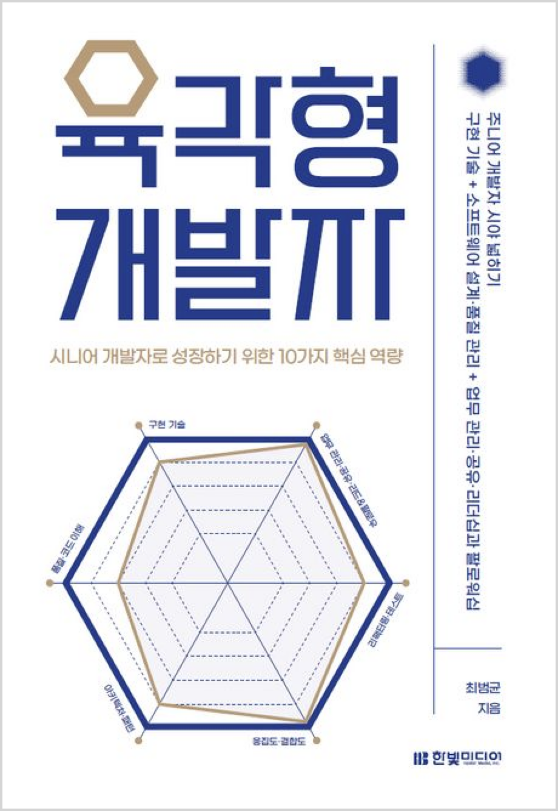

  
  <h1>육각형 개발자</h1>
  

    
    
    
  

## 📝 목차

- [1장. 들어가며](#1장-들어가며)
- [2장. 구현 기술과 학습](#2장-구현-기술과-학습)
- [3장. 소프트웨어 가치와 비용](#3장-소프트웨어-가치와-비용)
- [4장. 코드 이해](#4장-코드-이해)
- [5장. 응집도와 결합도](#5장-응집도와-결합도)
- [6장. 리팩터링](#6장-리팩터링)
- [7장. 테스트](#7장-테스트)
- [8장. 아키텍처 · 패턴](#8장-아키텍처--패턴)
- [9장. 업무 관리](#9장-업무-관리)
- [10장. 정리하고 공유하기](#10장-정리하고-공유하기)
- [11장. 리더와 팔로워](#11장-리더와-팔로워)
- [💬 느낀점](#-느낀점)

---

## 1장. 들어가며

> <strong><i>p18. 또 다른 문제도 있었다. 뜬금없이 중간 관리자 역할을 맞게 되었다. 이때의 관리자는 개발에 참여하지 않았다.</i></strong> 🐧🌵

- `튜브`: 이런 상황을 잘 헤쳐 나갈 수 있는 방법을 이 책에서 배울 수 있지 않을까?
- `샐리`: 중간 관리자가 코드를 짜진 않아도 구조는 알아야한다고 생각한다.
- `펭귄`: 확실히 관리자 직책을 맡으신 분들은 많이 바쁘신 것 같다.

> <strong><i>p22. 회사 업무를 하면서 성장한다는 느낌을 받지 못한 이유 중 하나는 개발(다양한 구현 기술 사용)과 성장을 동일시했기 때문이다.</i></strong> 🐧🐤

- `펭귄`: 확실히 특정 기술 스택을 아는 게 성장이 아니고 코드를 볼 때 나무가 아니라 숲을 보게 되는 안목을 기르는 것을 성장이라 본다.
- `샐리`: 회사 내에서의 성장을 하려면 어떻게 해야할지, 이젠 고민해봐야할 때!

> <strong><i>p23. 상황이 이렇다 보니 유지보수 업무나 기존 코드를 확장하는 일을 주로 하다 보면 새로운 기술을 접할 기회가 줄어들고 개발자로서 성장하지 못한다는 생각을 가질 수 있다. 하지만 언젠가 기회는 온다. 오래된 서비스라도 일부 또는 전체를 새로 만들어야 하는 상황이 발생한다. 이때를 노리면 된다.</i></strong> 🐧

- `펭귄`: 기회는 온다!

> <strong><i>p28. 경력과 무관하게 많은 개발자가 업무 관리를 중요하지 않게 여기는 경향이 컸다.</i></strong> 🌵

- `펭귄`: 업무 관리는 업무를 하는 개발자 뿐만 아니라 일정 조율 및 리소스를 파악하는 조직장의 능력도 중요한 것 같다.

> <strong><i>p28. 지금 생각해보면 가장 큰 문제는 개발 리더 부재였다. ... 신입 개발자 2명이 기능 요구 사항을 분석한다는 것은 버거운 일이다.</i></strong> 🐧

<a href="#-목차">⬆️ 위로 이동</a>

---

## 2장. 구현 기술과 학습

> <strong><i>p2. 예시 인용</i></strong> 🐧🌵🍋

- `펭귄`: 펭귄은 귀엽습니다.

<a href="#-목차">⬆️ 위로 이동</a>

---

## 3장. 소프트웨어 가치와 비용

> <strong><i>p2. 예시 인용</i></strong> 🐧🌵🍋

- `펭귄`: 펭귄은 귀엽습니다.

<a href="#-목차">⬆️ 위로 이동</a>

---

## 4장. 코드 이해

> <strong><i>p2. 예시 인용</i></strong> 🐧🌵🍋

- `펭귄`: 펭귄은 귀엽습니다.

<a href="#-목차">⬆️ 위로 이동</a>

---

## 5장. 응집도와 결합도

> <strong><i>p2. 예시 인용</i></strong> 🐧🌵🍋

- `펭귄`: 펭귄은 귀엽습니다.

<a href="#-목차">⬆️ 위로 이동</a>

---

## 6장. 리팩터링

> <strong><i>p2. 예시 인용</i></strong> 🐧🌵🍋

- `펭귄`: 펭귄은 귀엽습니다.

<a href="#-목차">⬆️ 위로 이동</a>

---

## 7장. 테스트

> <strong><i>p2. 예시 인용</i></strong> 🐧🌵🍋

- `펭귄`: 펭귄은 귀엽습니다.

<a href="#-목차">⬆️ 위로 이동</a>

---

## 8장. 아키텍처 · 패턴

> <strong><i>p2. 예시 인용</i></strong> 🐧🌵🍋

- `펭귄`: 펭귄은 귀엽습니다.

<a href="#-목차">⬆️ 위로 이동</a>

---

## 9장. 업무 관리

> <strong><i>p2. 예시 인용</i></strong> 🐧🌵🍋

- `펭귄`: 펭귄은 귀엽습니다.

<a href="#-목차">⬆️ 위로 이동</a>

---

## 10장. 정리하고 공유하기

> <strong><i>p2. 예시 인용</i></strong> 🐧🌵🍋

- `펭귄`: 펭귄은 귀엽습니다.

<a href="#-목차">⬆️ 위로 이동</a>

---

## 11장. 리더와 팔로워

> <strong><i>p2. 예시 인용</i></strong> 🐧🌵🍋

- `펭귄`: 펭귄은 귀엽습니다.

<a href="#-목차">⬆️ 위로 이동</a>

---

## 💬 느낀점

<table>
  <thead>
    <tr>
      <th width='10%'>팀원</th>
      <th width='90%'>느낀점</th>
    </tr>
  </thead>
  <tbody>
    <tr>
      <td align='center'><code>펭귄</code></td>
      <td></td>
    </tr>
    <tr>
      <td align='center'><code>샐리</code></td>
      <td></td>
    </tr>
    <tr>
      <td align='center'><code>튜브</code></td>
      <td></td>
    </tr>
  </tbody>
</table>

<a href="#-목차">⬆️ 위로 이동</a>
