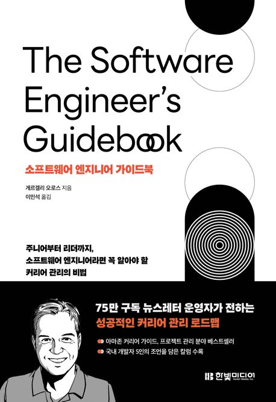

  
  <h1>소프트웨어 엔지니어 가이드북</h1>
  

    
    
    
  

## 📝 목차

- [1장. 커리어패스](#1장-커리어패스)
- [2장. 커리어 관리](#2장-커리어-관리)
- [3장. 성과 평가](#3장-성과-평가)
- [4장. 승진](#4장-승진)
- [5장. 어디서나 통하는 접근법](#5장-어디서나-통하는-접근법)
- [6장. 이직](#6장-이직)
- [7장. 업무를 완수하는 개발자](#7장-업무를-완수하는-개발자)
- [8장. 코딩](#8장-코딩)
- [9장. 소프트웨어 개발](#9장-소프트웨어-개발)
- [10장. 생산적인 소프트웨어 개발자의 도구](#10장-생산적인-소프트웨어-개발자의-도구)
- [11장. 업무를 완수하는 엔지니어](#11장-업무를-완수하는-엔지니어)
- [12장. 협업 및 팀워크](#12장-협업-및-팀워크)
- [13장. 소프트웨어 엔지니어링](#13장-소프트웨어-엔지니어링)
- [14장. 테스트](#14장-테스트)
- [15장. 소프트웨어 아키텍처](#15장-소프트웨어-아키텍처)
- [16장. 배움을 멈추지 말자](#16장-배움을-멈추지-말자)
- [💬 느낀점](#-느낀점)

---

## 1장. 커리어패스

> <strong><i>p27. 가장 열심히 일하거나 최고 품질의 결과물을 만들어야만 항상 가장 높은 보너스를 받고 승진 기회를 얻는 것은 아니란 사실을 깨달았다.</strong></i> 🐧🍋

> <strong><i>p27. 경력을 인정받으려면 추가적인 노력이 필요하다.</strong></i> 🍋

> <strong><i>p47. 수익 센터에서 일하면 자신이 비용 센터보다 우월하다고 느끼기 쉽다. 하지만 효과적인 기업에는 두 가지 유형의 팀과 조직이 모두 필요하므로 각 조직에서 성공하는 방법을 아는 것은 유용한 기술이다.</strong></i> 🌵

- `튜브`: 조금만 다가서도 멀어지는 나의 사랑 나의 꿈~

<a href="#-목차">⬆️ 위로 이동</a>

---

## 2장. 커리어 관리

> <strong><i>p51. 주도적으로 목표를 설정하고, 이를 추적하고, 지속적으로 개선해 더 나아지는 사람의 성과가 더 좋은 법이다.</strong></i> 🍋

> <strong><i>p51. 성공하고 싶다면 자신의 커리어패스에 대한 주인의식을 가져라.</strong></i> 🐧

> <strong><i>p52. 약속한 작업을 완료하고, 중요한 작업에 집중하고, 작업을 완료하면 다른 사람에게 알리자. 그렇지 않으면 내가 한 일은 눈에 띄지 않게 된다.</strong></i> 🍋

> <strong><i>52. 영향력 있는 일을 해냈다면 비즈니스에 미치는 영향을 측정하고 공유하자.</strong></i> 🌵

> <strong><i>p60. 많은 소프트웨어 엔지니어는 자신이 하는 일을 매니저가 잘 알고 있을 거라고 생각하지만, 그렇지 않다. ... 그러니 매니저에게 말하자! 정기적인 1:1 미팅이 필요한 이유다.</strong></i> 🍋🐧

- `튜브`: 조금만 다가서도 멀어지는 나의 사랑 나의 꿈~

> <strong><i>p42. 매주 수행한 주요 작업을 공유하자.</strong></i> 🌵

> <strong><i>p56. 피드백은 하나의 데이터 포인트에 불과하다. 물론 피드백은 매우 중요하다고 느껴지지만 실제로는 커리어와 장기적인 연관성이 거의 없다.</strong></i> 🌵

- `튜브`: 조금만 다가서도 멀어지는 나의 사랑 나의 꿈~

<a href="#-목차">⬆️ 위로 이동</a>

---

## 3장. 성과 평가

> <strong><i>p. 성과 평가보다는 여러분이 참여한 프로젝트, 강력한 관계를 맺은 사람, 습득한 기술, 해결한 과제 등이 더 큰 영향을 미친다.</strong></i> 🍋

> <strong><i>p69. 자신이 하는 일을 지나치게 많이 공유하는 것도 좋지 않다고 생각하지만, 내가 하는 일을 매니저가 잘 알거라 가정하지 않는 편이 좋다. 가끔씩 작업 일지를 매니저에게 공유하며 자신이 하는 일을 모두 설명하는 것이 좋다.</strong></i> 🐧

> <strong><i>p71. 성과 평가에 앞서 매니저와 동료에게 피드백을 요청하자. 가능한 한 빨리 요청해 나중에 평가가 나빠서 놀라는 일을 피하자.</strong></i> 🐧

> <strong><i>p77. 피드백을 정말 잘하는 매니저는 거의 없다.</strong></i> 🐧

- `튜브`: 조금만 다가서도 멀어지는 나의 사랑 나의 꿈~

<a href="#-목차">⬆️ 위로 이동</a>

---

## 4장. 승진

> <strong><i>13%/4.2. 예를 들어, 같은 프로젝트에서 일했더라도 CTO와 자주 대화하는 사람이 ‘승진을 결정하는 회의 참가자’와 아무런 교류가 없던 사람보다 우위를 점할 수 있다.</strong></i> 🍋

> <strong><i>4.4. 스태프 엔지니어로 승진하려는 엔지니어는 조직 전체의 문제에 대해 기존의 타사 프레임워크를 사용하는 대신 자체적인 사내 솔루션을 개발하는 경우가 많다.</strong></i> 🌵

> <strong><i>13%/4.4. 승진을 하면 보상이 다음 구간의 맨 아래로 이동한다.</strong></i> 🐧

> <strong><i>4.4. - 승진 지향 개발. 빅테크에서 승진 및 성과 평가가 영향력 중심적으로 진행되면 '승진 지향 개발'이라는 불행한 결과가 발생할 수 있다. 기업은 당신의 직급이 올라갈수록 더 큰 그룹에 영향을 미치는 업무를 맡기고, 더 영향력 있는 비즈니스 성과를 이끌어내길 기대한다.</i></strong> 🐧

> <strong><i>4.5. - 매니저의 중요성. 매니저와 이야기할 때 승진 이야기를 꺼내자. 매니저가 여러분의 위치를 어떻게 생각하는지, 그리고 매니저의 지원을 받으려면 무엇을 해야 하는지 물어보자. 직접 작성한 자기평가서를 보여주자. 일반적으로 참여할 프로젝트를 결정하는 최종 권한은 매니저에게 있다.</i></strong> 🐧

> <strong><i>15%/4.6. 충분한 영향력을 입증하고, 균등하게 주어지지 않은 기회를 잡는 이가 승진을 얻는다.</strong></i> 🍋

> <strong><i>15%/4.6. 수평적 이동이나 새로운 기술 스택 같은 직업적 선택은 경력에 즉각적인 보상은 주지 않겠지만, 장기적으로는 좋은 투자다.</strong></i> 🍋🌵🐧

- `튜브`: 조금만 다가서도 멀어지는 나의 사랑 나의 꿈~

<a href="#-목차">⬆️ 위로 이동</a>

---

## 5장. 어디서나 통하는 접근법

> <strong><i>5.2. - 플랫폼 팀에서 일할 때의 단점. 제품 팀은 최신 기능으로 매출이 증가하거나 더 많은 사용자를 유치했다고 쉽게 주장할 수 있다. 하지만 플랫폼 팀은 비즈니스에서 중요한 지표를 쉽게 만들기 어렵다.</strong></i> 🐧

> <strong><i>p16%/5.3. 제품 팀은 최신 기능으로 매출이 증가하거나 더 많은 사용자를 유치팼다고 쉽게 주장할 수 있다. 하지만 플랫폼 팀은 비즈니스에서 중요한 지표를 쉽게 만들기 어렵다.</strong></i> 🍋

- `튜브`: 조금만 다가서도 멀어지는 나의 사랑 나의 꿈~

<a href="#-목차">⬆️ 위로 이동</a>

---

## 15장. 소프트웨어 아키텍처

> <strong><i>p0. 환상 속에 있어 다가설 수 없는 나에게 너를 보여줘</strong></i> 🌵🍋🐧

- `튜브`: 조금만 다가서도 멀어지는 나의 사랑 나의 꿈~

<a href="#-목차">⬆️ 위로 이동</a>

---

## 26장. 배움을 멈추지 말자

> <strong><i>p0. 환상 속에 있어 다가설 수 없는 나에게 너를 보여줘</strong></i> 🌵🍋🐧

- `튜브`: 조금만 다가서도 멀어지는 나의 사랑 나의 꿈~

<a href="#-목차">⬆️ 위로 이동</a>

---

## 💬 느낀점

<table>
  <thead>
    <tr>
      <th width='10%'>팀원</th>
      <th width='90%'>느낀점</th>
    </tr>
  </thead>
  <tbody>
    <tr>
      <td align='center'><code>펭귄</code></td>
      <td></td>
    </tr>
    <tr>
      <td align='center'><code>샐리</code></td>
      <td></td>
    </tr>
    <tr>
      <td align='center'><code>튜브</code></td>
      <td></td>
    </tr>
  </tbody>
</table>

<a href="#-목차">⬆️ 위로 이동</a>
