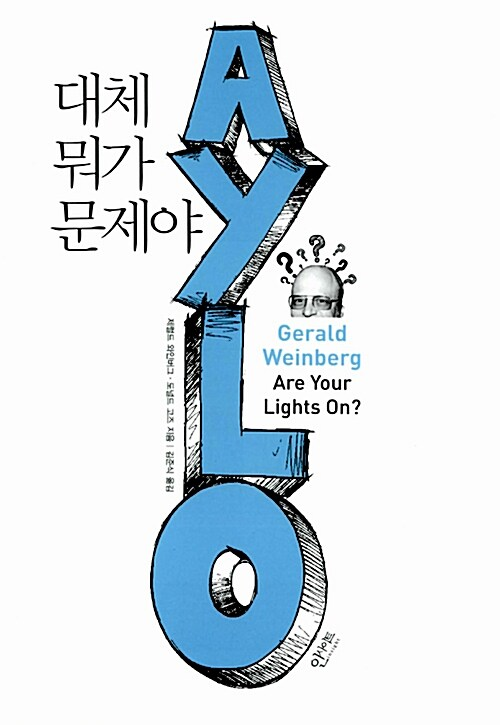

  
  <h1>소프트웨어 엔지니어 가이드북</h1>
  

    
    
    
  

## 📝 목차

- [1부. 무엇이 문제인가?](#1부-무엇이-문제인가)
- [2부. 그것은 어떤 문제인가?](#2부-그것은-어떤-문제인가)
- [3부. 정말로 무엇이 문제인가?](#3부-정말로-무엇이-문제인가)
- [4부. 누구의 문제인가?](#4부-누구의-문제인가)
- [5부. 문제는 어디에서 비롯되는가?](#5부-문제는-어디에서-비롯되는가)
- [6부. 정말로 그것을 해결하고 싶은가?](#6부-정말로-그것을-해결하고-싶은가)
- [💬 느낀점](#-느낀점)

---

## 1부. 무엇이 문제인가?

<a href="#-목차">⬆️ 위로 이동</a>

---

## 2부. 그것은 어떤 문제인가?

<a href="#-목차">⬆️ 위로 이동</a>

---

## 3부. 정말로 무엇이 문제인가?

<a href="#-목차">⬆️ 위로 이동</a>

---

## 4부. 누구의 문제인가?

<a href="#-목차">⬆️ 위로 이동</a>

---

## 5부. 문제는 어디에서 비롯되는가?

<a href="#-목차">⬆️ 위로 이동</a>

---

## 6부. 정말로 그것을 해결하고 싶은가?

<a href="#-목차">⬆️ 위로 이동</a>

---

## 💬 느낀점

<table>
  <thead>
    <tr>
      <th width='10%'>팀원</th>
      <th width='90%'>느낀점</th>
    </tr>
  </thead>
  <tbody>
    <tr>
      <td align='center'><code>펭귄</code></td>
      <td></td>
    </tr>
    <tr>
      <td align='center'><code>샐리</code></td>
      <td></td>
    </tr>
    <tr>
      <td align='center'><code>튜브</code></td>
      <td></td>
    </tr>
  </tbody>
</table>

<a href="#-목차">⬆️ 위로 이동</a>
