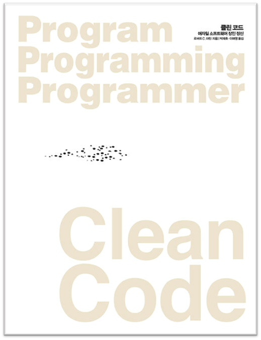

<div align="center">
  <a href="http://www.yes24.com/Product/Goods/11681152">
      
  </a>
  <h1>Clean Code 클린 코드</h1>
  <div>
    
    
    
  </div>
</div>

## 📝 목차

- [1장. 깨끗한 코드](#1장-깨끗한-코드)
- [2장. 의미 있는 이름](#2장-의미-있는-이름)
- [3장. 함수](#3장-함수)
- [4장. 주석](#4장-주석)
- [5장. 형식 맞추기](#5장-형식-맞추기)
- [6장. 객체와 자료 구조](#6장-객체와-자료-구조)
- [7장. 오류 처리](#7장-오류-처리)
- [8장. 경계](#8장-경계)
- [9장. 단위 테스트](#9장-단위-테스트)
- [10장. 클래스](#10장-클래스)
- [11장. 시스템](#11장-시스템)
- [느낀점](#느낀점)

---

## 1장. 깨끗한 코드

> <strong><i>p2. 헛소리! 앞으로 코드가 사라질 가망은 전혀 없다! 왜? 코드는 요구사항을 상세히 표현하는 수단이니까!</i></strong> 🐧

- `펭귄`: 요새 인공지능이 개발자를 대체한다는 소리가 나오는데, 나보다는 코딩테스트를 잘 볼 수 있겠지만은 인공지능이 기획안을 이해할 수 있을 것 같진 않다.
- `튜브`: 10년 전에도 같은 고민을 했다고 한다. 하지만 적어도 당분간은 그런 일은 일어날 것 같지는 않다.

> <strong><i>p4. 회사가 망한 원인은 바로 나쁜 코드 탓이었다.</i></strong> 🌵

> <strong><i>p7. 나쁜 코드를 양산하면 기한을 맞추지 못한다. 오히려 엉망진창인 상태로 인해 속도가 곧바로 늦어지고, 결국 기한을 놓친다. 기한을 맞추는 유일한 방법은, 그러니까 빨리 가는 유일한 방법은, 언제나 코드를 최대한 깨끗하게 유지하는 습관이다.</i></strong> 🐧🍋

- `펭귄`: 나쁜 코드를 짜면 나중에 기능 구현 시 그 코드를 이해하느라 추가로 시간이 걸린다. 처음부터 좋은 코드를 짜서 이해하는 시간을 줄이는 게 좋은 것 같다.

> <strong><i>p7. 좋은 코드를 사수하는 일은 바로 우리 프로그래머들의 책임이다.</i></strong> 🍋🌵

- `샐리`: 우리도 프로그래밍 분야의 전문가라는 생각과 책임감을 가지고 클린코드를 지켜야한다.
- `펭귄`: 나쁜 코드를 짤 때 항상 다른 곳에서 원인을 찾았는데 결국 짜는 나도 문제가 있음을 명심해야 겠다.

> <strong><i>p8. 깨끗한 코드와 나쁜 코드를 구분할 줄 안다고 깨끗한 코드를 작성할 줄 안다는 뜻은 아니다... '코드 감각'이 있는 프로그래머는 나쁜 모듈을 보면 좋은 모듈로 개선할 방안을 떠올린다. '코드 감각'으로 최고 방안을 선택한 후 여기서 거기까지 이동하는 경로를 계획한다.</i></strong> 🌵

> <strong><i>p9. 나쁜 코드는 나쁜 코드를 '유혹'한다!</i></strong> 🌵🍋

- `샐리`: 나쁜코드가 다른 나쁜코드를 유혹하는 지에 대한 예시가 떠올랐다. 왜 나쁜코드를 짜면 안되는 지 잊어버렸을 때, 다시 읽어볼만한 구절(5쪽)

> <strong><i>p9. 논리가 간단해야 버그가 숨어들지 못한다.</i></strong> 🙂

- `후미`: 코드의 논리가 복잡하면 코드에 버그가 있을때 디버깅하기 굉장히 어려움. 또한 버그가 생겨 코드를 수정하게 되면 그 코드의 논리는 더욱 복잡해진다.
- `샐리`: 코드의 길이를 줄이는 것이 목표가 아니다. 간단한 논리와 직관적인 코드가 중요하다.
- `펭귄`: 갑자기 생각나는 [컴공 짤](https://www.google.com/search?q=%EC%BB%B4%EA%B3%B5+%EA%B3%A0%EC%88%98+%EC%B4%88%EB%B3%B4&source=lnms&tbm=isch&sa=X&ved=2ahUKEwjHh8j2xpr2AhWyklYBHfbXAg0Q_AUoAXoECAEQAw&biw=1857&bih=977&dpr=1)

> <strong><i>p10. 깨끗한 코드는 세세한 사항까지 꼼꼼하게 처리하는 코드다.</i></strong> 🐧

- `펭귄`: 예외처리가 정말 중요한 것 같다.

> <strong><i>p10. 깨끗한 코드는 한가지에 '집중'한다. 각 함수와 클래스와 모듈은 주변 상황에 현혹되거나 오염되지 않은 채 한길만 걷는다.</i></strong> 🐧🙂

- `펭귄`: 함수가 하나의 역할만 하는게 중요한 것 같다
- `후미`: 시간 복잡도 VS 함수별 한 기능
  - `펭귄`, `튜브`: 여러 상황을 고려해야할 것 같다.
  - `샐리`: 컴퓨터 상황도 고려해야 한다.

> <strong><i>p11. 코드는 추측이 아니라 사실에 기반해야 한다. 반드시 필요한 내용만 담아야 한다. 코드를 읽는 사람에게 프로그래머가 단호하다는 인상을 줘야 한다.</i></strong> 🐧🌵

- `펭귄`: 코드한테는 단호할 필요가 있다.
- `튜브`: 모호하지 않은 코드와도 연관이 있는 것 같다.

> <strong><i>p12 - p13. 깨끗한 코드는 주의 깊게 작성한 코드다. 누군가 시간을 들여 깔끔하고 단정하게 정리한 코드다. 자세한 사항까지 꼼꼼하게 신경 쓴 코드다. 주의를 기울인 코드다.</i></strong> 🐧

- `펭귄`: 신입 개발자한테는 깔끔하고 정리한 코드를 고민하는 것보다는 “내가 구현할 수 있을까?”를 먼저 생각하게 되는 것 같다.

> <strong><i>p13 - p14. 켄트 백이 제안한 단순한 코드 규칙으로 구현을 시작한다. … 모든 테스트를 통과한다.</i></strong> 🙂

- `후미`: 테스트 케이스랑 단순한 코드랑 연관이 있나? 단순한이 코드가 아닌 코드 규칙을 수식한다.

> <strong><i>p14. 중복 줄이기, 표현력 높이기, 초반부터 간단한 추상화 고려하기.</i></strong> 🐧

- `샐리`: 표현력을 높인다는 것의 의미는 프로그램 요구사항을 잘 반영한다는 것일지도

> <strong><i>p15. 코드를 읽으면서 짐작했던 기능을 각 루틴이 수행한다면 깨끗한 코드라 불러도 되겠다.</i></strong> 🍋

> <strong><i>p18. 코드를 읽는 시간 대 코드를 짜는 시간 비율이 10대 1을 훌쩍 넘는다. 새 코드를 짜면서 우리는 끊임없이 기존 코드를 읽는다.</i></strong> 🌵🐧🙂🍋

### ✅ 요약

<small><a href="#-목차">⬆️ 위로 이동</a></small>

---

## 2장. 의미 있는 이름

> <strong><i>p23. 각 개념에 이름만 붙여도 코드가 상당히 나아진다.</i></strong> 🌵🐧

- `튜브`: 2장을 요약하는 한 마디 같다.

> <strong><i>p25. 컴파일러나 인터프리터만 통과하려는 생각으로 코드를 구현하는 프로그래머는 스스로 문제를 일으킨다.</i></strong> 🍋🌵

- `샐리`: 임베디드 소프트웨어 과목 때, 돌아가기만 하면 된다는 생각으로 짰었다. 결국 다시 짰다.
- `펭귄`: 타입스크립트 타입 검사 통과하기에 어쩔 수 없이 any를 쓰게 되는 내가 생각났다.
- `튜브`: 이름 짓기 귀찮아서 \_만 붙였던 과거의 내가 찔렸다.

> <strong><i>p25. 일관성이 떨어지는 표기법은 그릇된 정보다.</i></strong> 🙂🐧

- `후미`: 같은 단어뜻을 가진 여러 영단어를 혼용해서 사용해서 일관성이 떨어짐
- `샐리`: 일관성 있는 이름을 사용해야 데이터도 의미를 가질 수 있고, 쓰일 수 있다.
- `펭귄`: 회사에서 커밋 메시지를 구체화해서 적으려고 노력하는데, 나만의 커밋룰을 정해서 정리한 게 큰 도움이 되었다. 그만큼 일관성이 중요한 것 같다.
- `튜브`: 변수 이름 비롯해서 여러 규칙을 문서화하는 것이 중요한 것 같다.

> <strong><i>p26. 불용어를 추가한 이름 역시 아무런 정보도 제공하지 못한다. ... 불용어는 중복이다.(a, an, the, variable)</i></strong> 🍋

- `샐리`: 1학년 때, 시험 때 변수 이름으로 예약어를 써서 감점된 경험이 있다.

> <strong><i>p27. 읽는 사람이 차이를 알도록 이름을 지어라.</i></strong> 🙂🌵

- `후미`: 읽는 사람을 위한 코드를 짜자… 나중에는 내가 읽는 사람이 된다.

> <strong><i>p28. 검색은 되었지만, 7을 사용한 의도가 다른 경우도 있다. 상수가 여러 숫자이고 누군가 상수 내 숫자 위치를 바꿨다면 문제는 더욱 심각해진다. 상수에 버그가 있으나 검색으로 찾아내지 못한다.</i></strong> 🐧🙂

- `펭귄`: 리터럴을 쓰는 것보다는 상수로 정의해놓고 쓰는 이유.

> <strong><i>p35. addr라는 접두어를 추가해 addrFirstName, addrLastName, addrState라 쓰면 맥락이 좀 더 분명해진다. 변수가 좀 더 큰 구조에 속한다는 사실이 적어도 독자에게는 분명해진다.</i></strong> 🐧

> <strong><i>p37. 일반적으로 짧은 이름이 긴 이름보다 좋다. 단, 의미가 분명한 경우에 한해서다. 이름에 불필요한 맥락을 추가하지 않도록 주의한다.</i></strong> 🐧

- `펭귄`: 필요한 맥락과 불필요한 맥락 그 중간을 찾기가 어려운 것 같다.

> <strong><i>p38. 사람들이 이름을 바꾸지 않으려는 이유 하나는 다른 개발자가 반대할까 두려워서다. 오히려 (좋은 이름으로 바꿔주면) 반갑고 고맙다. 우리들 대다수는 자신이 짠 클래스 이름과 매서드 이름을 모두 암기하지 못한다.</i></strong> 🌵

> <strong><i>p38. 여느 코드 개선 노력과 마찬가지로 이름 역시 나름대로 바꿨다가는 누군가 질책할지도 모른다. 그렇다고 코드를 개선하려는 노력을 중단해서는 안 된다.</i></strong> 🌵🍋

### ✅ 요약

1. 변수명은 꼭 필요한 정보만 넣어 간단명료하게 짓는다.(ex. 불용어 제거, 일관성 있는 이름, IDE 검색이 편하게)
2. 동일한 맥락에서 한 개념에 한 단어를 사용하자. 다른 맥락이라면, 단어를 구분하여 쓰자.
3. 변수명을 지을 때 우선순위는 개발자 용어, 그 다음은 도메인이다.
4. 추론하기 힘든 변수는 맥락을 추가하되, 누구나 유추가능한 맥락은 넣지 말자.

<small><a href="#-목차">⬆️ 위로 이동</a></small>

---

## 3장. 함수

> <strong><i>p43. 각 함수가 이야기 하나</i></strong> 🙂

> <strong><i>p43. 함수가 얼마나 짧아야 하느냐고? 일반적으로 목록 3-2보다 짧아야 한다! 사실 목록 3-2는 목록 3-3으로 줄여야 마땅하다. (3-2는 14줄, 3-3은 6줄..)</i></strong> 🌵

- `튜브`: 정말 14줄이 길다고?
- `샐리`: 내 코드를 돌아보면, 3-2도 아닌, 3-1 수준의 코드였던 것을 반성한다.
- `후미`: 이 정도로 짧게 함수를 짤 수 있을까…

> <strong><i>p44. 함수는 한 가지를 해야 한다. 그 한 가지를 잘 해야 한다. 그 한 가지만을 해야 한다.</i></strong> 🍋🙂

- `후미` : 지난번에 논의 했던 시간 복잡도를 고려하면 한 함수에 여러 기능을 넣어도 되는데 시간 복잡도 보다는 클린코드가 더 중요한 것 같다.
- `샐리`: 한 가지 역할을 하는 함수는 어떻게 정의되는가? 모호한 것 같다. (평균을 내는 함수는 더하는 함수와 길이로 나누는 부분으로 구성되어야하는가?)
- `튜브`: 어느 단위까지 쪼개야 할까?

> <strong><i>p45. 지정된 함수 이름 아래에서 추상화 수준이 하나인 단계만 수행한다면 그 함수는 한 가지 작업만 한다. 어쨌거나 우리가 함수를 만드는 이유는 큰 개념을 (다시 말해, 함수 이름을) 다음 추상화 수준에서 여러 단계로 나눠 수행하기 위해서가 아니던가.</i></strong> 🌵

- `샐리`: 코드를 읽을 때, 이야기의 흐름을 서술식으로 나타낼 수 있다면 비슷한 추상화 단계라고 볼 수 있지 않을까? (만약 A라면, b, c, d를 하라 → 만약 A라면, B를 해라. B는 b, c, d로 구성되어있다. / A,B는 사람이 알아들을 수 있는 말. b,c,d는 기능적 이름)
- `튜브`: 함수 이름과 역할을 ‘추상화 수준’과 일치시킨다고 해석할 수 있을 것 같다.

> <strong><i>p45. 함수가 '한 가지'만 하는지 판단하는 방법이 하나 더 있다. 단순히 다른 표현이 아니라 의미 있는 이름으로 다른 함수를 추출할 수 있다면 그 함수는 여러 작업을 하는 셈이다.</i></strong> 🌵🍋

- `샐리`: 이건 저자의 생각일 뿐, 우리는 적용할 수 있는 만큼만 받아들이면 될 것 같다!

> <strong><i>p46. 코드는 위에서 아래로 이야기처럼 읽혀야 좋다.</i></strong> 🍋

- `튜브`: 예제 3-2 → 3-3 에서도

> <strong><i>p46. 한 함수내에 추상화 수준을 섞으면 코드를 읽는 사람이 헷갈린다.</i></strong> 🙂

> <strong><i>p49. 길고 서술적인 이름이 짧고 어려운 이름보다 좋다. 길고 서술적인 이름이 길고 서술적인 주석보다 좋다.</i></strong> 🍋🌵

- `샐리`: 유명하고 잘 짜인 오픈소스에서 내 함수의 이름과 구성을 참고할 수 있겠다!

> <strong><i>p49. 함수가 작고 단순 할 수록 서술적인 이름을 고르기 쉬워진다.</i></strong> 🙂🌵🍋

- `후미` : 함수를 짧게 짜라는 리마인드!!
- `튜브` : 거꾸로 ‘좋은 함수 이름을 짓다 보면 간결한 함수를 짤 수 있다’는 의미로 볼 수 있을 것 같다.

> <strong><i>p50. 함수에서 이상적인 인수 개수는 0개(무항)다.</i></strong> 🍋🌵

- `샐리`: 부스트캠프 할 때, yaml 파일을 썼던 기억이 난다.

> <strong><i>p50. 4개 이상은 특별한 이유가 필요하다. 특별한 이유가 있어도 사용하면 안 된다.</i></strong> 🌵

- `샐리`: 53페이지에 인수객체 예제가 적절한 것 같다.
- `튜브`: 조금 가혹한 것 같기도 하다. 파이썬 함수 생각하면 예외도 있는 것 같다.

> <strong><i>p50. 출력 인수는 입력 인수보다 이해하기 어렵다.</i></strong> 🍋

- `샐리`: 코드에 출력인수를 표현해놓기란 쉽지 않다!

> <strong><i>p52. 플래그 인수는 추하다. 함수로 부울 값을 넘기는 관례는 정말로 끔찍하다.</i></strong> 🌵

> <strong><i>p54. 함수에 인수 이름을 넣는다.</i></strong> 🙂

- `후미` : 함수명을 `assertEquals` 보다 `assertExpectedEqualsActual`으로 쓰면 어떤 변수를 사용하는 지와 변수 위치를 쉽게 알 수 있다.

> <strong><i>p57. 명령과 조회를 분리해 혼란을 뽑는다.</i></strong> 🙂🌵🍋

> <strong><i>p59. 정상 동작과 오류 처리 동작을 분리하면 코드를 이해하고 수정하기 쉬워진다.</i></strong> 🙂🍋🌵

- `샐리`: if 문과 try-catch의 맥락의 차이가 분명 존재한다!

> <strong><i>p60. 중복은 문제다. 코드 길이가 늘어날 뿐 아니라 알고리즘이 변하면 네 곳이나 손봐야 하니까.</i></strong> 🍋

> <strong><i>p61. 함수는 return 문이 하나여야 한다는 말이다. 루프 안에서 break나 continue를 사용해선 안되며 goto는 절대로, 절대로 안 된다. … 함수를 작게 만든다면 간혹 return, break, continue를 여러 차례 사용해도 괜찮다. 오히려 때로는 단일 입/출구 규칙보다 의도를 표현하기 쉬워진다.</i></strong> 🌵🍋

### ✅ 요약

1. 작게 만들어라! 한 가지만 해라! 함수 당 추상화 수준은 하나로!
2. 서술적인 이름을 사용하라!
3. 부수 효과를 일으키지 마라!
4. 명령과 조회를 분리하라!
5. 오류 코드보다 예외를 사용하라!
6. 반복하지 마라!

<small><a href="#-목차">⬆️ 위로 이동</a></small>

---

## 4장. 주석

> <strong><i>p68. 사실상 주석은 기껏해야 필요악이다.</i></strong> 🌵

- `튜브` : 조금 과장된 표현인 것 같긴 하지만, 4장을 요약하는 한 줄인 듯

> <strong><i>p68. 우리는 코드로 의도를 표현하지 못해, 그러니까 실패를 만회하기 위해 주석을 사용한다.</i></strong> 🙂🌵

- `후미`: 찔리지만 억울하다..
- `펭귄`: 저자의 생각이 다소 극단적인 것 같다..

> <strong><i>p68. 그러므로 주석이 필요한 상황에 처하면 곰곰이 생각하기 바란다. 상황을 역전해 코드로 의도를 표현할 방법은 없을까? 코드로 의도를 표현할 때마다 스스로를 칭찬해준다.</i></strong> 🐧

- `펭귄`: 보통 주석은 내 코드에 설명에 필요하다 생각해 달았는데, 이런 태도보다는 더 깔끔한 코드를 짜도록 노력해야겠다.

> <strong><i>p68. 주석은 오래될수록 코드에서 멀어진다. 오래될수록 완전히 그릇될 가능성도 커진다.</i></strong> 🍋🌵

- `샐리`: 특히 상급자/타인의 코드/주석을 고치기란…부담스럽다. 시간이 지나며 틀리게 된 정보를 포함하더라도 그냥 지나치게 되는 것 같다.
- `튜브`: 리팩토링 할때도 일이 늘어날 수도 있을 것 같다.

> <strong><i>p73. 주석이 올바른지 검증하기 쉽지 않다. 이것이 의미를 명료히 밝히는 주석이 필요한 이유인 동시에 주석이 위험한 이유이기도 하다.</i></strong> 🐧

- `샐리`: 주석이 틀려도 코드는 돌아가니까, 주석이 틀리게될 수 있다는 경각심을 가져야할 것 같다.

> <strong><i>p75. 주기적으로 todo 주석을 점검해 없애라.</i></strong> 🙂🍋🐧

- `후미`: todo 많이 쓰는데 todo를 썼으면 나중에 그 기능을 구현하고 todo를 지우자..

> <strong><i>p76. 이해가 안 되어 다른 모듈까지 뒤져야 하는 주석은 독자와 제대로 소통하지 못하는 주석이다.</i></strong> 🌵

- `샐리`: 어차피 코드 다 들어가보는게 맘 편하다!

> <strong><i>p80. 모든 함수에 Javadocs를 달거나 모든 변수에 주석을 달아야 한다는 규칙은 어리석기 그지없다.</i></strong> 🌵

- `튜브`: 쓰다 보면 정말로 다 있어야 하는가 하는 의문이 들 때가 있었다. / 그런데 쓰려면 다 쓰는 게 맞지 않나..?
- `펭귄`: 요새 IDE는 마우스 올리면 바로 함수 설명을 보여줘 따로 코드를 타고 들어가지 않아도 되서, 외부에서 사용하는 함수의 경우 웬만하면 Javadoc을 달면 좋을 것 같다. 🙂

> <strong><i>p84. 주석이 필요하지 않도록 코드를 개선하는 것이 좋다.</i></strong> 🙂

> <strong><i>p85. 닫는 괄호에 주석을 달아야겠다는 생각이 든다면 대신에 함수를 줄이려 시도하자.</i></strong> 🍋

- `샐리`: “3장 함수" 부분과도 연관이 있는 부분인 것 같다. 닫는 괄호가 늘어난다면, 함수로 빼는 것도 방법이다!

> <strong><i>p85. 배너(소스 파일에서 특정 위치를 표시)는 반드시 필요할때만, 아주 드물게 사용하는 편이 좋다.</i></strong> 🙂

- `후미`: 맞는 말이다! 하지만 필요할 때도 있는거 같다..
- `펭귄`: 강의/실습 코드에서 쓰일 때는 괜찮은 것 같기도 하다.

> <strong><i>p86. 주석으로 처리된 코드는 다른 사람들이 지우기를 주저한다. 이유가 있어 남겨놓았으리라고, 중요하니까 지우면 안 된다고 생각한다. 그래서 질 나쁜 와인병 바닥에 앙금이 쌓이듯 쓸모 없는 코드가 점차 쌓여 간다.</i></strong> 🍋🐧

- `튜브`: 맞는 말이다. 하지만 용기가 필요하다.

> <strong><i>p87. 소스 코드 관리 시스템이 우리를 대신해 코드를 기억해준다. 그냥 코드를 삭제하라.</i></strong> 🍋🐧

> <strong><i>p88. 주석을 달아야한다면 근처에 있는 코드만 기술하라. 코드 일부에 주석을 달면서 시스템의 전반적인 정보를 기술하지 마라.</i></strong> 🍋🐧🌵

> <strong><i>p89. 주석과 주석이 설명하는 코드는 둘 사이 관계가 명백해야 한다. ... 주석 자체가 다시 설명을 요구하니 안타깝기 그지없다.</i></strong> 🍋

> <strong><i>p89. 짧고 한 가지만 수행하며 이름을 잘 붙인 함수가 주석으로 헤더를 추가한 함수보다 좋다.</i></strong> 🍋

### ✅ 요약

1. 좋은 주석: 법적인 주석, 정보를 제공하는 주석, 의도를 설명하는 주석, 의미를 명료하게 밝히는 주석, 결과를 경고하는 주석, TODO 주석, 중요성을 강조하는 주석
2. 나쁜 주석: 주절거리는 주석, 같은 이야기를 중복하는 주석, 오해할 여지가 있는 주석, 의무적으로 다는 주석, 이력을 기록하는 주석, 있으나 마나 한 주석, 무서운 잡음, 닫는 괄호에 다는 주석, 공로를 돌리거나 저자를 표시하는 주석, 주석으로 처리한 코드, HTML 주석
3. 함수나 변수로 표현할 수 있다면 주석을 달지 마라!

<small><a href="#-목차">⬆️ 위로 이동</a></small>

---

## 5장. 형식 맞추기

> <strong><i>p96. 전문가가 짰다는 인상을 심어주면 좋겠다. 그 대신에 술 취한 뱃사람 한 무리가 짜놓은 듯 어수선해 보인다면 독자들은 프로젝트의 다른 측면도 똑같이 무성의한 태도로 처리했으리라 생각할 것이다.</i></strong> 🍋

- `샐리`: 깨진 유리창 효과처럼!

> <strong><i>p96. 오랜 시간이 지나 원래 코드의 흔적을 더 이상 찾아보기 어려울 정도로 코드가 바뀌어도 맨 처음 잡아놓은 구현 스타일과 가독성 수준은 유지보수 용이성과 확장성에 계속 영향을 미친다.</i></strong> 🍋🌵

- `샐리`: “4장 주석"에서도 이야기 했듯이, 처음 짠 코드/주석이 나중에도 영향을 끼친다는 것을 기억하자!

> <strong><i>p98. 독자는 위에서 아래로 기사를 읽는다. … 소스 파일도 신문 기사와 비슷하게 작성한다. 이름은 간단하면서도 설명이 가능하게 짓는다. 이름만 보고도 올바른 모듈을 살펴보고 있는지 아닌지를 판단할 정도로 신경 써서 짓는다. 소스 파일 첫 부분은 고차원 개념과 알고리즘을 설명한다. 아래로 내려갈수록 의도를 세세히 묘사한다. 마지막에는 가장 저차원 함수와 세부내역이 나온다.</i></strong> 🍋🐧

- `펭귄`: 이번 장을 요약하면 위와 같지 않을까?
- `튜브`: 여전히 이름 짓는 것이 중요하다.

> <strong><i>p98 - p100. 빈 행은 새로운 개념을 시작한다는 시각적 단서다. … 서로 밀접한 코드 행은 세로로 가까이 놓아야 한다는 뜻이다.</i></strong> 🍋

- `샐리`: KNN이 생각나는 글..
- `튜브`: 빈 행을 써서 구분하는 것 좋지만, 너무 많은 빈행을 남발하면 안 된다. 적당히 쓰자.

> <strong><i>p101. 같은 파일에 속할 정도로 밀접한 두 개념은 세로 거리로 연관성을 표현한다. 여기서 연관성이란 한 개념을 이해하는 데 다른 개념이 중요한 정도다.</i></strong> 🌵🐧

- `튜브`: ‘연관성’이라는 표현이 핵심을 적절히 표현하는 것 같다.

> <strong><i>p101. 변수는 사용하는 위치에 최대한 가까이 선언한다.</i></strong> 🍋

> <strong><i>p104. 한 함수가 다른 함수를 호출한다면 두 함수는 세로로 가까이 배치한다. 또한 가능하다면 호출하는 함수를 호출되는 함수보다 먼저 배치한다. 그러면 프로그램이 자연스럽게 읽힌다.</i></strong> 🍋🐧

- `샐리`: 자주 호출하는 함수는 따로 헤더로 빼는 것도 괜찮지 않을까?

> <strong><i>p106. 일반적으로 함수 호출 종속성은 아래 방향으로 유지한다.</i></strong> 🌵

- `튜브`: 아직은 호출할 함수가 위에 있는 것이 어색하기는 하다.

> <strong><i>p108. 공백을 넣으면 두 가지 주요 요소가 확실히 나뉜다는 사실이 더욱 분명해진다.</i></strong> 🍋🌵

- `샐리`: 앞서 말했던게 세로 연관성에 관련한 이야기였다면, 이건 가로 연관성에 관한 이야기이다.
- `튜브`: 연산자 우선순위를 공백으로 나타내는 것이 인상적이었다. (그래도 3\*3 + 5는 좀 불편)

> <strong><i>p110. 선언문과 할당문을 별도로 정렬하지 않는다.</i></strong> 🍋

- `샐리`: 오히려 가독성이 떨어지고, 힘든 작업이다! 굳이 하지 말자!

> <strong><i>p113. 지금까지 나는 while문 끝에 세미콜론(;) 하나를 살짝 덧붙인 코드로 수없이 골탕을 먹었다.</i></strong> 🍋

- `샐리`: 꼭 고수들이 이러더라..++a, a++

> <strong><i>p114. 한 소스 파일에서 봤던 형식이 다른 소스 파일에도 쓰이리라는 신뢰감을 독자에게 줘야한다.</i></strong> 🍋🌵

### ✅ 요약

1. 적절한 행 길이를 유지하라!
2. 코드는 기사를 읽듯 높은 추상화부터 시작해 각 의도를 설명하듯 짜야한다.

<small><a href="#-목차">⬆️ 위로 이동</a></small>

---

## 6장. 객체와 자료 구조

> <strong><i>p118 - p119. 어째서 수많은 프로그래머가 조회(get)함수와 설정(set)함수를 당연하게 공개(public)해 비공개 변수를 외부에 노출할까? ... 변수를 private으로 선언하더라도 각 값마다 조회(get)함수와 설정(set)함수를 제공한다면 구현을 외부로 노출하는 셈이다.</i></strong> 🍋

> <strong><i>p119. 추상 인터페이스를 제공해 사용자가 구현을 모른 채 자료의 핵심을 조작할 수 있어야 진정한 의미의 클래스다.</i></strong> 🍋🌵

- `튜브`: 앞에서 말한 이름 짓기의 연장선 + 이 장의 핵심 내용인 것 같다.

> <strong><i>p119. 객체는 추상화 뒤로 자료를 숨긴 채 자료를 다루는 함수만 공개한다. 자료 구조는 자료를 그대로 공개하며 별다른 함수는 제공하지 않는다.</i></strong> 🍋

- `샐리`: 구조체(자료구조)와 클래스(추상화) 이야기인 것 같다.

> <strong><i>p122. 객체 지향 코드에서 어려운 변경은 절차적인 코드에서 쉬우며, 절차적인 코드에서 어려운 변경은 객체 지향 코드에서 쉽다!</i></strong> 🍋

- `샐리`: 절차 지향 코드는 새 함수를 추가하기 쉽고, 새 자료구조를 추가하기 어렵다. 객체 지향 코드는 그 반대! 나중에 이 차이를 잘 고려하여 코드를 짜자!

> <strong><i>p123. 디미터 법칙은 잘 알려진 휴리스틱으로, 모듈은 자신이 조작하는 객체의 속사정을 몰라야 한다는 법칙이다.</i></strong> 🍋🙂

- `후미`: 함수내에서 어떤 연산이 이루어지는지 알 필요 없고 단지 함수의 결과값만 알면 된다!

> <strong><i>p123. `final String outputDir = ctxt.getOptions().getScratchDir().getAbsolutePath();` 흔히 위와 같은 코드를 기차충돌(train wreck)이라 부른다. ... 조잡하다 여겨지는 방식이므로 피하는 편이 좋다.</i></strong> 🍋

- `튜브`: ‘기차 충돌 형태의 코드는 요즘 들어 읽기 쉬운 코드를 지향하는 fluent interface에 등장하고 있다.’ 고 합니다. (xxviii 페이지, 복간에 부쳐 중에) / 경우에 따라 다른 것 같다.
- `후미`: 기차 충돌 방식으로 코드 flow를 보여주는 것도 좋은것 같음.
- `샐리`: 명시적으로 형을 지정하는 방식은 도움이 될 것 같다. 변수 재활용성에 있어서도 장점일 것 같다.

> <strong><i>p124. 객체라면 내부 구조를 숨겨야하므로 ... 반면, 자료 구조라면 당연히 내부 구조를 노출하므로 ... </i></strong> 🍋

- `샐리`: 객체와 자료 구조의 차이를 깨달은 것 같다.

> <strong><i>p125. 객체라면 뭔가를 하라고 말해야지 속을 드러내라고 말하면 안 된다.</i></strong> 🍋🙂🌵

- `후미`: 객체는 이렇게 해야 맞는것 같다.

> <strong><i>p126. 자료 구조체의 전형적인 형태는 공개 변수만 있고 함수가 없는 클래스다. 이런 자료 구조체를 때로는 자료 전달 객체(Data Transfer Object, DTO)라 한다.</i></strong> 🍋

> <strong><i>p126. 좀 더 일반적인 형태는 '빈(bean)' 구조다. ... 빈은 비공개(private)변수를 조회/설정 함수로 조작한다. 일종의 사이비 캡슐화로, ... 별다른 이익을 제공하지 않는다.</i></strong> 🍋

- `샐리`: 커피"콩”, 가장 기본적인 형태를 말하는 것 같다!

> <strong><i>p127. 활성 레코드는 DTO의 특수한 형태다. 공개 변수가 있거나 비공개 변수에 조회/설정 함수가 있는 자료 구조지만, 대개 save나 find와 같은 탐색 함수도 제공한다. ... 활성 레코드는 자료 구조로 취급한다.</i></strong> 🍋🌵

> <strong><i>p127. 객체는 동작을 공개하고 자료를 숨긴다. 그래서 기존 동작을 변경하지 않으면서 새 객체 타입을 추가하기는 쉬운 반면, 기존 객체에 새 동작을 추가하기는 어렵다. 자료 구조는 별다른 동작 없이 자료를 호출한다. 그래서 기존 자료 구조에 새 동작을 추가하기는 쉬우나, 기존 함수에 새 자료 구조를 추가하기는 어렵다. (어떤) 시스템을 구현할 때, 새로운 자료 타입을 추가하는 유연성이 필요하면 객체가 더 적합하다. 다른 경우로 새로운 동작을 추가하는 유연성이 필요하면 자료 구조와 절차적인 코드가 더 적합하다. 우수한 소프트웨어 개발자는 편견없이 이 사실을 이해해 직면한 문제에 최적인 해결책을 선택한다.</i></strong> 🍋🌵

### ✅ 요약

1. 새로운 자료 타입을 추가하는 유연성이 필요하면 객체가 더 적합하다.
2. 다른 경우로 새로운 동작을 추가하는 유연성이 필요하면 자료 구조와 절차적인 코드가 더 적합하다.

<small><a href="#-목차">⬆️ 위로 이동</a></small>

---

## 7장. 오류 처리

> <strong><i>p130. 뭔가 잘못되면 바로 잡을 책임은 바로 우리 프로그래머에게 있다.</i></strong> 🙂🐧

- `후미`: 개발자라면 당연히 프로그램을 만들면서 a/s도 해야된다.
- `펭귄`: 이 책은 개발자에게 코드에 대한 책임감을 상기시킨다.

> <strong><i>p131. 오류가 발생하면 예외를 던지는 편이 낫다. 그러면 호출자 코드가 더 깔끔해진다. 논리가 오류 처리 코드와 뒤섞이지 않으니까.</i></strong> 🌵

- `튜브`: 오류를 잘 잡는 것도 중요하지만 깔끔하게 짜는 것도 중요하다. (이 부분 앞뒤의 코드를 잘 설명해 주는 듯하다)
- `펭귄`: 적절한 예외처리가 코드를 더 깔끔하게 한다.

> <strong><i>p133. 먼저 강제로 예외를 일으키는 테스트 케이스를 작성한 후 테스트를 통과하게 코드를 작성하는 방법을 권장한다. 그러면 자연스럽게 try 블록의 트랜잭션 범위부터 구현하게 되므로 범위 내에서 트랜잭션 본질을 유지하기 쉬워진다.</i></strong> 🌵🐧

- `펭귄`: 원래는 로직부터 구현하고 여기서 에러가 나겠다 싶으면 오류처리를 해줬었다. 위의 방법으로 한 번 구현해봐야지..!
- `후미`: 일단 당해봐야 미리 처리를 할것 같다.

> <strong><i>p135. 예외를 던질 때는 전후 상황을 충분히 덧붙인다.</i></strong> 🙂

- `후미`: 무슨 에러인지 정확히 명시를 해야 나중에 디버깅할때 편한다.
- `펭귄`: 에러 모니터링 시 에러 메시지가 중요하다.

> <strong><i>p135. 오류가 발생한 위치로 분류가 가능하다. ... 애플리케이션에서 오류를 정의할 때 프로그래머에게 가장 중요한 관심사는 오류를 잡아내는 방법이 되어야 한다.</i></strong> 🌵

- `튜브`: 예외를 처리해서 중요한 것은 어떻게 처리하는 것이라는 점을 말하는 것 같다.

> <strong><i>p137. 흔히 예외 클래스가 하나만 있어도 충분한 코드가 많다. 예외 클래스에 포함된 정보로 오류를 구분해도 괜찮은 경우가 그렇다.</i></strong> 🌵

- `후미`: 예시 코드에 있는 클래스는 모든 에러를 모아둔 클래스라고 생각. 데코레이터를 사용해 예외처리를 하니 훨씬 코드 읽기도 편해졌음.

> <strong><i>p138. 이를 특수 사례 패던(Special Case Pattern)이라고 부른다. 클래스를 만들거나 객체를 조작해 특수 사례를 처리하는 방식이다. 그러면 클라이언트 코드가 예외적인 상황을 처리할 필요가 없어진다. 클래스나 객체가 예외적인 상황을 캡슐화해서 처리하므로.</i></strong> 🐧

- `펭귄`: 남의 코드를 고치기 쉽지 않지만 더 효율적이고 간결한 코드를 위해서 용기를 내보자.
- `튜브`: 무조건 예외 처리 코드를 써야 하는 것이 아니라, 코드를 잘 짜면 필요가 없을 수도

> <strong><i>p139. 위 코드는 null 확인이 누란된 문제라 말하기 쉽다. 하지만 실상은 null 확인이 너무 많아 문제다. 메서드에서 null을 반환하고픈 유혹이 든다면 그 대신 예외를 던지거나 특수 사례 객체를 반환한다. 사용하려는 외부 API가 null을 반환한다면 감싸기 메서드를 구현해 예외를 던지거나 특수 사례 객체를 반환하는 방식을 고려한다.</i></strong> 🌵🐧

- `펭귄`: 많이 찔렸는데, None을 반환하기 보다는 해당 자료형에 맞게 None을 표현할 수 있는 것을 사용하자.

> <strong><i>p140. null을 반환하기 보단 빈 리스트를 리턴하자.</i></strong> 🙂🌵🐧

- `후미`: 빈리스트나 공백(“”)을 반환하는게 통일성측면에서도 좋다.

> <strong><i>p142. 대다수 프로그래밍 언어는 호출자가 실수로 넘기는 null을 적절히 처리하는 방법이 없다. 그렇다면 애초에 null을 넘기지 못하도록 금지하는 정책이 합리적이다. 즉, 인수로 null이 넘어오면 코드에 문제가 있다는 말이다. 이런 정책을 따르면 그만큼 부주의한 실수를 저지를 확률도 작아진다.</i></strong> 🌵🐧

- `펭귄`: return None은 lint로 금지시켜야한다.

> <strong><i>p142. 깨끗한 코드는 읽기도 좋아야 하지만 안정성도 높아야 한다.</i></strong> 🙂

### ✅ 요약

1. 깨끗한 코드는 읽기도 좋야야 하지만 안정성도 높아야 한다.

<small><a href="#-목차">⬆️ 위로 이동</a></small>

---

## 8장. 경계

> <strong><i>p144. 패키지 제공자나 프레임워크 제공자는 적용성을 최대한 넓히려 애쓴다. 더 많은 환경에서 돌아가야 더 많은 고객이 구매하니까. 반면, 사용자는 자신의 요구에 집중하는 인터페이스를 바란다. 이런 긴장으로 인해 시스템 경계에서 문제가 생길 소지가 많다.</i></strong> 🌵

- `튜브`: 이 장을 요약하는 한 문단? 혼자서 함수 짤 때도 비슷한 느낌을 받은 것 같다.

> <strong><i>p146. 경계 인터페이스 Map을 Sensors 안으로 숨긴다. 따라서 Map 인터페이스가 변하더라도 나머지 프로그램에는 영향을 미치지 않는다. 제네릭스를 사용하든 하진 않든 더 이상 문제가 안 된다. Sensors 클래스 안에서 객체 유형을 관리하고 변환하기 때문이다.</i></strong> 🐧🌵

- `펭귄`: 나중에 개발할 때 아이디어로 써먹어야지.

> <strong><i>p147. 곧바로 우리쪽 코드를 작성해 외부 코드를 호출하는 대신 먼저 간단한 테스트 케이스를 작성해 외부 코드를 익히면 어떨까? 짐 뉴커크는 이를 학습 테스트라 부른다.</i></strong> 🍋🐧🌵🙂

- `샐리`: 종종 STL 테스트
- `후미`: 종종 python 문법 테스트

> <strong><i>p151. 우리가 바라는 인터페이스를 구현하면 우리가 인터페이스를 전적으로 통제한다는 장점이 생긴다.</i></strong> 🙂

- `펭귄`: 협업하면은 인터페이스 혹은 설정값들을 미리 정할 수 없는 상황이 생기는데, 어댑터를 둠으로써 서로 원하는 인터페이스를 구현할 수 있고 나중에 정하더라도 모두 적용할 수 있도록 하는 방법이 정말 신박했다.

> <strong><i>p152. 경계에 위치하는 코드는 깔끔히 분리한다. 또한 기대치를 정의하는 테스트 케이스도 작성한다. 이쪽 코드에서 외부 패키지를 세세하게 알아야 할 필요가 없다. ... 외부 패키지를 호출하는 코드를 가능한 줄여 경계를 관리하자. Map에서 봤듯이, 새로운 클래스로 경계를 감싸거나 아니면 ADAPTER 패턴을 사용해 우리가 원하는 인터페이스를 패키지가 제공하는 인터페이스로 변환하자.</i></strong> 🍋🐧🌵

- `샐리`: 외부 라이브러리를 가져다 사용하는 함수를 만들었던 기억이 난다!
- `펭귄`: [ADAPTER 패턴 참고자료](https://jusungpark.tistory.com/22)

### ✅ 요약

<small><a href="#-목차">⬆️ 위로 이동</a></small>

---

## 9장. 단위 테스트

> <strong><i>p155. 지금 즈음이면 TDD가 실제 코드를 짜기 전에 단위 테스트부터 짜라고 요구한다는 사실을 모르는 사람은 없으리라. ...
>
> - 첫째 법칙: 실패하는 단위 테스트를 작성할 때까지 실제 코드를 작성하지 않는다.
> - 둘째 법칙: 컴파일은 실패하지 않으면서 실행이 실패하는 정도로만 단위 테스트를 작성한다.
> - 셋째 법칙: 현재 실패하는 테스트를 통과할 정도로만 실제 코드를 작성한다.</i></strong> 🐧🙂

- `펭귄`: TDD가 무엇인지 잘 몰랐다. 다음 책은 TDD 추천합니다..
- `샐리`: 처음부터 내가 완벽한 코드를 완성할 수도 없고, 처음부터 완벽한 테스트 코드도 없다! 둘을 번갈아가면서 짜는 방식일까? 테스트 코드를 깔끔하게 유지하라는 이 책의 주장과 일맥상통하는 듯 하다!

> <strong><i>p157. 테스트에 쏟아 부은 노력은 확실히 허사였다. 하지만 실패를 초래한 원인은 테스트 코드를 막 짜도 좋다고 허용한 결정이었다. 테스트 코드를 깨끗하게 짰다면 쏟아 부은 노력은 허사로 돌아가지 않았을 터였다.</i></strong> 🌵

> <strong><i>p157. 테스트 코드를 깨끗하게 유지하지 않으면 결국은 잃어버린다.</i></strong> 🍋

- `샐리`: 테스트 코드를 여러번 짜는 것만큼 비효율적인 일은 없는 것 같다. 따라서, 비효율을 없애기 위해서는 코드를 깔끔히 짜놓는 것이 중요!

> <strong><i>p157. 코드에 유연성, 유지보수성, 재사용성을 제공하는 버팀목이 바로 단위테스트다. 이유는 단순하다. 테스트 케이스가 있으면 변경이 두렵지 않으니까! ... 테스트 케이스가 없다면 모든 변경이 잠정적인 버그다.</i></strong> 🐧🍋🙂

> <strong><i>p157. 테스트 코드가 지저분할수록 실제 코드도 지저분해진다.</i></strong> 🌵

> <strong><i>p160. 테스트 환경은 자원이 제한적일 가능성이 낮다. 이것이 이중 표준의 본질이다. 실제 환경에서는 절대로 안 되지만 테스트 환경에서는 전혀 문제없는 방식이 있다.</i></strong> 🍋

> <strong><i>p165. given-when-then이라는 관례를 사용했다</i></strong> 🍋🌵

> <strong><i>p165. 테스트를 분리하면 중복되는 코드가 많아진다. TEMPLATE METHOD 패턴을 사용하면 중복을 제거할 수 있다.</i></strong> 🍋

> <strong><i>p165. 대체로 나는 단일 assert를 지원하는 해당 분야 테스트 언어를 만들려 노력한다. 하지만 때로는 주저 없이 함수 하나에 여러 assert 문을 넣기도 한다. 단지 assert 문 개수는 최대한 줄여야 좋다는 생각이다.</i></strong> 🐧🌵

- `펭귄`: assert를 하나만 쓸 수 있다면 좋겠지만은, 하나만 써야해서 검증 코드를 작성하는 데 더 시간이 많이 걸린다면 차라리 여러 게 쓰는 것이 좋을 것 같다. (저자 말에 공감)

> <strong><i>p167. 그러므로 가장 좋은 규칙은 "개념 당 assert 문 수를 최소로 줄여라"와 "테스트 함수 하나는 개념 하나만 테스트하라"라 하겠다.</i></strong> 🍋

> <strong><i>p168. 테스트는 적시에 작성해야 한다.</i></strong> 🙂

### ✅ 요약

깨끗한 테스트를 만들기 위한 다섯 가지 규칙!

- <strong>F</strong>ast: 테스트는 빨라야 한다.
- <strong>I</strong>ndependent: 각 테스트는 서로 의존하면 안 된다. 한 테스트가 다음 테스트가 실행될 환경을 준비해서는 안 된다.
- <strong>R</strong>epeatable: 테스트는 어떤 환경에서도 반복 가능해야 한다.
- <strong>S</strong>elf-Validating: 테스트는 부울(bool) 값으로 결과를 내야 한다.
- <strong>T</strong>imely: 테스트는 적시에 작성해야 한다. 단위 테스트는 테스트하려는 실제 코드를 구현하기 직전에 구현한다.

<small><a href="#-목차">⬆️ 위로 이동</a></small>

---

## 10장. 클래스

> <strong><i>p172. 클래스를 정의하는 표준 자바 관례에 따르면, 가장 먼저 변수 목록이 나온다. 정적(static) 공개(public) 상수가 있다면 맨 처음에 나온다. 다음으로 정적 비공개(private) 변수가 나오며, 이어서 비공개 인스턴스 변수가 나온다. 공개 변수가 필요한 경우는 거의 없다. 변수 목록 다음에는 공개 함수가 나온다. 비공개 함수는 자신을 호출하는 공개 함수 직후에 넣는다. 즉, 추상화 단계가 순차적으로 내려간다.
>
> - 클래스를 정의하는 표준 자바 관례: 변수목록(정적 공개 상수 → 정적 비공개 변수 → 비공개 인스턴스 변수) → 함수목록(공개함수 → 비공개함수)</i></strong> 🍋🌵🐧

> <strong><i>p172. 캡슐화를 풀어주는 결정은 언제나 최후의 수단이다.</i></strong> 🍋🐧

> <strong><i>p175. 클래스 이름은 해당 클래스 책임을 기술해야한다. 실제로 작명은 클래스 크기를 줄이는 첫 번째 관문이다. 간결한 이름이 떠오르지 않는다면 필경 클래스 크기가 너무 커서 그렇다. 클래스 이름이 모호하다면 필경 클래스 책임이 너무 많아서다.</i></strong> 🍋🌵🐧🙂

- `후미`: 확실히 처음 클래스를 정하고 여러 기능들을 추가 할때 클래스명이 길어질때도 있는데 이때가 클래스를 분리할때 인거 같다.
- `튜브`: 이름이 코드 품질을 결정한다! 함수 이름이랑 비슷한 맥락인 것 같다.

> <strong><i>p175. 클래스 설명은 만일("if"), 그리고("and"), -(하)며("or"), 하지만("but")을 사용하지 않고서 25단어 내외로 가능해야한다.</i></strong> 🍋

- `샐리`: 클래스 명의 규칙과도 연관된 것 같다.
- `후미`: doc string에 함수 설명을 쓸때 한줄로 안써지면 클래스를 분리해야 될거 같다.

> <strong><i>p175 - 176. 단일 책임 원칙(Single Responsibility Principle, SRP)은 클래스나 모듈을 변경할 이유가 하나, 단 하나뿐이어야 한다는 원칙이다. SRP는 '책임'이라는 개념을 정의하며 적절한 클래스 크기를 제시한다. 클래스는 책임, 즉 변경할 이유가 하나여야 한다는 의미다. ... 책임, 즉 변경할 이유를 파악하려 애쓰다 보면 코드를 추상화하기도 쉬워진다. 더 좋은 추상화가 더 쉽게 떠오른다. SuperDashboard에서 버전 정보를 다루는 메서드 세 개를 따로 빼내 Version이라는 독자적인 클래스를 만든다(목록 10-2, 10-3 참조). Version 클래스는 다른 애플리케이션에서 재사용하기 아주 쉬운 구조다!</i></strong> 🍋🌵

- `샐리`: “변경할 이유”의 정확한 의미…?
- `튜브`: ‘책임'(=변경할 이유)이 ‘역할’이랑 비슷한 의미..?
- `펭귄`: 클래스를 어느 하나의 목적을 달성하기 위해 여러 메서드를 정의하는 느낌으로 생각하면 “책임"이 어떤 의미인지 와닿지 않을까…?

> <strong><i>p176. 소프트웨어를 돌아가게 만드는 활동과 소프트웨어를 깨끗하게 만드는 활동은 완전히 별개다. 우리들 대다수는 두뇌 용량에 한계가 있어 '깨끗하고 체계적인 소프트웨어'보다 '돌아가는 소프트웨어'에 초점을 맞춘다.</i></strong> 🐧

- `샐리`: 팀바팀..! 리더의 역할이 중요한 것 같다. 장비로 밀어붙이는 것도 좋은 것 같다 ㅎ

> <strong><i>p177. 큰 클래스 몇 개가 아니라 작은 클래스 여럿 이뤄진 시스템이 더 바람직하다.</i></strong> 🍋🌵

> <strong><i>p178. '함수를 작게, 매개변수 목록을 짧게'라는 전략을 따르다 보면 때때로 몇몇 메서드만이 사용하는 인스턴스 변수가 아주 많아진다. 이는 십중팔구 새로운 클래스로 쪼개야 한다는 신호다.</i></strong> 🌵🐧🙂

> <strong><i>p188. OCP(Open-Closed Principle)란 클래스 확장에 개방적이고 수정에 폐쇄적이어야 한다는 원칙이다. ... 새 기능을 수정하거나 기존 기능을 변경할 때 건드릴 코드가 최소인 시스템 구조가 바람직하다. 이상적인 시스템이라면 새 기능을 추가할 때 시스템을 확장할 뿐 기존 코드를 변경하지는 않는다. </i></strong> 🍋🐧🙂

- `샐리`: 처음엔 이해가 안돼서 여러번 읽었는데, 이론적으로 맞는말인 것 같다. 근데 이론은 이론일 뿐.. 어려울 것 같다.
- `후미`: 나중을 생각하면 OCP를 따라 클래스를 짜는것이 좋겠다.

> <strong><i>p190. 시스템 결합도를 낮추면 유연성과 재사용성도 더욱 높아진다. 결합도가 낮다는 소리는 각 시스템 요소가 다른 요소로부터 그리고 변경으로부터 잘 격리되어 있다는 의미다. 시스템 요소가 서로 잘 격리되어 있으면 각 요소를 이해하기도 더 쉬워진다.</i></strong> 🍋🙂

- `후미`: 함수 간에 dependency를 최소화 하는 것이 만들어진 함수를 가져다 사용하기 간편해 진다.
- `샐리`: 결합도라는 개념을 처음 생각해본 것 같다. 앞으로 클래스를 쪼갤 때 유용하게 쓰일 개념!

> <strong><i>p190. 결합도를 최소로 줄이면 자연스럽게 또 다른 클래스 설계 원칙인 DIP(Dependency Inversion Principle)를 따르는 클래스가 나온다. 본질적으로 DIP는 클래스가 상세한 구현이 아니라 추상화에 의존해야 한다는 원칙이다.</i></strong> 🍋

- `샐리`: 추상화를 제대로 구현한다면 188 페이지에서 언급한 “확장은 쉽게, 수정은 어렵게”를 만족할 수 있을 것 같다.

---

## 11장. 시스템

> <strong><i>p.194 도시가 돌아가는 또 다른 이유는 적절한 추상화와 모듈화 때문이다. 그래서 큰 그림을 이해하지 못할지라도 개인과 개인이 관리하는 ‘구성요소’는 효율적으로 돌아간다. </i></strong> 🍋🌵🐧

> <strong><i>p.195 소프트웨어 시스템은 (애플리케이션 객체를 제작하고 의존성을 서로 ‘연결’하는) 준비 과정과 (준비 과정 이후에 이어지는) 런타임 로직을 분리해야 한다. </i></strong> 🍋

> <strong><i>p.195 초기화 지연(Lazy Initialization)혹은 계산 지연(Lazy Evaluation)이라는 기법이다. … 책임이 둘이라는 말은 메서드가 작업을 두 가지 이상 수행한다는 의미다. 즉, 작게나마 단일 책임 원칙(Single Responsibility Principle, SRP)을 깬다는 말이다. </i></strong> 🍋

> <strong><i>p.196 시스템 생성과 시스템 사용을 분리하는 한 가지 방법으로, 생성과 관련한 코드는 모두 main이나 main이 호출하는 모듈로 옮기고, 나머지 시스템은 모든 객체가 생성되었고 모든 의존성이 연결되었다고 가정한다. … main 함수에서 시스템에 필요한 객체를 생성한 후 이를 애플리케이션에 넘긴다. … 애플리케이션은 main이나 객체가 생성되는 과정을 전혀 모른다는 뜻이다. 단지 모든 객체가 적절히 생성되었다고 가정한다. </i></strong> 🍋🙂🐧

> <strong><i>p.197 LineItem을 생성하는 시점은 애플리케이션이 결정하지만 LineItem을 생성하는 코드는 애플리케이션이 모른다. </i></strong> 🍋🌵🐧

> <strong><i>p.198 사용과 제작을 분리하는 강력한 메커니즘 하나가 의존성 주입(Dependency Injection, DI)이다. 의존성 주입은 제어 역전(Inversion of Control, IoC) 기법을 의존성 관리에 적용한 메커니즘이다. 제어 역전에서는 한 객체가 맡은 보조 책임을 새로운 객체에게 전적으로 떠넘긴다. </i></strong> 🍋🌵

> <strong><i>p.198 진정한 의존성 주입은 여기서 한 걸음 더 나간다. 클래스가 의존성을 해결하려 시도하지 않는다. 클래스는 완전히 수동적이다. 대신에 의존성을 주입하는 방법으로 설정자(setter) 메서드나 생성자 인수를 제공한다. … 대다수 DI 컨테이너는 필요할 때까지는 객체를 생성하지 않고, 대부분은 계산 지연이나 비슷한 최적화에 쓸 수 있도록 팩토리를 호출하거나 프록시를 생성하는 방법을 제공한다. </i></strong> 🍋

> <strong><i>p.199 테스트 주도 개발(Test-driven Development, TDD), 리팩터링, 깨끗한 코드는 코드 수준에서 시스템을 조정하고 확장하기 쉽게 만든다. </i></strong> 🍋

> <strong><i>p199. 처음부터 올바르게 시스템을 만들 수 있다는 믿음은 미신이다. 대신에 우리는 오늘 주어진 사용자 스토리에 맞춰 시스템을 구현해야 한다. 내일은 새로운 스토리에 맞춰 시스템을 조정하고 확장하면 된다. 이것이 반복적이고 점진적인 애자일 방법의 핵심이다. </i></strong> 🙂🌵🐧

> <strong><i>p.200 소프트웨어 시스템은 ‘수명이 짧다’는 본질로 인해 아키텍처의 점진적인 발전이 가능하다. </i></strong> 🍋🌵

> <strong><i>p.210 코드 수준에서 아키텍처 관심사를 분리할 수 있다면, 진정한 테스트 주도 아키텍처 구축이 가능해진다. 그때그때 새로운 기술을 채택해 단순한 아키텍처를 복잡한 아키텍처로 키워갈 수도 있다. </i></strong> 🍋

> <strong><i>p.211 모듈을 나누고 관심사를 분리하면 지엽적인 관리와 결정이 가능해진다. </i></strong> 🍋

> <strong><i>p.211 우리는 때때로 가능한 마지막 순간까지 결정을 미루는 방법이 최선이라는 사실을 까먹곤 한다. … 최대한 정보를 모아 최선의 결정을 내리기 위해서다. </i></strong> 🍋

> <strong><i>p.213 (결론 모두) </i></strong> 🍋

### ✅ 요약

<small><a href="#-목차">⬆️ 위로 이동</a></small>

---

## 12장. 창발성

> <strong><i>p.216 우리들 대다수는 켄트 백이 제시한 단순한 설계 규칙 네 가지가 소프트웨어 설계 품질을 크게 높여준다고 믿는다. 켄트 벡은 다음 규칙을 따르면 설계는 '단순하다'고 말한다. 🌵

```
  - 모든 테스트를 실행한다.
  - 중복을 없앤다.
  - 프로그래머 의도를 표현한다.
  - 클래스와 메서드 수를 최소로 줄인다.
```

> <strong><i>p217. 즉, 테스트 케이스를 작성하면 설계 품질이 높아진다.</i></strong> 🐧

> <strong><i>p217. 리팩토링 단계에서 응집도를 높이고, 결합도를 낮추고, 관심사를 분리하는 등..프로그래머의 의도를 표현하고, 클래스와 메서드 수를 최소로 줄이는 단계이기도 한다.</i></strong> 🙂

> <strong><i>p222. 자신의 작품에 조금만 더 주의를 기울이자</i></strong> 🙂

### ✅ 요약

<small><a href="#-목차">⬆️ 위로 이동</a></small>

## 느낀점

|  팀원  | 느낀점 |
| :----: | :----- |
| `펭귄` |        |
| `샐리` |        |
| `후미` |        |
| `튜브` |        |

<small><a href="#-목차">⬆️ 위로 이동</a></small>
