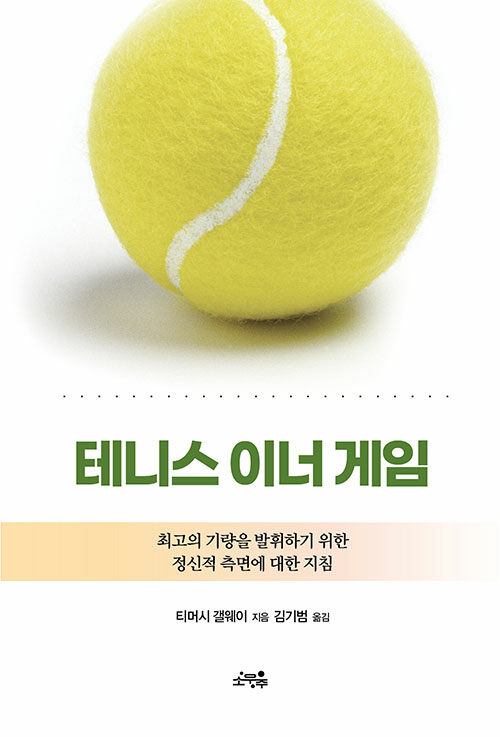

  
  <h1>테니스 이너게임</h1>
  

    
    
    
  

## 📝 목차

- [📝 목차](#-목차)
- [1장. 테니스의 정신적 측면에 관하여](#1장-테니스의-정신적-측면에-관하여)
- [2장. 두 자아의 발견](#2장-두-자아의-발견)
- [3장. 자아1을 조용히 시키기](#3장-자아1을-조용히-시키기)
- [4장. 자아2를 신뢰하기](#4장-자아2를-신뢰하기)
- [5장. 기술의 발견](#5장-기술의-발견)
- [6장. 습관 바꾸기](#6장-습관-바꾸기)
- [💬 느낀점](#-느낀점)

---

## 1장. 테니스의 정신적 측면에 관하여

<a href="#-목차">⬆️ 위로 이동</a>

---

## 2장. 두 자아의 발견

<a href="#-목차">⬆️ 위로 이동</a>

---

## 3장. 자아1을 조용히 시키기

> <strong><i>p40. 마음을 조용히 시키는 것은 생각, 계산, 판단, 걱정, 공포, 희망, 노력, 후회, 조절, 조바심, 산만함을 줄이는 것이다.</i></strong> 🍋

> <strong><i>p41. 판단하지 않는 것은 이너 게임에 가장 기초가 되는 핵심 사항이다.</i></strong> 🍋

> <strong><i>p43. 여기서 말하는 판단이란 어떤 사건에 부정적이거나 긍정적인 가치를 부여하는 것이다.</i></strong> 🍋

> <strong><i>p43. 여기서 말하는 판단이란 어떤 사건에 부정적이거나 긍정적인 가치를 부여하는 것이다. ... 결국 판단이란 우리가 보고, 듣고, 느끼고, 생각하는 모든 경험에 대한 지극히 개인적인 반응이다.</i></strong> 🐧

> <strong><i>p58. 언제나 인정받기를 바라고, 거부당하는 것을 못 견디는 이 예민한 자아-정신은 칭찬을 잠재적 비판으로 간주한다. '코치가 어떤 동작에 만족한다면 다른 동작에는 불만족할 거야. 잘치는 모습을 좋아한다면 잘 못 치는 모습은 싫어할 거야.'라고 생각하는 것이다.</i></strong> 🐧

> <strong><i>p59. 판단하지 않는다고 해서 사건의 본질을 보지 못하는 것은 아니다. 판단을 배제하는 것은 눈앞에 보이는 사실에 어떠한 것도 더하거나 빼지 않는다는 의미다.</i></strong> 🌵

<a href="#-목차">⬆️ 위로 이동</a>

---

## 4장. 자아2를 신뢰하기

> <strong><i>p72. 당신은 당신의 몸이 아니다. 마치 다른 사람을 응원하듯이 당신의 몸이 배우고, 경기를 할 수 있도록 신뢰해야 하는 것이다.</i></strong> 🌵

> <strong><i>p73. 당신의 몸이 포핸드 치는 방법을 알고 있다면 알아서 치도록 놔둬라. 그렇지 않다면 배울 수 있도록 놔둬라.</i></strong> 🌵

> <strong><i>p76. 자아 2에는 눈으로 한 번 보는 것이 백 마디 말보다 효과적이다. 자아 2는 스스로 동작을 하면서 배우기도 하지만 남들의 동작을 보면서 배우기도 한다.</i></strong> 🐧🍋

- `펭귄`: 요즘 필라테스를 하는데 선생님 말하는 것보다는 자세를 유심히 관찰하게 된다.
- `튜브`: 고수들 하는 걸 근처에서 보는 것만 해도 도움이 정말 많이 되었다.

> <strong><i>p84. 친구에게 공을 5개나 10개 정도 던져 달라고 하자. 이 과정에서는 스트로크에 어떤 변화를 주려고 해서는 안 된다. 단지 지켜보기만 하자. 분석하지도 말고 그냥 유심히 관찰하기만 하면 된다. 그러면서 라켓의 위치가 어디인지 항상 파악해보자. 판단을 배제하면서 스트로크를 관찰하기만 해도 변화가 생길 수 있다. 하지만 좀 더 많은 변화를 원한다면 바람직한 형태의 이미지를 그려보자.</i></strong> 🌵

> <strong><i>p88. 이들 기본 스타일을 수강생들에게 간단히 설명한 단음, 본인이 지금까지 추구해왔던 스타일과 가장 동떨어진 스타일로 한 번 해보도록 권장한다.</i></strong> 🍋

- `샐리`: 폼을 생각하지않고 공에 집중하는 스타일로 쳐보자!

> <strong><i>p89. 판단하지 않기, 이미지 그리기, '자연스럽게 하도록 놔두기'는 이너 게임에서 가장 기본이 되는 세 가지 기술이다.</i></strong> 🐧🌵

- `펭귄`: 운전면허 기능 시험 준비할 때 이미지 트레이닝 한게 도움이 많이 되었다.

<a href="#-목차">⬆️ 위로 이동</a>

---

## 5장. 기술의 발견

> <strong><i>p97. 즉, 지시 사항에 지나치게 의존함으로써 자신의 동작을 느끼지 못하면 자연적 학습 과정을 통한 접근이 어려워질 뿐만 아니라 우리의 잠재력을 제대로 발휘하지 못하게 된다.</i></strong> 🍋

> <strong><i>p112. 우리는 모두 각자 자신의 서브를 익혀야 하며, 어떤 서브도 모두에게 최선일 수는 없다.</i></strong> 🍋

<a href="#-목차">⬆️ 위로 이동</a>

---

## 6장. 습관 바꾸기

<a href="#-목차">⬆️ 위로 이동</a>

---

## 💬 느낀점

<table>
  <thead>
    <tr>
      <th width='10%'>팀원</th>
      <th width='90%'>느낀점</th>
    </tr>
  </thead>
  <tbody>
    <tr>
      <td align='center'><code>펭귄</code></td>
      <td></td>
    </tr>
    <tr>
      <td align='center'><code>샐리</code></td>
      <td></td>
    </tr>
    <tr>
      <td align='center'><code>튜브</code></td>
      <td></td>
    </tr>
  </tbody>
</table>

<a href="#-목차">⬆️ 위로 이동</a>
