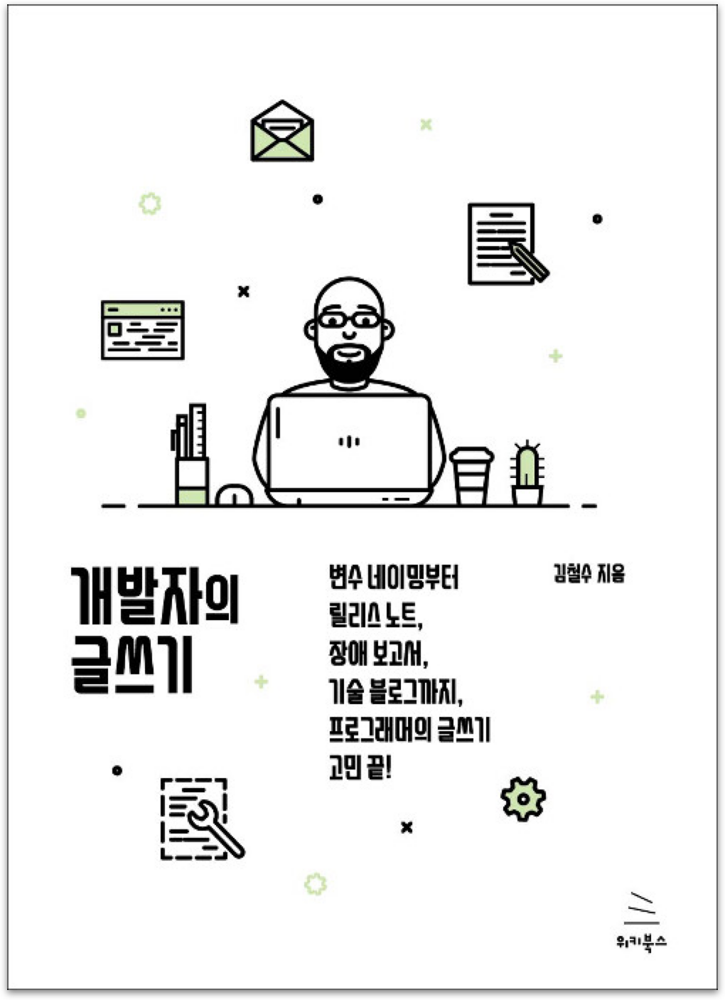

  
  <h1>개발자의 글쓰기</h1>
  

    
    
    
  

## 📝 목차

- [1장. 개발자가 알아야 할 글쓰기 기본](#1장-개발자가-알아야-할-글쓰기-기본)
- [2장. 개발 시간을 줄여주는 이름 짓기와 주석 쓰기](#2장-개발-시간을-줄여주는-이름-짓기와-주석-쓰기)
- [3장. 사용자와 소통하는 에러 메시지 쓰기](#3장-사용자와-소통하는-에러-메시지-쓰기)
- [4장. 독자 관점에서 릴리스 문서와 장애 보고서 쓰기](#4장-독자-관점에서-릴리스-문서와-장애-보고서-쓰기)
- [5장. 설명, 묘사, 논증, 서사로 개발 가이드 쓰기](#5장-설명-묘사-논증-서사로-개발-가이드-쓰기)
- [6장. 수주를 돕는 SI 제안서 쓰기](#6장-수주를-돕는-SI-제안서-쓰기)

---

## 1장. 개발자가 알아야 할 글쓰기 기본

> <strong><i>p27. 문장을 쉽게 쓰려면 이처럼 간단한 문장 구조로 핵심만 말한 뒤, 필요에 따라 부가 설명을 하면 된다. 이 때 첫 문장의 주어를 가져다가 소제목으로 만들면 자연스럽게 문단을 구성할 수 있다.</i></strong> 🐧🙂🍋

- `후미`: 유용한 정보여서 다음에 써보려고 한다.

- `샐리`: 한 문장을 쓰는데 오랜 시간이 걸리는데, 이 방법을 사용하면 시간을 줄일 수 있을 것 같다.

> <strong><i>p34. 비지니스 문서에는 반드시 계층을 표현한다.</i></strong> 🙂🍋

- `샐리`: 지금까지 내 md 파일이 이상했던 이유는 글 사이의 위계가 지켜지지 않았기 때문임을 깨달았다.

- `펭귄`: 글머리 기호가 3 depth 이상이 되면 좀 복잡해지는 경향이 있어서, 3 depth 이상이 되면 다른 포맷으로 바꾸는 것 같다. 예를 들면, 표를 만들다던가 소제목으로 분리한다던가..

> <strong><i>p35. 조사, 순서, 숫자, 하다, 기호만 붙이고 나머지는 띄어 쓴다.</i></strong> 🐧🍋

> <strong><i>p43. 프로그램 안에서 일관성과 개연성만 있다면, 또는 그 프로그램의 코드를 보는 개발자 사이에 일관적이고 개연적인 합의만 돼 있다면 어떻게 쓰든 상관없다.</i></strong> 🍋

- `샐리`: 합의가 되어있다면 상관없다고 책에 나와있으나, 현실에서는 그 단어가 어떤 의미인지도 모르고 사용할 때도 많은 것 같다.

### ✅ 요약

<small><a href="#-목차">⬆️ 위로 이동</a></small>

---

## 2장. 개발 시간을 줄여주는 이름 짓기와 주석 쓰기

> <strong><i>p48. 애자일이 주목받아서 문서를 최소로 만드는 시대에 문서 대신에 코드로 소통하려면 좋은 이름 짖기는 필수다.</i></strong> 🙂🍋

- `후미`: 개발자들의 문서는 결국 코드니 코드의 변수명을 잘지어야된다.

- `샐리`: 변수의 쓰임을 주석으로 처리하면, 주석의 의미를 찾기 위해서 코드를 타고 들어가서 선언부를 확인해야한다. 혹은 해당 변수가 사용되는 모든 부분에 주석을 써놔야하는 번거로움이 있다. 이보다는 좋은 이름을 짓는게 확실히 나은 것 같다.

> <strong><i>p49. 이름 짓기는 창조 과정이 아니라 정해진 원칙으로 적절한 단어를 선택해 조합하는 과정일 뿐이다.</i></strong> 🙂🍋

- `펭귄`: 약간의 꿀팁? 야매팁?인데, 함수명 짓기 어렵다면, 해당 함수가 하는 일 한 줄로 작성한 문장을 영어로 번역하고 정리하면 의외로 괜찮은 함수명을 지을 수 있다.

> <strong><i>p53. 요즘에는 IDE가 발전해서 굳이 상수를 모두 대문자로 쓸 필요가 있는지 의문이다. ... 어느 쪽이든 회사 안에서는 통일하는 것이 좋다.</i></strong> 🙂🍋🌵

- `샐리`: 관례로 굳어져있어서 그런지, 상수는 대문자로 쓰는게 좋은 것 같다. 협력사에서 제공해주는 코드 중에 임베디드 핀을 뜻하는 상수값이 존재하는데, 이를 구분할 때 중요한 것 같다.

- `튜브`: 약속하면 소문자도 가능하겠구나 생각은 했지만 대문자가 아직 자연스러운 것 같기는 하다.

> <strong><i>p53. 긴이름? 짧은이름? 검색 잘 되는 이름! ... 변수 이름의 길이와 오탈자의 상관관계는 이제 없다고 봐야 한다.</i></strong> 🍋

> <strong><i>p59. 그래서 변수명은 그냥 두더라도 -s 대신 다음과 같이 'array'나 'list of'를 쓰는 편이 더 나을 수도 있다. 어떤 것이 편한지는 개인마다 다르겠지만 회사 또는 프로젝트 안에서는 규칙을 하나로 통일해야 할 것이다.</i></strong> 🐧🙂🌵

- `펭귄`: 이런 사소한 것들을 미리 정해두면 고민하는 시간을 많이 줄여주는 것 같다.

- `후미`: list_of_data등 1D array나 list_of_list_of_data같이 2D array까진 쓰는 것도 좋은 것 같다.

> <strong><i>p60. 어떤 이름을 약어로 쓰고 싶다면 몇 가지 안을 만들어서 비개발자에게 물어보는 것도 좋다.</i></strong> 🍋

- `샐리`: 비개발자도 좋고, 옆 파트 개발자에게 물어보는 것도 좋은 것 같다.

> <strong><i>p60. 하지만 이 변수를 다시 사용할 때는 total로 검색을 시작하는 경우보다 visitor로 검색을 시작하는 경우가 더 많을 것이다. 따라서 total이라는 수식어보다는 본래 의미를 뜻하는 visitor를 앞에 쓸 것을 추천한다.</i></strong> 🐧🙂🌵

- `후미`: 의미를 뜻하는 단어를 앞에 먼저 적자.

- `샐리`: total은 ‘전체의', cnt는 ‘수'를 뜻하는데, 형용사냐 명사냐에 따라 어순의 차이로 인해 visitor를 앞에 쓰는게 아직은 좀 익숙하지 않은 것 같다.

> <strong><i>p66. 그러면 검색하기 쉬운 이름은 어떻게 지을까? 아주 쉽다. 구전적 범주화를 이용해 한 단계 상위 범주의 이름을 태그처럼 덧붙이면 된다. 고전적 범주화란 특정한 대상들을 묶어 상위 범주를 만들어 이해하는 것이다.</i></strong> 🐧🙂🍋

> <strong><i>p72. 감각적인 단어는 그렇지 않은 단어보다 기억하기가 쉽다. 특히 시각적으로나 청각적으로 완결된 단어가 그렇지 않은 단어보다 더 잘 기억된다.</i></strong> 🍋

- `샐리`: 입밖으로 꺼냈을 때, 읽히는지가 중요하다는 의견에 동의한다.

> <strong><i>p73. 개발자만 보는 보편적인 문서라면 보편적으로 쓰는 이름은 그대로 써도 무방하다. 굳이 자기만의 센스를 발휘해서 바꿀 필요가 없다.</i></strong> 🙂

- `후미`: p49처럼 창의성 보다는 보편적으로 쓰는 단어를 사용하자.

> <strong><i>p75. 자주 사용되거나 중요한 이름이라면 입력하기 쉬운지, 오타를 낼 가능성이 작은지, 다른 사람에게 말로 전달하기 쉬운지 검토해 보는 것이 좋다.</i></strong> 🙂🍋

- `튜브`: 오타를 낼 가능성이 작은지도 검토해 보자.

- `샐리`: 회의나 코드리뷰를 할때에도 말로 전달할 수 있는 변수명이 중요하다. 또한, 여러 유사한 변수명이 생기지 않게 주의하자!

> <strong><i>p77. 처음부터 주석 없이 코딩하는 연습을 하자.</i></strong> 🍋🌵

> <strong><i>p80. 본인의 영어 실력이 별로라면 어쩔 수 없이 주석을 달아야한다.</i></strong> 🍋

> <strong><i>p87. 그 주석이 언제 어떻게 읽히는지에 따라 반복해서 쓸 것인지를 결정해야 한다. 무조건 처음 한 번만 쓰고 같은 내용이 반복되는 주석을 지워야만 좋은 것은 아니다.</i></strong> 🍋🌵

- `샐리`: 코드를 항상 처음부터 읽지 않기 때문에, (함수를 타고 들어오는 경우도 있다.) 중요한 부분이라면, 주석을 여러번 써주는 것도 방법이다.

> <strong><i>p87. 발췌는 중요한 것을 뽑아내는 것이다. 중요한 것을 뽑으려면 덜 중요한 것을 빼야 한다.</i></strong> 🍋

> <strong><i>p91. 주석의 악순환에서 벗어나는 가장 좋은 방법은 주석도 코드라고 생각하는 것이다. 코드 리뷰를 하면서 주석 리뷰도 꼼꼼히 해야 한다. 불필요한 주석은 없애고, 꼭 필요한 주석은 반드시 코드처럼 다뤄야 한다.</i></strong> 🐧🌵

- `펭귄`: 주석이 컴파일 시 문제가 없기 때문에 지나치는 게 아니라, 컴파일 시 문제가 없기 때문에 어떤 영향을 줄지 파악하기 어렵다. 잘못된 주석은 인수인계자에게 큰 문제를 야기할 수 있기 때문에 주석도 코드처럼 생각할 필요가 있는 것 같다.

- `튜브`: 주석은 당장 동작에 영향을 주지는 않지만 크게 보았을 때 코드에 영향을 준다!

> <strong><i>p91. 필자도 주요 개발자 사이트에 올라온 문서에서 주석을 추출해 주석 빅데이터를 만들려고 했다. 그러면 주석을 자동으로 추천하거나 주석을 써야 할지 말아야 할지를 알려주는 서비스를 제공할 수 있겠다 싶었다.</i></strong> 🍋

- `샐리`: 은퇴하면 꼭 만들어봐야지. 재밌을 것 같다.

### ✅ 요약

- 좋은 이름이 가진 5가지 특징(SMART)
  - easy to Search / 검색하기 쉽고
  - easy to Mix / 조합하기 쉽고
  - easy to Agree / 수긍하기 쉽고
  - easy to Remember / 기억하기 쉽고
  - easy to Type / 입력하기 쉽고

<small><a href="#-목차">⬆️ 위로 이동</a></small>

---

## 3장. 사용자와 소통하는 에러 메시지 쓰기

> <strong><i>p98. 문제는 두 번째 경우다. 링크가 있어서 클릭했는데 해당 페이지가 없는 경우다. 이것을 깨진 링크, 또는 죽은 링크, 나쁜 링크라도고 한다. 문제는 이런 깨진 링크를 개발자들이 내버려 두는 데 있다.</i></strong> 🍋

> <strong><i>p99. 처음부터 개발자용 에러 메시지와 사용자용 에러 메시지를 분리해 작성하는 것이 좋다. 예를 들어 C에서 #define 전처리를 이용해 매크로로 처리하면 여러 에러 메시지를 한 번에 쉽게 관리할 수 있다.</i></strong> 🍋

- `샐리`: 테스트 코드와 실제 사용자 구동 코드가 다르면 편하다! 실제 현업에서도 이렇게 사용하더라!

> <strong><i>p102. 오류의 내용과 오류의 원인을 함께 알려줘야 사용자가 대처할 수 있다.</i></strong> 🍋

- `샐리`: 책의 예시가 매우 적절했다. 고객센터를 터지게 하는 것보다는 에러를 알려줘서 사용자가 스스로 정정하도록 만드는 것이 좋은 것 같다.

- `후미`: 내가 잘못 입력한 부분에 대해 어떤 것이 잘못 되었는지 알려주는 것을 경험해보니 좋았다.

> <strong><i>p102. 이렇게 보면 에러 메시지의 목적은 사용자에게 에러가 났음을 알려주는 것이 아니라 사용자 스스로 에러를 해결하게 하는 것이다. 따라서 사용자 에러 메시지에는 에러의 내용, 에러의 원인, 에러 해결 방법이 포함되어야 한다.</i></strong> 🐧

- `펭귄`: 종종 개발한 기능에 대한 에러 문의가 들어온 적이 있었는데, 에러 원인과 해결책을 적어놓으면 운영비용이 많이 줄어들 것 같다.

> <strong><i>p104. 앞에서 에러 내용이나 원인을 먼저 구구절절 말하기보다는 에러를 해결하는 방법을 먼저 얘기하는 편이 사용자에게 훨씬 낫다. 그리고 에러 내용보다 에러 원인을 먼저 말하는 것이 낫다. </i></strong> 🍋

- `샐리`: 실제로 내가 사용하는 서비스에 이런식으로 써져있는데, 다 이런 원리가 들어가는구나 싶었다. 고객이 궁금해하는 순서대로 적는 방식이 좋은 것 같다!

> <strong><i>p106. 버튼에는 이런 식으로 행동을 분명히 표시하는 것이 좋다. 가능하다면 ‘취소’라는 말보다 더 구체적인 행동을 말로 전하는 것이 좋다. 짧고 애매한 것보다는 길더라도 분명한 것이 더 낫다.</i></strong> 🍋

- `펭귄`: 확실히 액션을 분명히 표시하는 게 좋은 것 같다. 다만 ‘취소'나 ‘닫기'는 사용자도 충분히 인지할 수 있는 내용이라 액션만 확실히만 표현하고 있다.

> <strong><i>p109. 확인이 오른쪽에 있는 이유는 행동의 연속성 때문이다.</i></strong> 🍋

- `샐리`: 지금까지 항상 오른쪽에 확인 버튼이 있는게 당연하다고 생각했는데, 이런 이유 임을 이제 깨달았다!

> <strong><i>p109. OS와 상관없이 확인-취소 순서로 하든 취소-확인 순서로 하든 한 가지 순서로만 표시해야 한다. 그래야 사용자 경험이 어긋나지 않는다.</i></strong> 🍋🐧

- `샐리`: 왼손잡이가 많은 국가에서는 왼쪽에 확인버튼을, 오른손잡이가 많은 국가에서는 오른쪽에 확인 버튼을 둘까? 아니면 하나의 서비스이므로 버튼 위치를 통일할까?

> <strong><i>p110. 확인, 취소 대신 '삭제하고 이동하기', '이 페이지에 머물기'처럼 구체적인 행동을 적는 것도 좋은 방법이다.</i></strong> 🙂

> <strong><i>p111. 같은 메시지가 반복될 때는 그런 메시지를 무시하기 일쑤다. 이런 경우에는 사용자에게 앞으로 남은 로그인 횟수를 메시지로 보여주면 된다. 어떤 사용자든 로그인 가능 횟수가 줄어들면 자기 행동에 주의하게 된다.</i></strong> 🍋

- `샐리`: 현재 인터넷에서 제공되는 많은 서비스가 이와 같은 방식을 사용한다. 사소하지만, 이러한 방식이 자리잡게 된 이유를 알게돼서 좋았다.

> <strong><i>p118. 어떤 방식을 쓸지는 서비스와 사용자에 따라 달라지겠지만, 개발자도 자신만의 철학을 가져야 한다. 에러 메시지를 보여주기 전에 개발자 스스로 사용자를 어떤 관점으로 보는지 생각해 봐야 한다.</i></strong> 🍋

- `샐리`: 사용자에게 얼마나 친절하게 에러를 전달할지 등은 미리 정하고 가야하는 것이 맞을 것 같다. 정하지 않으면, 중구난방으로 친절한 정도가 달라, 사용자들이 황당해할 것 같다.

### ✅ 요약

<small><a href="#-목차">⬆️ 위로 이동</a></small>

---

## 4장. 독자 관점에서 릴리스 문서와 장애 보고서 쓰기

> <strong><i>p120. 어떤 일을 하고 나서 그 일의 내용을 상사나 고객에게 글로 보고해야 할 때가 있다. 
이때 글을 지나치게 줄여 쓰면 일을 안 한 것처럼 보인다. 그렇다고 해서 일의 내용을 하나씩 구체적으로 다 쓰면 아무도 읽지 않는다.</i></strong> 🍋

- `펭귄`: 회사에서 일일보고를 쓰는데, 다른 사람에게 꼭 공유를 해야하는 건 자세히 쓰는 편이고 아직 개발이 덜 되서 공유하기 어려운 건 간단히만 공유하는 편이다.

> <strong><i>p122. 체인지 로그를 적절한 양으로 쓰려면 일단은 체인지 로그를 최대한 많이 써야 한다. 그 다음에는 일정한 기준으로 선정하고 비슷한 것끼리 분류한 뒤 문장을 요약하는 기술이 필요하다. 
>    
> 1단계: 선정하기    
> 2단계: 분류하기    
> 3단계: 요약하기   
> 4단계: 종합하기</i></strong> 🍋    

> <strong><i>p135. 이렇게 체인지 로그를 하나의 관점으로만 쓸 필요는 없다. 내용에 따라 관점을 적절히 선택하는 것이 중요하다. 정말 사소한 것이라면 마지막 문장에 기타로 묶는 것도 좋은 방법이다.</i></strong> 🐧

- `펭귄`: 잘 쓰여진 체인지로그가 앱의 인상을 바꿔놓는 것 같다. 항상 앱을 업데이트하기 전에 체인지로그를 확인하는데, 확실한 내용이 없으면 “바뀐게 없는 것 같은데 왜 업데이트 해야하지?”라는 생각이 들어 업데이트 하지 않는다. 오히려 체인지로그를 읽기 쉽게 써놓은 앱은 거의 업데이트한다.

> <strong><i>p141. 하나의 문제에 문제점은 여러 가지이고, 여러 가지 문제점을 모두 해결하기에는 예산과 인력이 늘 부족하므로 특정 문제점을 선택할 수 밖에 없다. 그러므로 어떤 문제점을 선택하냐에 따라 문제 해결 방법은 완전히 달라진다.</i></strong> 🐧🍋

- `샐리`: 오늘 해야할 일(오늘 해결할 이슈)은 문제, 그 문제를 해결하기 위해 고칠 부분은 문제점이지 않을까?

> <strong><i>p147. 원인의 원인을 찾을 수 없을 때 그 원인이 장애의 최초 원인이다.</i></strong> 🐧

---

## 5장. 설명, 묘사, 논증, 서사로 개발 가이드 쓰기

> <strong><i>p164. 개발자가 독자에게 서비스 개념을 설명할 때는 범주, 용도, 특징 순으로 쓰는 것이 좋다.</i></strong> 🐧🙂🌵🍋

> <strong><i>p167. 범주는 서비스를 소개하거나 설명하는 첫 문장인 만큼 정확하고 적절하게 정해야 한다. 가장 좋은 방법은 여러 경쟁사가 사용하는 보편적인 서비스 범주를 따라 하는 것이다.</i></strong> 🐧🍋

> <strong><i>p168. 강력한 마케팅을 전개할 수 있다면 완전히 새로운 개념의 범주를 만들어서 사용할 수 있다. 범주를 선점하는 회사가 해당 범주의 대표주자가 되기 때문이다. </i></strong> 🍋

> <strong><i>p169. 첫 문단의 첫 문장에 범주가 사용된다면 첫 문단의 두 번째 문장은 독자 관점의 용도를 주로 적는다. 용도는 독자가 이 서비스를 이용하는 이유다. </i></strong> 🍋

> <strong><i>p170. 막상 용도를 쓰려고 하면 그리 쉬운 일은 아니다.</i></strong> 🍋

> <strong><i>p171. 장점은 자기 기준에서 잘하는 것이고, 강점은 경쟁 서비스와 비교해서 나은 것이다.</i></strong> 🍋

> <strong><i>p180. 글이 그림과 같이 있으면 글과 그림이 같은 용어를 사용하는지 꼭 확인해야 한다.</i></strong> 🐧🌵

> <strong><i>p182. 이 요구사항 정의서는 주관적 묘사를 완전히 배제하고 오직 객관적 묘사만 포함해야 한다.</i></strong> 🐧

> <strong><i>p183. 개발자가 주관적 묘사를 객관적 묘사로 바꾸고, 그것을 다시 주관적 묘사로 바꿀 수 있으면 일하기가 한결 편하다.</i></strong>🌵🍋

> <strong><i>p185. 가장 좋은 방법은 개발자가 직접 체험한 결과를 알려주는 것이다.</i></strong> 🍋

> <strong><i>p186. 거칠게도 공손하게도 쓰지 말자.</i></strong> 🍋

> <strong><i>p187. 이런 표현은 다음과 같이 바꾸자. “~하십시오.”, “ ~하지 마십시오.”</i></strong> 🍋

> <strong><i>p187. 세상에 어떤 일이든 100% 확신할 수는 없다. 하지만 개발문서는 독자에게 여지를 줘서는 안 된다.</i></strong> 🐧🙂🌵

> <strong><i>p192. 그러니 다음과 같이 답을 먼저 알려주고 나머지는 간단히 정리하는 것이 좋다.</i></strong> 🍋

> <strong><i>p198. 하지만 개발자가 쓴 개발문서의 독자는 매우 다양하다. 심지어 문서를 깃허브에 공개하면 전 세계 개발자가 읽는다.</i></strong> 🍋

> <strong><i>p201. 독자가 이 예문이 지시한 대로 25개의 행동을 따라하다 보면 열 번째쯤에서 “내가 이걸 왜 하고 있지?”, “이렇게 하는 이유가 뭐지?”, “이렇게 하면 어떻게 된다는 거지?” 하는 생각이 든다. … 이런 문제를 막기 위해 단계 개념을 사용한다.</i></strong> 🍋
> 
> <strong><i>p202. 각 단계는 반드시 목표가 있어야한다. </i></strong> 🙂

### ✅ 요약

<small><a href="#-목차">⬆️ 위로 이동</a></small>

---

## 6장. 수주를 돕는 SI 제안서 쓰기

> <strong><i>p209. 개발자는 일부분만 보고 그림만 그려서는 안 된다. 제안요청서 곳곳에는 기술 부문을 어떻게 작성해야 하는지 힌트가 숨어 있다.</i></strong> 🐧

> <strong><i>p221. 따라서 개발자는 고객의 요구사항을 받아서 분석해서 개발하는 것이 아니라, 고객에게 요구사항을 제시해서 고객이 선택하게 만들어야 하고 그 선택에 따라 개발해야 한다.</i></strong> 🐧

> <strong><i>p223 요구사항 정의와 구현, 고객의 검수 사이의 시간 차이를 줄이는 것이다.</i></strong> 🙂🌵

> <strong><i>p225. 해당 기능의 개발이 끝나면 즉시 고객에게 테스트를 요청하고 검수를 받는다. ... 이렇게 하면 고객의 요구와 개발, 검수 사이의 시간 차이를 최소화할 수 있고, 고객의 변덕에 대비할 수 있다.</i></strong> 🐧

### ✅ 요약

<small><a href="#-목차">⬆️ 위로 이동</a></small>
