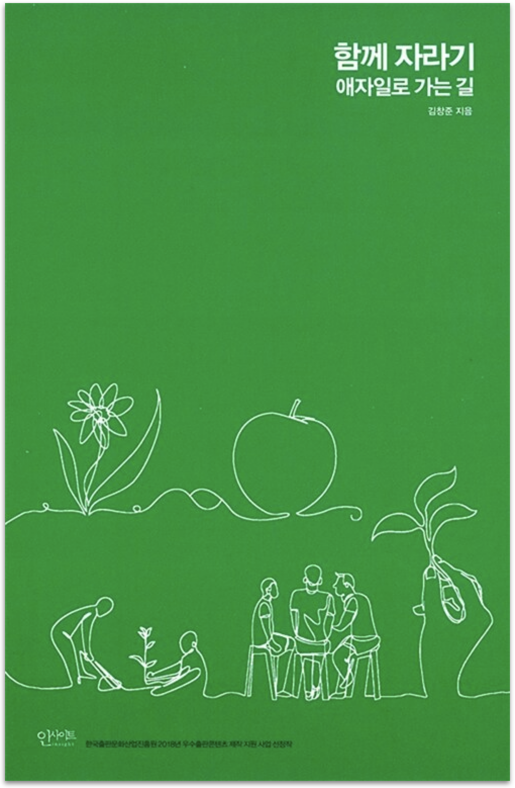

  
  <h1>함께 자라기</h1>
  

    
    
    
  

## 📝 목차

- [1장. 자라기](#1장-자라기)
- [2장. 함께](#2장-함께)
- [3장. 애자일](#3장-애자일)
- [💬 느낀점](#-느낀점)

---

## 1장. 자라기

> <strong><i>p22. 최소한도의 경험치만 넘어가면 경력 연수와 실제 직무 성과의 상관성이 생각보다 낮다는 것은 소프트웨어 개발뿐만 아니라 다른 여러 영역에서도 동일하게 밝혀졌습니다.</i></strong> 🐧🐤🙂🌵

- `샐리`: 주변에서도 심심치 않게 보인다.
- `후미`: 만년 차장, 과장이 괜히 있는 말이 아니니다.
- `튜브`: 책에서 말하는 ‘최소한도의 경험치'도 생각보다 짧아서 인상적이었다. (6개월 ~ 2년정도)

> <strong><i>p27. 그가 말하는 1만 시간 법칙에서 1만 시간은 '자신의 기량을 향상시킬 목적으로 반복적으로 하는 수련'을 한 시간을 일컫습니다.</i></strong> 🐧🌵🐤🙂

- `펭귄`: 1만 시간 법칙이 흔히 “1만 시간 동안 반복하면 잘하게 된다" 이런 느낌으로 퍼져있는데, 이 법칙의 핵심은 “자신의 기량을 향상시킬 목적으로 수련"인 것 같다.
- `후미`: 개선 없는 1만 시간은 물이 점점 고여 썩어가는 느낌인것 같다..
- `튜브`: 같은 시간을 보내도 이 ‘수련'에 속할 수도 있고 아닐 수도 있기 때문에 때문에 경력 연수와 직무 성과에 상관성이 낮은 것 같다.

> <strong><i>p27. 정말 기량 향상을 목적으로 자신의 약점을 개선하려고 애쓰는 수련, 그것만이 의도적 수련입니다. </i></strong> 🐤

- `샐리`: 넋놓고 시간을 보내는 것이 아닌, 자신의 목표를 위해 무언가를 개선하는 과정이 수련이라고 생각하기 때문에 와닿은 문장!

> <strong><i>p35. 조직이 첫 주기에 만들어낸 결과물을 계단 삼아서 다음 주기에는 조금 더 높은(더 똑똑한) 위치에서 다음 결과물을 만들어냅니다.</i></strong> 🌵

- `튜브`: 단순히 결과물에 그치지 않고 결과물을 통해 조직이 성장하는 것!
- `후미`: [“회의도, 신규개발도 모두 스톱”…오늘의집 ‘FIW’ 제도 ‘눈길’ - 이데일리 뉴스](https://m.edaily.co.kr/news/read?newsId=01321846635542008&mediaCodeNo=257)
- `샐리`: 다같이 리팩토링하는 시간을 가지는 게 정말 좋은 것 같습니다!

> <strong><i>p38. 어떻게 하면 더하기보다 곱하기를 할 수 있을 것인가입니다.</i></strong> 🙂

- `후미`: 확실히 이전 자료, 프로젝트를 거름삼아 다음것을 진행하면 더하기가 아닌 곱하기가 되는거 같다.
- `샐리`: 범용적인 플랫폼을 구축해놓는 것이 중요한 것 같다!

> <strong><i>p38. 자신이 평소 투자하는 비용을 한번 살펴보세요. A 작업, B 작업, C 작업이 각각 어느  정도 비율인지, 만약 B나 C가 거의 없다면 '이상한 나라의 앨리스'에 나오는 붉은 여왕의 말대로, 후퇴하는 셈이 될 겁니다.</i></strong> 🐤🌵

- `샐리`: 내가 하는 일에는 C 작업이 있는지 다시 생각하게 된다.

> <strong><i>p39. 자신이 이미 갖고 있는 것들을 잘 활용하라. … 새로운 지식 유입에 집중하지 말고 가지고 있는 지식을 얼마나 어떻게 활용하는지 반성하라.</i></strong> 🐤

- `샐리`: 지금까지 배웠던 것 중에 얼마나 실제로 활용해보았는지 반성하게 된다. 회사 업무 외에 내가 개인적으로 자기발전을 위해 리뷰해본적이 없는 것 같아서 아쉽다.
- `펭귄`: 배우기만 하고 실제 써먹지 않으면 까먹기 쉽다.
- `튜브`: 실제로 써먹지 않으면 실제로는 모르는 것일 수도 있다.

> <strong><i>p39. 이미 갖고 있는 것들을 하이퍼링크로 서로 촘촘히 연결하라. 노드 간 이동 속도가 빨라질 수 있도록 고속도로를 놔라. 즉, 이미 습득한 지식, 기술 경험 등을 서로 연결 지어서 시너지 효과가 나게 하고 하나의 영역에서 다른 영역으로 왔다갔다하는 것을 자주 해서 다른 영역 간을 넘나들기가 수월해지도록 하라.</i></strong> 🐧

- `펭귄`: 그래서 요즘 [Obsidian](https://obsidian.md/)에 관심을 갖고 있다.

> <strong><i>p40. 피드백을 자주 받아라. … 사이클 타임을 줄여라. 새로운 정보를 얻었다면 1년 후에 크고 완벽한 실험을 하려고 준비하기보다는 1달, 혹은 1주 후에 작게라도 실험해 보는 것이 좋다. 순환률을 높여라. … 일찍, 그리고 자주 실패하라. 실패에서 학습하라.</i></strong> 🐤🌵

- `샐리`: 예전에 실수한 걸 물어보지 않고 프로젝트를 진행했던 때가 생각난다. 했던 일을 또 하게 되고, 시간은 시간대로 늘어나더라.

> <strong><i>p45. 저는 알파고 같은 인공지능 시대에 대비하려면 배우기 힘든 것에 집중하라고 말하고 싶습니다.</i></strong> 🐤

- `샐리`: 디바이스 드라이버가 돌아가도록 설계하는 것 뿐만아니라, 효율적인 플랫폼에 대해 고민하게 됐다.

> <strong><i>p51. 반면에 소프트웨어 개발자는 소프트웨어를 뭘 만들지를 고민하고 설계하는 부분이 포함되며, 그 과정에서 타인과 상호작용하는 업무가 많습니다. 앞서 이야기한 독창성, 협상, 설득 등에서 차이가 나는 것이죠.</i></strong> 🐧🐤 

> <strong><i>p55. 꾸준한 반복으로 달인이 되려면 적어도</i></strong>    
> <strong><i>1. 실력을 개선하려는 동기가 있어야 하고</i></strong>    
> <strong><i>2. 구체적인 피드백을 적절한 시기에 받아야 한다</i></strong> 🌵

- `펭귄`: [코드 리뷰의 목적은 성장이어야 한다 - JBEE.io](https://jbee.io/essay/code-review-goal/)

> <strong><i>p63. 의도적 수련의 필수 요건 중 하나가 ‘적절한 난이도’입니다..</i></strong> 🐤🌵  

> <strong><i>p66-70. 지루함을 느끼는 경우: a1 실력낮추기  
지루함을 느끼는 경우: a2 난이도 높이기  
불안함을 느끼는 경우: b2 실력 높이기  
불안함을 느끼는 경우: b1 난이도 낮추기
</i></strong> 🐤  

> <strong><i>p68. 인지심리학에서 상대의 전문성을 빠른 시간 내에 간파하는 기법 주에 남들보다 일을 좀 더 효율적/효과적으로 하기 위해 내가 직접 만들어 쓰는 나만의 도구, 방법을 묻는 방법이 있습니다.</i></strong> 🐤  

> <strong><i>p69-70. 실력을 어떻게 당장 올릴 수 있을까요. 크게 보면 사회적 접근과 도구적 접근, 내관적 접근 세 가지가 가능합니다.   
> 사회적 접근은, 나보다 뛰어난 전문가의 도움을 얻는 것입니다. …   
> 도구적 접근은 다른 도구의 도움을 받는 겁니다. …   
> 내관적 접근은 비슷한 일을 했던 경험을 머릿속에서 되살려보는 겁니다. …</i></strong> 🐤  

> <strong><i>p86. 여기서 중요한 점은 그 당시에 자신이 만들 수 있는 작고 간단한 추가 기능을 생각해 낼 수 있었던 점이 아닌가 싶습니다.</i></strong> 🐤  

> <strong><i>p87. ‘전문가가 빨리 되기’를 위해서는 ‘전문가에게서 전문성을 효과적으로 뽑아내기’에 대해 전문가가 되어야겠지요.   
> 그 첫걸음은 전문가를 만나는 것이고, 그 다음은 구체적 사례를 듣는 것이 되겠죠.</i></strong> 🐤  

> <strong><i>p102. 뛰어난 소프트웨어 개발자일수록 타인과 인터랙션에 더 많은 시간을 쓰며, ...</i></strong> 🐤  

<small><a href="#-목차">⬆️ 위로 이동</a></small>

## 2장. 함께

<small><a href="#-목차">⬆️ 위로 이동</a></small>

## 3장. 애자일

<small><a href="#-목차">⬆️ 위로 이동</a></small>

---

## 💬 느낀점

<table>
  <thead>
    <tr>
      <th width='10%'>팀원</th>
      <th width='90%'>느낀점</th>
    </tr>
  </thead>
  <tbody>
    <tr>
      <td align='center'><code>펭귄</code></td>
      <td></td>
    </tr>
    <tr>
      <td align='center'><code>샐리</code></td>
      <td></td>
    </tr>
    <tr>
      <td align='center'><code>후미</code></td>
      <td></td>
    </tr>
    <tr>
      <td align='center'><code>튜브</code></td>
      <td></td>
    </tr>
  </tbody>
</table>

<small><a href="#-목차">⬆️ 위로 이동</a></small>
